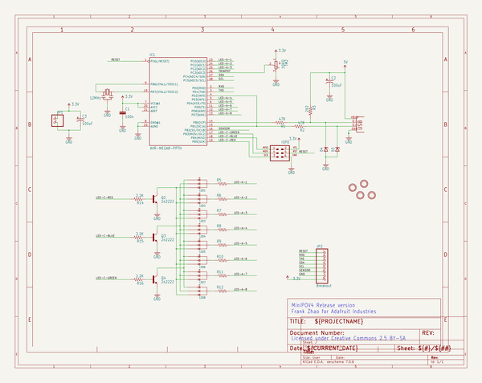
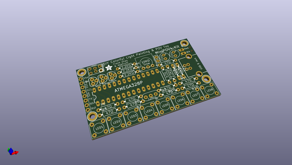
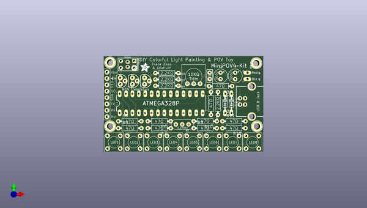
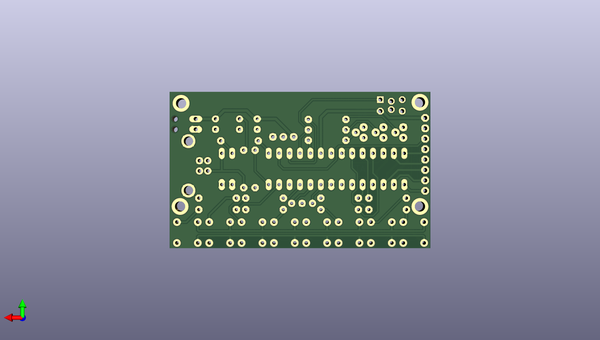

# adafruit_minipov4_kit
 
## summary 
* id: adafruit_adafruit_minipov4_kit_adafruit_minipov4_kit
* user: adafruit
* name: adafruit_minipov4_kit
* board: adafruit_minipov4_kit
* repo: https://github.com/adafruit/Adafruit-MiniPOV4-Kit

* src_file_repo_sch: 
* src_file_repo_sch_link: https://github.com/adafruit/Adafruit-MiniPOV4-Kit/tree/master/
* full details link: https://github.com/oomlout/oomlout_oomp_project_bot_v_2/tree/main/projects/adafruit_adafruit_minipov4_kit_adafruit_minipov4_kit/current_version/working  

## schematic  
  
[schematic (pdf)](working_schematic.pdf)  

## pcb  
 
  
  
  
[board (pdf)](working.pdf)  

## working_bom
| Id | Designator | Footprint | Quantity | Designation | Supplier and ref |  | None | 
| --- | --- | --- | --- | --- | --- | --- | --- | 
| 1 | R11,R9,R5,R6,R10,R8,R12,R7 | 0207_9 | 8 |  |  |  | [''] | 
| 2 | LED1,LED3,LED4,LED7,LED6,LED5,LED8,LED2 | PIRANHA5MM | 8 | LED-RGB-CA-PIRANHA |  |  | [''] | 
| 3 | JP1 | 1X02_OVAL | 1 |  |  |  | [''] | 
| 4 | Q2,Q3,Q4 | TO-92 | 3 | 2n2222 |  |  | [''] | 
| 5 | U$2,U$5,U$4,U$3 | MOUNTINGHOLE_2.5_PLATED_THICK | 4 | MOUNTINGHOLE2.5_THICK |  |  | [''] | 
| 6 | @HOLE1,@HOLE0 |  | 2 |  |  |  | [''] | 
| 7 | R2,R1 | 0207_9 | 2 | 47R |  |  | [''] | 
| 8 | TM2 | TRIM-3386 | 1 | 10KΩ |  |  | [''] | 
| 9 | R15,R16,R14 | 0207_9 | 3 | 2.2K |  |  | [''] | 
| 10 | USB0 | USB-B-PTH | 1 | USBPTH |  |  | [''] | 
| 11 | C3,C2 | E2,5-6 | 2 | 100uF |  |  | [''] | 
| 12 | IC1 | DIL28-3 | 1 | ATmega8/88/168/168P/328P |  |  | [''] | 
| 13 | JP2 | 1X08-BIG | 1 | Breakout |  |  | [''] | 
| 14 | Q1 | CERM_OSC | 1 | 12MHz |  |  | [''] | 
| 15 | D3,D4 | DO34Z7 | 2 |  |  |  | [''] | 
| 16 | U$6 | ADAFRUIT_3.5MM | 1 |  |  |  | [''] | 
| 17 | R3 | 0207_9 | 1 | 2K2 |  |  | [''] | 
| 18 | ISP0 | AVR-ISP-6 | 1 | AVR-ISP-6 |  |  | [''] | 
| 19 | C1 | CAP-PTH-SMALL2 | 1 | 100n |  |  | [''] | 

## bom_schematic
| Ref | Qnty | Value | Cmp name | Footprint | Description | Vendor | DNP | 
| --- | --- | --- | --- | --- | --- | --- | --- | 
| C1 | 1 | 100n | CAPPTH2 | working:CAP-PTH-SMALL2 |  |  |  | 
| C2, C3 | 2 | 100uF | CPOL-USE2.5-6 | working:E2,5-6 |  |  |  | 
| D3, D4 | 2 | ZENER-DIODEDO34-7 | ZENER-DIODEDO34-7 | working:DO34Z7 |  |  |  | 
| IC1 | 1 | AVR-MEGA8-PPTH | AVR-MEGA8-PPTH | working:DIL28-3 |  |  |  | 
| ISP0 | 1 | AVR-ISP-6 | AVR-ISP-6 | working:AVR-ISP-6 |  |  |  | 
| JP1 | 1 | HEADER-1X2 | HEADER-1X2 | working:1X02_OVAL |  |  |  | 
| JP2 | 1 | Breakout | PINHD-1X8BIG | working:1X08-BIG |  |  |  | 
| LED1, LED2, LED3, LED4, LED5, LED6, LED7, LED8 | 8 | LED-RGB-CA-PIRANHA | LED-RGB-CA-PIRANHA | working:PIRANHA5MM |  |  |  | 
| Q1 | 1 | 12MHz | CERMOSCILL | working:CERM_OSC |  |  |  | 
| Q2, Q3, Q4 | 3 | 2n2222 | TRANSISTOR_NPNTO92 | working:TO-92 |  |  |  | 
| R1, R2 | 2 | 47R | R-US_0207/9 | working:0207_9 |  |  |  | 
| R3 | 1 | 2K2 | R-US_0207/9 | working:0207_9 |  |  |  | 
| R5, R6, R7, R8, R9, R10, R11, R12 | 8 | R-US_0207/9 | R-US_0207/9 | working:0207_9 |  |  |  | 
| R14, R15, R16 | 3 | 2.2K | R-US_0207/9 | working:0207_9 |  |  |  | 
| TM2 | 1 | 10KΩ | TRIMPOT3386 | working:TRIM-3386 |  |  |  | 
| U$2, U$3, U$4, U$5 | 4 | MOUNTINGHOLE2.5_THICK | MOUNTINGHOLE2.5_THICK | working:MOUNTINGHOLE_2.5_PLATED_THICK |  |  |  | 
| USB0 | 1 | USBPTH | USBPTH | working:USB-B-PTH |  |  |  | 

## mounting_holes
| x | y | package | value | ref | size | 
| --- | --- | --- | --- | --- | --- | 
| 0.0 | 0.0 | MOUNTINGHOLE_2.5_PLATED_THICK | MOUNTINGHOLE2.5_THICK | U$2 | m3 | 
| 58.41999999999999 | 0.0 | MOUNTINGHOLE_2.5_PLATED_THICK | MOUNTINGHOLE2.5_THICK | U$3 | m3 | 
| 0.0 | 25.400000000000006 | MOUNTINGHOLE_2.5_PLATED_THICK | MOUNTINGHOLE2.5_THICK | U$4 | m3 | 
| 58.166 | 25.146 | MOUNTINGHOLE_2.5_PLATED_THICK | MOUNTINGHOLE2.5_THICK | U$5 | m3 | 

