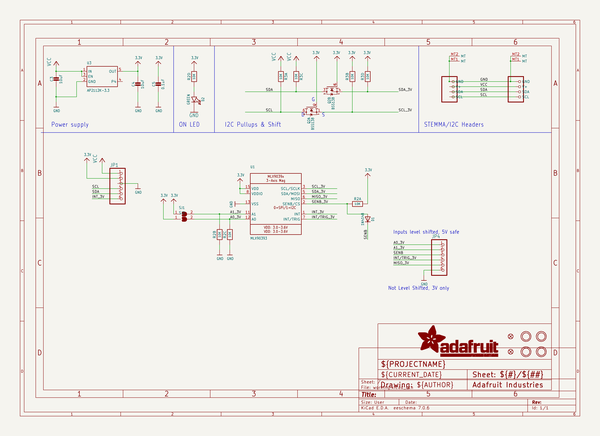
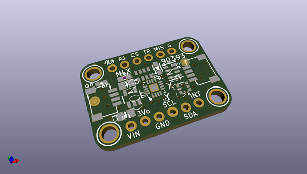
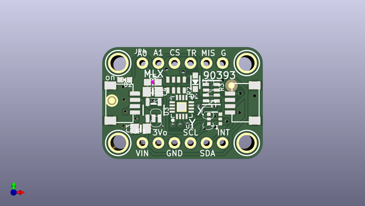
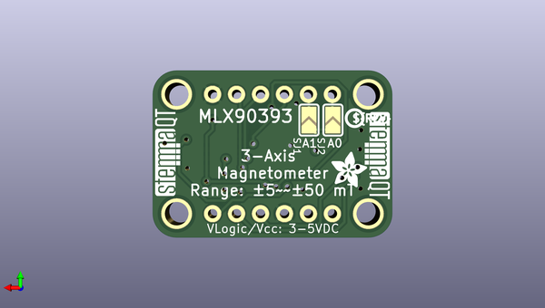

# adafruit_mlx90393_pcb
 
## summary 
* id: adafruit_adafruit_mlx90393_pcb_adafruit_mlx90393_wide_range_magnetometer
* user: adafruit
* name: adafruit_mlx90393_pcb
* board: adafruit_mlx90393_wide_range_magnetometer
* repo: https://github.com/adafruit/Adafruit-MLX90393-PCB

* src_file_repo_sch: 
* src_file_repo_sch_link: https://github.com/adafruit/Adafruit-MLX90393-PCB/tree/master/
* full details link: https://github.com/oomlout/oomlout_oomp_project_bot_v_2/tree/main/projects/adafruit_adafruit_mlx90393_pcb_adafruit_mlx90393_wide_range_magnetometer/current_version/working  

## schematic  
  
[schematic (pdf)](working_schematic.pdf)  

## pcb  
 
  
  
  
[board (pdf)](working.pdf)  

## working_bom
| Id | Designator | Footprint | Quantity | Designation | Supplier and ref |  | None | 
| --- | --- | --- | --- | --- | --- | --- | --- | 
| 1 | U1 | QFN16_3MM | 1 | MLX90393 |  |  | [''] | 
| 2 | D2 | CHIPLED_0603_NOOUTLINE | 1 | GREEN |  |  | [''] | 
| 3 | U$37,U$36,U$34,U$33 | MOUNTINGHOLE_2.5_PLATED | 4 | MOUNTINGHOLE2.5 |  |  | [''] | 
| 4 | C5 | 0603-NO | 1 | 0.1uF |  |  | [''] | 
| 5 | Q2 | SOT363 | 1 | BSS138 |  |  | [''] | 
| 6 | JP4,JP1 | 1X06_ROUND_70 | 2 |  |  |  | [''] | 
| 7 | FID4,FID2 | FIDUCIAL_1MM | 2 | FIDUCIAL_1MM |  |  | [''] | 
| 8 | R2 | RESPACK_4X0603_NO | 1 | 10K |  |  | [''] | 
| 9 | U3 | SOT23-5 | 1 | AP2112K-3.3 |  |  | [''] | 
| 10 | C4,C3 | 0805-NO | 2 | 10uF |  |  | [''] | 
| 11 | D1 | SOD-323_MINI | 1 | 1N4148 |  |  | [''] | 
| 12 | CONN3,CONN4 | JST_SH4 | 2 | STEMMA_I2C_QT |  |  | [''] | 
| 13 | R3 | RESPACK_4X0603 | 1 | 10K |  |  | [''] | 
| 14 | SJ2,SJ1 | SOLDERJUMPER_ARROW_NOPASTE | 2 |  |  |  | [''] | 
| 15 | U$41,U$42 | STEMMAQT | 2 |  |  |  | [''] | 
| 16 | U$18 | PCBFEAT-REV-040 | 1 |  |  |  | [''] | 
| 17 | U$39 | ADAFRUIT_3.5MM | 1 |  |  |  | [''] | 

## bom_schematic
| Ref | Qnty | Value | Cmp name | Footprint | Description | Vendor | DNP | 
| --- | --- | --- | --- | --- | --- | --- | --- | 
| C3, C4 | 2 | 10uF | CAP_CERAMIC0805-NOOUTLINE | working:0805-NO |  |  |  | 
| C5 | 1 | 0.1uF | CAP_CERAMIC0603_NO | working:0603-NO |  |  |  | 
| CONN3, CONN4 | 2 | STEMMA_I2C_QT | STEMMA_I2C_QT | working:JST_SH4 |  |  |  | 
| D1 | 1 | 1N4148 | DIODE_SOD323MINI | working:SOD-323_MINI |  |  |  | 
| D2 | 1 | GREEN | LED0603_NOOUTLINE | working:CHIPLED_0603_NOOUTLINE |  |  |  | 
| FID2, FID4 | 2 | FIDUCIAL_1MM | FIDUCIAL_1MM | working:FIDUCIAL_1MM |  |  |  | 
| JP1, JP4 | 2 | HEADER-1X670MIL | HEADER-1X670MIL | working:1X06_ROUND_70 |  |  |  | 
| Q2 | 1 | BSS138 | MOSFET-N_DUAL | working:SOT363 |  |  |  | 
| R2 | 1 | 10K | RESISTOR_4PACK_NO | working:RESPACK_4X0603_NO |  |  |  | 
| R3 | 1 | 10K | RESISTOR_4PACK | working:RESPACK_4X0603 |  |  |  | 
| SJ1, SJ2 | 2 | SOLDERJUMPER | SOLDERJUMPER | working:SOLDERJUMPER_ARROW_NOPASTE |  |  |  | 
| U1 | 1 | MLX90393 | MLX90393 | working:QFN16_3MM |  |  |  | 
| U3 | 1 | AP2112K-3.3 | VREG_SOT23-5 | working:SOT23-5 |  |  |  | 
| U$33, U$34, U$36, U$37 | 4 | MOUNTINGHOLE2.5 | MOUNTINGHOLE2.5 | working:MOUNTINGHOLE_2.5_PLATED |  |  |  | 

## mounting_holes
| x | y | package | value | ref | size | 
| --- | --- | --- | --- | --- | --- | 
| 0.0 | 12.700000000000003 | MOUNTINGHOLE_2.5_PLATED | MOUNTINGHOLE2.5 | U$33 | m3 | 
| 20.319999999999993 | 12.700000000000003 | MOUNTINGHOLE_2.5_PLATED | MOUNTINGHOLE2.5 | U$34 | m3 | 
| 0.0 | 0.0 | MOUNTINGHOLE_2.5_PLATED | MOUNTINGHOLE2.5 | U$36 | m3 | 
| 20.319999999999993 | 0.0 | MOUNTINGHOLE_2.5_PLATED | MOUNTINGHOLE2.5 | U$37 | m3 | 

