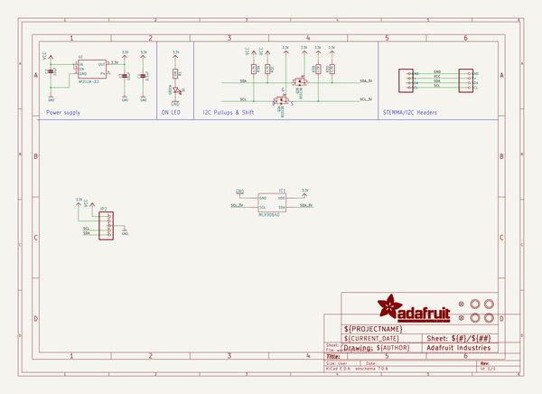
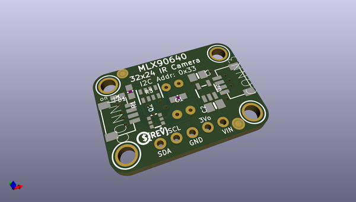
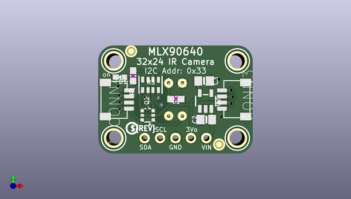
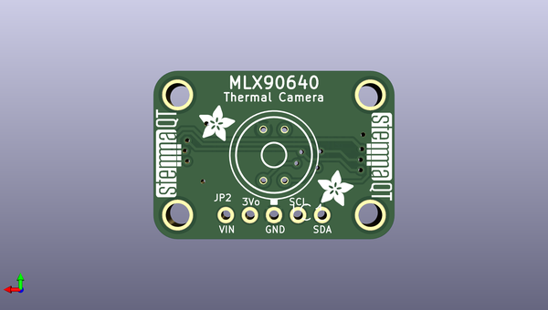

# adafruit_mlx90640_pcb
 
## summary 
* id: adafruit_adafruit_mlx90640_pcb_adafruit_mlx90640_ir_thermal_camera
* user: adafruit
* name: adafruit_mlx90640_pcb
* board: adafruit_mlx90640_ir_thermal_camera
* repo: https://github.com/adafruit/Adafruit-MLX90640-PCB

* src_file_repo_sch: 
* src_file_repo_sch_link: https://github.com/adafruit/Adafruit-MLX90640-PCB/tree/master/
* full details link: https://github.com/oomlout/oomlout_oomp_project_bot_v_2/tree/main/projects/adafruit_adafruit_mlx90640_pcb_adafruit_mlx90640_ir_thermal_camera/current_version/working  

## schematic  
  
[schematic (pdf)](working_schematic.pdf) 

## pcb  
 
  
  
  
[board (pdf)](working.pdf)  

## working_bom
| Id | Designator | Footprint | Quantity | Designation | Supplier and ref |  | None | 
| --- | --- | --- | --- | --- | --- | --- | --- | 
| 1 | R3 | RESPACK_4X0603 | 1 | 4.7K |  |  | [''] | 
| 2 | C3,C2 | 0805-NO | 2 | 10uF |  |  | [''] | 
| 3 | U$17,U$1,U$19,U$21 | MOUNTINGHOLE_2.5_PLATED | 4 | MOUNTINGHOLE2.5 |  |  | [''] | 
| 4 | FID4,FID3 | FIDUCIAL_1MM | 2 | FIDUCIAL_1MM |  |  | [''] | 
| 5 | D1 | CHIPLED_0603_NOOUTLINE | 1 | GREEN |  |  | [''] | 
| 6 | Q2 | SOT363 | 1 | BSS138 |  |  | [''] | 
| 7 | U2 | SOT23-5 | 1 | AP2112K-3.3 |  |  | [''] | 
| 8 | U$25 | PCBFEAT-REV-040 | 1 |  |  |  | [''] | 
| 9 | R1 | 0603-NO | 1 | 10K |  |  | [''] | 
| 10 | CONN4,CONN3 | JST_SH4 | 2 | STEMMA_I2C_QT |  |  | [''] | 
| 11 | C1 | 0603-NO | 1 | 0.1uF |  |  | [''] | 
| 12 | U$31,U$30 | STEMMAQT | 2 |  |  |  | [''] | 
| 13 | IC1 | MLX90640 | 1 | MLX90640 |  |  | [''] | 
| 14 | U$22,U$4 | ADAFRUIT_3.5MM | 2 |  |  |  | [''] | 
| 15 | JP2 | 1X05_ROUND | 1 |  |  |  | [''] | 

## bom_schematic
| Ref | Qnty | Value | Cmp name | Footprint | Description | Vendor | DNP | 
| --- | --- | --- | --- | --- | --- | --- | --- | 
| C1 | 1 | 0.1uF | CAP_CERAMIC0603_NO | working:0603-NO |  |  |  | 
| C2, C3 | 2 | 10uF | CAP_CERAMIC0805-NOOUTLINE | working:0805-NO |  |  |  | 
| CONN3, CONN4 | 2 | STEMMA_I2C_QT | STEMMA_I2C_QT | working:JST_SH4 |  |  |  | 
| D1 | 1 | GREEN | LED0603_NOOUTLINE | working:CHIPLED_0603_NOOUTLINE |  |  |  | 
| FID3, FID4 | 2 | FIDUCIAL_1MM | FIDUCIAL_1MM | working:FIDUCIAL_1MM |  |  |  | 
| IC1 | 1 | MLX90640 | MLX90640 | working:MLX90640 |  |  |  | 
| JP2 | 1 | HEADER-1X5ROUND | HEADER-1X5ROUND | working:1X05_ROUND |  |  |  | 
| Q2 | 1 | BSS138 | MOSFET-N_DUAL | working:SOT363 |  |  |  | 
| R1 | 1 | 10K | RESISTOR_0603_NOOUT | working:0603-NO |  |  |  | 
| R3 | 1 | 4.7K | RESISTOR_4PACK | working:RESPACK_4X0603 |  |  |  | 
| U2 | 1 | AP2112K-3.3 | VREG_SOT23-5 | working:SOT23-5 |  |  |  | 
| U$1, U$17, U$19, U$21 | 4 | MOUNTINGHOLE2.5 | MOUNTINGHOLE2.5 | working:MOUNTINGHOLE_2.5_PLATED |  |  |  | 

## mounting_holes
| x | y | package | value | ref | size | 
| --- | --- | --- | --- | --- | --- | 
| 0.0 | 12.7 | MOUNTINGHOLE_2.5_PLATED | MOUNTINGHOLE2.5 | U$1 | m3 | 
| 20.32 | 12.7 | MOUNTINGHOLE_2.5_PLATED | MOUNTINGHOLE2.5 | U$17 | m3 | 
| 0.0 | 0.0 | MOUNTINGHOLE_2.5_PLATED | MOUNTINGHOLE2.5 | U$19 | m3 | 
| 20.32 | 0.0 | MOUNTINGHOLE_2.5_PLATED | MOUNTINGHOLE2.5 | U$21 | m3 | 

