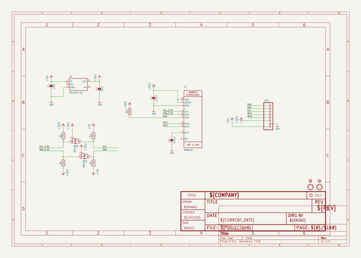
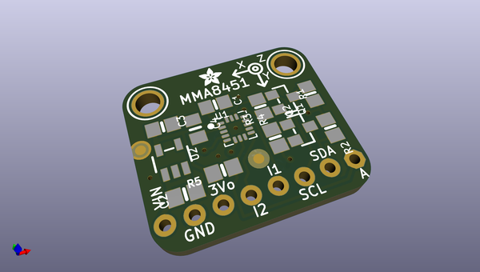
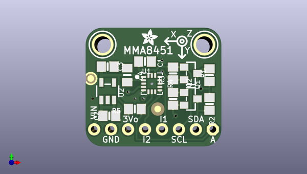
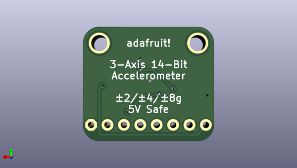

# adafruit_mma8451_breakout_pcb
 
## summary 
* id: adafruit_adafruit_mma8451_breakout_pcb_adafruit_mma8451
* user: adafruit
* name: adafruit_mma8451_breakout_pcb
* board: adafruit_mma8451
* repo: https://github.com/adafruit/Adafruit-MMA8451-Breakout-PCB

* src_file_repo_sch: 
* src_file_repo_sch_link: https://github.com/adafruit/Adafruit-MMA8451-Breakout-PCB/tree/master/
* full details link: https://github.com/oomlout/oomlout_oomp_project_bot_v_2/tree/main/projects/adafruit_adafruit_mma8451_breakout_pcb_adafruit_mma8451/current_version/working  

## schematic  
  
[schematic (pdf)](working_schematic.pdf) 

## pcb  
 
  
  
  
[board (pdf)](working.pdf)  

## working_bom
| Id | Designator | Footprint | Quantity | Designation | Supplier and ref |  | None | 
| --- | --- | --- | --- | --- | --- | --- | --- | 
| 1 | C1 | 0805-NO | 1 | 0.1uF |  |  | [''] | 
| 2 | U$6,U$3 | MOUNTINGHOLE_2.5_PLATED | 2 | MOUNTINGHOLE2.5 |  |  | [''] | 
| 3 | R3,R4,R1,R5,R2 | 0805-NO | 5 | 10K |  |  | [''] | 
| 4 | JP1 | 1X08_ROUND_70 | 1 |  |  |  | [''] | 
| 5 | U2 | SOT23-5 | 1 | MIC5225-3.3 |  |  | [''] | 
| 6 | FID1,FID2 | FIDUCIAL_1MM | 2 | FIDUCIAL" |  |  | [''] | 
| 7 | C3,C2 | 0805-NO | 2 | 10uF |  |  | [''] | 
| 8 | U$10 | ADAFRUIT_2.5MM | 1 |  |  |  | [''] | 
| 9 | Q2,Q1 | SOT23-WIDE | 2 | BSS138 |  |  | [''] | 
| 10 | U1 | MMA845X_QFN_16MM | 1 | MMA8451 |  |  | [''] | 
| 11 | C4 | 0805_10MGAP | 1 | 0.1uF |  |  | [''] | 

## bom_schematic
| Ref | Qnty | Value | Cmp name | Footprint | Description | Vendor | DNP | 
| --- | --- | --- | --- | --- | --- | --- | --- | 
| C1 | 1 | 0.1uF | CAP_CERAMIC0805-NOOUTLINE | working:0805-NO |  |  |  | 
| C2, C3 | 2 | 10uF | CAP_CERAMIC0805-NOOUTLINE | working:0805-NO |  |  |  | 
| C4 | 1 | 0.1uF | CAP_CERAMIC0805_10MGAP | working:0805_10MGAP |  |  |  | 
| FID1, FID2 | 2 | FIDUCIAL"" | FIDUCIAL{dblquote}{dblquote} | working:FIDUCIAL_1MM |  |  |  | 
| JP1 | 1 | HEADER-1X870MIL | HEADER-1X870MIL | working:1X08_ROUND_70 |  |  |  | 
| Q1, Q2 | 2 | BSS138 | MOSFET-NWIDE | working:SOT23-WIDE |  |  |  | 
| R1, R2, R3, R4, R5 | 5 | 10K | RESISTOR0805_NOOUTLINE | working:0805-NO |  |  |  | 
| U1 | 1 | MMA8451 | ACCEL_MMA845X | working:MMA845X_QFN_16MM |  |  |  | 
| U2 | 1 | MIC5225-3.3 | VREG_SOT23-5 | working:SOT23-5 |  |  |  | 
| U$3, U$6 | 2 | MOUNTINGHOLE2.5 | MOUNTINGHOLE2.5 | working:MOUNTINGHOLE_2.5_PLATED |  |  |  | 

## mounting_holes
| x | y | package | value | ref | size | 
| --- | --- | --- | --- | --- | --- | 
| 0.0 | 0.0 | MOUNTINGHOLE_2.5_PLATED | MOUNTINGHOLE2.5 | U$3 | m3 | 
| 15.24 | 0.0 | MOUNTINGHOLE_2.5_PLATED | MOUNTINGHOLE2.5 | U$6 | m3 | 

