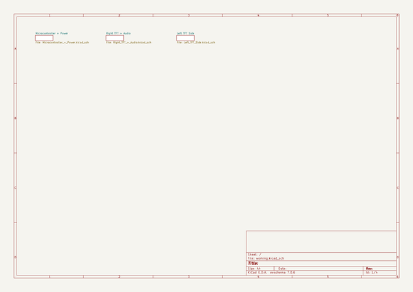

# adafruit_monster_m4sk_pcb
 
## summary 
* id: adafruit_adafruit_monster_m4sk_pcb_adafruit_monster_m4sk
* user: adafruit
* name: adafruit_monster_m4sk_pcb
* board: adafruit_monster_m4sk
* repo: https://github.com/adafruit/Adafruit-MONSTER-M4SK-PCB

* src_file_repo_sch: 
* src_file_repo_sch_link: https://github.com/adafruit/Adafruit-MONSTER-M4SK-PCB/tree/master/
* full details link: https://github.com/oomlout/oomlout_oomp_project_bot_v_2/tree/main/projects/adafruit_adafruit_monster_m4sk_pcb_adafruit_monster_m4sk/current_version/working  

## schematic  
  
[schematic (pdf)](working_schematic.pdf) 

## pcb  
 
  
  
  
[board (pdf)](working.pdf)  

## bom_schematic
no data

