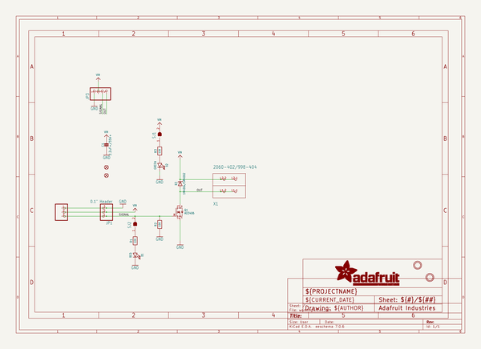
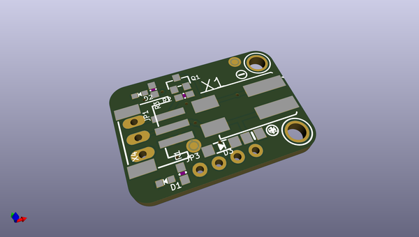
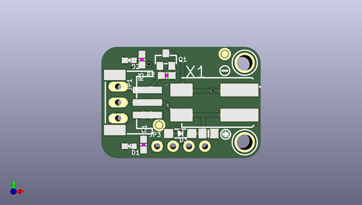
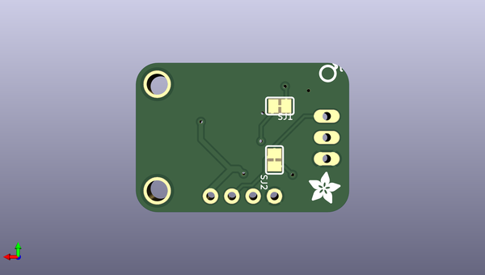

# adafruit_mosfet_driver_stemma_pcb
 
## summary 
* id: adafruit_adafruit_mosfet_driver_stemma_pcb_adafruit_mosfet_driver_stemma_breakout
* user: adafruit
* name: adafruit_mosfet_driver_stemma_pcb
* board: adafruit_mosfet_driver_stemma_breakout
* repo: https://github.com/adafruit/Adafruit-MOSFET-Driver-STEMMA-PCB

* src_file_repo_sch: 
* src_file_repo_sch_link: https://github.com/adafruit/Adafruit-MOSFET-Driver-STEMMA-PCB/tree/main/
* full details link: https://github.com/oomlout/oomlout_oomp_project_bot_v_2/tree/main/projects/adafruit_adafruit_mosfet_driver_stemma_pcb_adafruit_mosfet_driver_stemma_breakout/current_version/working  

## schematic  
  
[schematic (pdf)](working_schematic.pdf) 

## pcb  
 
  
  
  
[board (pdf)](working.pdf)  

## working_bom
| Id | Designator | Footprint | Quantity | Designation | Supplier and ref |  | None | 
| --- | --- | --- | --- | --- | --- | --- | --- | 
| 1 | X4 | JSTPH3 | 1 | JST PH 3 |  |  | [''] | 
| 2 | FID3,FID2 | FIDUCIAL_1MM | 2 | FIDUCIAL_1MM |  |  | [''] | 
| 3 | D2 | CHIPLED_0603_NOOUTLINE | 1 | GREEN |  |  | [''] | 
| 4 | R2,R3,R1 | 0603-NO | 3 | 10K |  |  | [''] | 
| 5 | PLABEL1 | PLABEL1 | 1 |  |  |  | [''] | 
| 6 | D3 | SOD-123 | 1 | 1N400x/SM4002 |  |  | [''] | 
| 7 | JP3 | 1X04_ROUND | 1 |  |  |  | [''] | 
| 8 | X1 | P-2060-402_998-404 | 1 | 2060-402/998-404 |  |  | [''] | 
| 9 | U$9 | SYMBOL_MINUS | 1 |  |  |  | [''] | 
| 10 | U$1,U$8 | MOUNTINGHOLE_2.5_PLATED | 2 | MOUNTINGHOLE2.5 |  |  | [''] | 
| 11 | PLABEL0 | PLABEL0 | 1 |  |  |  | [''] | 
| 12 | D1 | CHIPLED_0603_NOOUTLINE | 1 | RED |  |  | [''] | 
| 13 | PLABEL2 | PLABEL2 | 1 |  |  |  | [''] | 
| 14 | JP1 | 1X03_OVAL | 1 | 0.1 Header" |  |  | [''] | 
| 15 | U$3 | SYMBOL_PLUS | 1 |  |  |  | [''] | 
| 16 | Q1 | SOT23-WIDE | 1 | AO3406 |  |  | [''] | 
| 17 | C1 | 0805-NO | 1 | 2.2uF+/35V+ |  |  | [''] | 
| 18 | PLABEL8 | PLABEL8 | 1 |  |  |  | [''] | 
| 19 | PLABEL4 | PLABEL4 | 1 |  |  |  | [''] | 
| 20 | PLABEL9 | PLABEL9 | 1 |  |  |  | [''] | 
| 21 | PLABEL7 | PLABEL7 | 1 |  |  |  | [''] | 
| 22 | SJ2,SJ1 | SOLDERJUMPER_CLOSEDWIRE | 2 |  |  |  | [''] | 
| 23 | PLABEL13 | PLABEL13 | 1 |  |  |  | [''] | 
| 24 | PLABEL3 | PLABEL3 | 1 |  |  |  | [''] | 
| 25 | U$5 | PCBFEAT-REV-040 | 1 |  |  |  | [''] | 
| 26 | U$12 | ADAFRUIT_3.5MM | 1 |  |  |  | [''] | 
| 27 | PLABEL5 | PLABEL5 | 1 |  |  |  | [''] | 
| 28 | PLABEL11 | PLABEL11 | 1 |  |  |  | [''] | 
| 29 | PLABEL6 | PLABEL6 | 1 |  |  |  | [''] | 
| 30 | PLABEL12 | PLABEL12 | 1 |  |  |  | [''] | 
| 31 | PLABEL10 | PLABEL10 | 1 |  |  |  | [''] | 

## bom_schematic
| Ref | Qnty | Value | Cmp name | Footprint | Description | Vendor | DNP | 
| --- | --- | --- | --- | --- | --- | --- | --- | 
| C1 | 1 | 2.2uF+/35V+ | CAP_CERAMIC0805-NOOUTLINE | working:0805-NO |  |  |  | 
| D1 | 1 | RED | LED0603_NOOUTLINE | working:CHIPLED_0603_NOOUTLINE |  |  |  | 
| D2 | 1 | GREEN | LED0603_NOOUTLINE | working:CHIPLED_0603_NOOUTLINE |  |  |  | 
| D3 | 1 | 1N400x/SM4002 | DIODE-SCHOTTKYSOD-123 | working:SOD-123 |  |  |  | 
| FID2, FID3 | 2 | FIDUCIAL_1MM | FIDUCIAL_1MM | working:FIDUCIAL_1MM |  |  |  | 
| JP1 | 1 | 0.1" Header | HEADER-1X3 | working:1X03_OVAL |  |  |  | 
| JP3 | 1 | HEADER-1X4ROUND | HEADER-1X4ROUND | working:1X04_ROUND |  |  |  | 
| Q1 | 1 | AO3406 | MOSFET-NWIDE | working:SOT23-WIDE |  |  |  | 
| R1, R2, R3 | 3 | 10K | RESISTOR_0603_NOOUT | working:0603-NO |  |  |  | 
| SJ1, SJ2 | 2 | SOLDERJUMPER_CLOSED | SOLDERJUMPER_CLOSED | working:SOLDERJUMPER_CLOSEDWIRE |  |  |  | 
| U$1, U$8 | 2 | MOUNTINGHOLE2.5 | MOUNTINGHOLE2.5 | working:MOUNTINGHOLE_2.5_PLATED |  |  |  | 
| X1 | 1 | 2060-402/998-404 | 2060-402/998-404 | working:P-2060-402_998-404 |  |  |  | 
| X4 | 1 | JST PH 3 | CON_JST_PH_3PIN | working:JSTPH3 |  |  |  | 

## mounting_holes
| x | y | package | value | ref | size | 
| --- | --- | --- | --- | --- | --- | 
| 0.0 | 0.0 | MOUNTINGHOLE_2.5_PLATED | MOUNTINGHOLE2.5 | U$1 | m3 | 
| 0.0 | 12.7 | MOUNTINGHOLE_2.5_PLATED | MOUNTINGHOLE2.5 | U$8 | m3 | 

