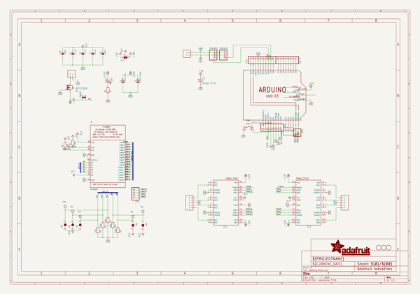
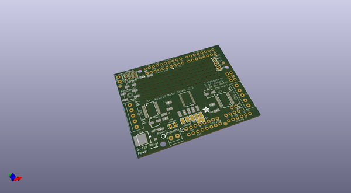
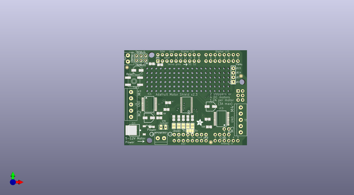
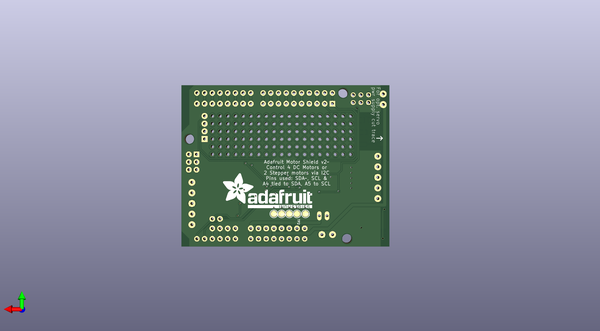

# adafruit_motor_shield_v2_pcb
 
## summary 
* id: adafruit_adafruit_motor_shield_v2_pcb_adafruit_motor_shield_v2_3
* user: adafruit
* name: adafruit_motor_shield_v2_pcb
* board: adafruit_motor_shield_v2_3
* repo: https://github.com/adafruit/Adafruit-Motor-Shield-V2-PCB

* src_file_repo_sch: 
* src_file_repo_sch_link: https://github.com/adafruit/Adafruit-Motor-Shield-V2-PCB/tree/master/
* full details link: https://github.com/oomlout/oomlout_oomp_project_bot_v_2/tree/main/projects/adafruit_adafruit_motor_shield_v2_pcb_adafruit_motor_shield_v2_3/current_version/working  

## schematic  
  
[schematic (pdf)](working_schematic.pdf)  

## pcb  
 
  
  
  
[board (pdf)](working.pdf)  

## working_bom
| Id | Designator | Footprint | Quantity | Designation | Supplier and ref |  | None | 
| --- | --- | --- | --- | --- | --- | --- | --- | 
| 1 | IC3,IC1 | SSOP24 | 2 | TB6612FNG |  |  | [''] | 
| 2 | @HOLE2,@HOLE1,@HOLE0 |  | 3 |  |  |  | [''] | 
| 3 | SERVO1,SERVO2 | 1X03 | 2 |  |  |  | [''] | 
| 4 | JP3 | 1X10_ROUND70 | 1 |  |  |  | [''] | 
| 5 | J2,J1 | 1X05-3.5MM | 2 | 1X5 |  |  | [''] | 
| 6 | R4 | 0805-NO | 1 | 1K |  |  | [''] | 
| 7 | LED1 | CHIPLED_0805_NOOUTLINE | 1 | Green |  |  | [''] | 
| 8 | SJ1 | SOLDERJUMPER_2WAY_OPEN_NOPASTE | 1 |  |  |  | [''] | 
| 9 | C6,C10 | 0805-NO | 2 | 10uF |  |  | [''] | 
| 10 | Q1 | D-PAK_TO252AA | 1 | AOD417 |  |  | [''] | 
| 11 | JP4 | 1X02_ROUND | 1 |  |  |  | [''] | 
| 12 | A3,A1,A4,A0,A2 | SOLDERJUMPER_REFLOW_NOPASTE | 5 |  |  |  | [''] | 
| 13 | C2,C1,C3 | 0805-NO | 3 | 0.1uF |  |  | [''] | 
| 14 | D0-7,JP2 | 1X08-CLEANBIG | 2 |  |  |  | [''] | 
| 15 | SERPWR0,MPOWER0 | 1X2-3.5MM | 2 | 1X2-3.5MM |  |  | [''] | 
| 16 | R1,R2,R3,R6,R5 | 0805-NO | 5 | 10k |  |  | [''] | 
| 17 | U$6 | ADAFRUIT_3.5MM | 1 |  |  |  | [''] | 
| 18 | SW1 | EVQ-Q2 | 1 | SPST_TACT-EVQQ2 |  |  | [''] | 
| 19 | R8,R7 | 0805-NO | 2 | 10K |  |  | [''] | 
| 20 | C4 | PANASONIC_C | 1 | 47uF/16v |  |  | [''] | 
| 21 | U$3,U$2,U$4 | FIDUCIAL_1MM | 3 | FIDUCIAL |  |  | [''] | 
| 22 | JP1 | 1X04_ROUND_76 | 1 |  |  |  | [''] | 
| 23 | C5 | PANASONIC_C | 1 | 47uF+/16v |  |  | [''] | 
| 24 | U2 | TSSOP28 | 1 | PCA9685 |  |  | [''] | 
| 25 | CN1 | 1X04-CLEANBIG | 1 | 1X4-CLEANBIG |  |  | [''] | 
| 26 | U$1 | ARDUINOR3_ICSP | 1 | ARDUINO_R3_ICSP |  |  | [''] | 
| 27 | C9 | PANASONIC_C | 1 | 10\0uF 6.3V |  |  | [''] | 
| 28 | PWR0 | JP1 | 1 |  |  |  | [''] | 
| 29 | TP2,TP5,TP4,TP3,TP1 | TESTPOINT_ROUND_2MM | 5 |  |  |  | [''] | 
| 30 | U$5 | ADAFRUIT_TEXT_30MM | 1 |  |  |  | [''] | 

## bom_schematic
| Ref | Qnty | Value | Cmp name | Footprint | Description | Vendor | DNP | 
| --- | --- | --- | --- | --- | --- | --- | --- | 
| A0, A1, A2, A3, A4 | 5 | SOLDERJUMPERREFLOW_NOPASTE | SOLDERJUMPERREFLOW_NOPASTE | working:SOLDERJUMPER_REFLOW_NOPASTE |  |  |  | 
| C1, C2, C3 | 3 | 0.1uF | CAP_CERAMIC0805-NOOUTLINE | working:0805-NO |  |  |  | 
| C4 | 1 | 47uF/16v | CAP_ELECTROLYTICPANASONIC_C | working:PANASONIC_C |  |  |  | 
| C5 | 1 | 47uF+/16v | CAP_ELECTROLYTICPANASONIC_C | working:PANASONIC_C |  |  |  | 
| C6, C10 | 2 | 10uF | CAP_CERAMIC0805-NOOUTLINE | working:0805-NO |  |  |  | 
| C9 | 1 | 10\0uF 6.3V | CPOL-USC | working:PANASONIC_C |  |  |  | 
| CN1 | 1 | 1X4-CLEANBIG | 1X4-CLEANBIG | working:1X04-CLEANBIG |  |  |  | 
| D0-7 | 1 | PINHD-1X8CLEANBIG | PINHD-1X8CLEANBIG | working:1X08-CLEANBIG |  |  |  | 
| IC1, IC3 | 2 | TB6612FNG | TB6612FNG | working:SSOP24 |  |  |  | 
| J1, J2 | 2 | 1X5 | 1X5 | working:1X05-3.5MM |  |  |  | 
| JP1 | 1 | HEADER-1X476MIL | HEADER-1X476MIL | working:1X04_ROUND_76 |  |  |  | 
| JP2 | 1 | PINHD-1X8CLEANBIG | PINHD-1X8CLEANBIG | working:1X08-CLEANBIG |  |  |  | 
| JP3 | 1 | HEADER-1X1070MIL | HEADER-1X1070MIL | working:1X10_ROUND70 |  |  |  | 
| JP4 | 1 | HEADER-1X2ROUND | HEADER-1X2ROUND | working:1X02_ROUND |  |  |  | 
| LED1 | 1 | Green | LED0805_NOOUTLINE | working:CHIPLED_0805_NOOUTLINE |  |  |  | 
| MPOWER0 | 1 | 1X2-3.5MM | 1X2-3.5MM | working:1X2-3.5MM |  |  |  | 
| PWR0 | 1 | JP1E | JP1E | working:JP1 |  |  |  | 
| Q1 | 1 | IRF?5305R | IRF?5305R | working:D-PAK_TO252AA |  |  |  | 
| R1, R2, R3, R5, R6 | 5 | 10k | RESISTOR0805_NOOUTLINE | working:0805-NO |  |  |  | 
| R4 | 1 | 1K | RESISTOR0805_NOOUTLINE | working:0805-NO |  |  |  | 
| R7, R8 | 2 | 10K | RESISTOR0805_NOOUTLINE | working:0805-NO |  |  |  | 
| SERPWR0 | 1 | 1X2-3.5MM | 1X2-3.5MM | working:1X2-3.5MM |  |  |  | 
| SERVO1, SERVO2 | 2 | PINHD-1X3 | PINHD-1X3 | working:1X03 |  |  |  | 
| SJ1 | 1 | SOLDERJUMPER_2WAY | SOLDERJUMPER_2WAY | working:SOLDERJUMPER_2WAY_OPEN_NOPASTE |  |  |  | 
| SW1 | 1 | SPST_TACT-EVQQ2 | SPST_TACT-EVQQ2 | working:EVQ-Q2 |  |  |  | 
| TP1, TP2, TP3, TP4, TP5 | 5 | TESTPOINTROUND2MM | TESTPOINTROUND2MM | working:TESTPOINT_ROUND_2MM |  |  |  | 
| U2 | 1 | PCA9685 | PCA9685 | working:TSSOP28 |  |  |  | 
| U$1 | 1 | ARDUINO_R3_ICSP | ARDUINO_R3_ICSP | working:ARDUINOR3_ICSP |  |  |  | 
| U$2, U$3, U$4 | 3 | FIDUCIAL | FIDUCIAL | working:FIDUCIAL_1MM |  |  |  | 

