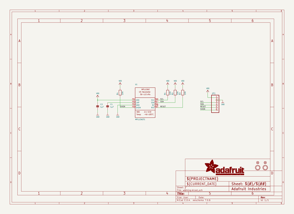
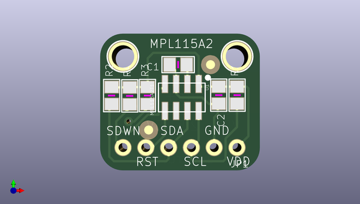
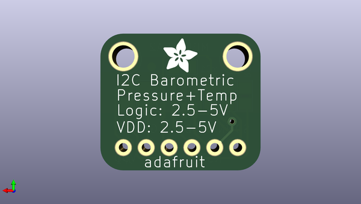

# adafruit_mpl115a2_breakout_pcb
 
## summary 
* id: adafruit_adafruit_mpl115a2_breakout_pcb_adafruit_mpl115a2_breakout
* user: adafruit
* name: adafruit_mpl115a2_breakout_pcb
* board: adafruit_mpl115a2_breakout
* repo: https://github.com/adafruit/Adafruit-MPL115A2-Breakout-PCB

* src_file_repo_sch: 
* src_file_repo_sch_link: https://github.com/adafruit/Adafruit-MPL115A2-Breakout-PCB/tree/master/
* full details link: https://github.com/oomlout/oomlout_oomp_project_bot_v_2/tree/main/projects/adafruit_adafruit_mpl115a2_breakout_pcb_adafruit_mpl115a2_breakout/current_version/working  

## schematic  
  
[schematic (pdf)](working_schematic.pdf) 

## pcb  
 
  
  
  
[board (pdf)](working.pdf)  

## working_bom
| Id | Designator | Footprint | Quantity | Designation | Supplier and ref |  | None | 
| --- | --- | --- | --- | --- | --- | --- | --- | 
| 1 | C2,C1 | 0805 | 2 | 1µF |  |  | [''] | 
| 2 | R4,R2,R3,R1 | 0805 | 4 | 10K |  |  | [''] | 
| 3 | U1 | LGA8 | 1 | MPL115A2T1 |  |  | [''] | 
| 4 | JP1 | 1X06_ROUND_70 | 1 |  |  |  | [''] | 
| 5 | FID1,FID2 | FIDUCIAL_1MM | 2 | FIDUCIAL" |  |  | [''] | 
| 6 | U$8,U$9 | MOUNTINGHOLE_2.5_PLATED | 2 | MOUNTINGHOLE2.5 |  |  | [''] | 
| 7 | U$14 | ADAFRUIT_3.5MM | 1 |  |  |  | [''] | 

## bom_schematic
| Ref | Qnty | Value | Cmp name | Footprint | Description | Vendor | DNP | 
| --- | --- | --- | --- | --- | --- | --- | --- | 
| C1, C2 | 2 | 1µF | CAP_CERAMIC0805 | working:0805 |  |  |  | 
| FID1, FID2 | 2 | FIDUCIAL"" | FIDUCIAL{dblquote}{dblquote} | working:FIDUCIAL_1MM |  |  |  | 
| JP1 | 1 | HEADER-1X670MIL | HEADER-1X670MIL | working:1X06_ROUND_70 |  |  |  | 
| R1, R2, R3, R4 | 4 | 10K | RESISTOR0805 | working:0805 |  |  |  | 
| U1 | 1 | MPL115A2T1 | MPL115A2 | working:LGA8 |  |  |  | 
| U$8, U$9 | 2 | MOUNTINGHOLE2.5 | MOUNTINGHOLE2.5 | working:MOUNTINGHOLE_2.5_PLATED |  |  |  | 

## mounting_holes
| x | y | package | value | ref | size | 
| --- | --- | --- | --- | --- | --- | 
| 0.0 | 0.0 | MOUNTINGHOLE_2.5_PLATED | MOUNTINGHOLE2.5 | U$8 | m3 | 
| 12.7 | 0.0 | MOUNTINGHOLE_2.5_PLATED | MOUNTINGHOLE2.5 | U$9 | m3 | 

