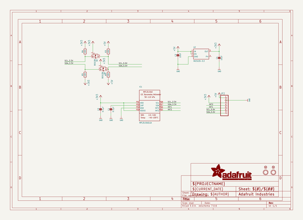
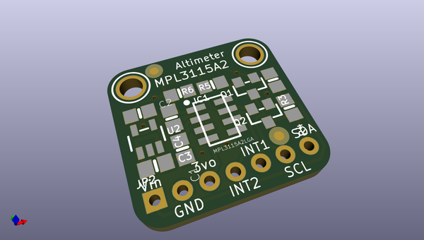
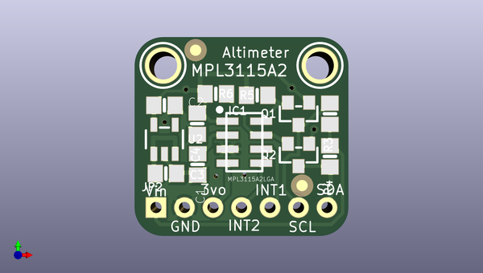
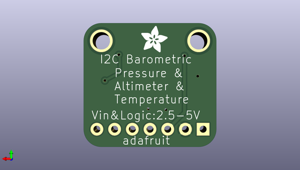

# adafruit_mpl3115a2_pcb
 
## summary 
* id: adafruit_adafruit_mpl3115a2_pcb_mpl3115a2_v0_2
* user: adafruit
* name: adafruit_mpl3115a2_pcb
* board: mpl3115a2_v0_2
* repo: https://github.com/adafruit/Adafruit-MPL3115A2-PCB

* src_file_repo_sch: 
* src_file_repo_sch_link: https://github.com/adafruit/Adafruit-MPL3115A2-PCB/tree/master/
* full details link: https://github.com/oomlout/oomlout_oomp_project_bot_v_2/tree/main/projects/adafruit_adafruit_mpl3115a2_pcb_mpl3115a2_v0_2/current_version/working  

## schematic  
  
[schematic (pdf)](working_schematic.pdf) 

## pcb  
 
  
  
  
[board (pdf)](working.pdf)  

## working_bom
| Id | Designator | Footprint | Quantity | Designation | Supplier and ref |  | None | 
| --- | --- | --- | --- | --- | --- | --- | --- | 
| 1 | R3,R6,R5,R4 | 0805-NO | 4 | 10K |  |  | [''] | 
| 2 | JP2 | 1X07_ROUND_70 | 1 |  |  |  | [''] | 
| 3 | C4,C3 | 0805-NO | 2 | 10uF |  |  | [''] | 
| 4 | FID1,FID2 | FIDUCIAL_1MM | 2 | FIDUCIAL" |  |  | [''] | 
| 5 | U$8,U$9 | MOUNTINGHOLE_2.5_PLATED | 2 | MOUNTINGHOLE2.5 |  |  | [''] | 
| 6 | U2 | SOT23-5 | 1 | MIC5225-3.3 |  |  | [''] | 
| 7 | C2,C1 | 0805-NO | 2 | 0.1µF |  |  | [''] | 
| 8 | IC1 | LGA8 | 1 | MPL3115A2LGA |  |  | [''] | 
| 9 | Q1,Q2 | SOT23-WIDE | 2 | BSS138 |  |  | [''] | 
| 10 | U$14 | ADAFRUIT_3.5MM | 1 |  |  |  | [''] | 

## bom_schematic
| Ref | Qnty | Value | Cmp name | Footprint | Description | Vendor | DNP | 
| --- | --- | --- | --- | --- | --- | --- | --- | 
| C1, C2 | 2 | 0.1µF | CAP_CERAMIC0805-NOOUTLINE | working:0805-NO |  |  |  | 
| C3, C4 | 2 | 10uF | CAP_CERAMIC0805-NOOUTLINE | working:0805-NO |  |  |  | 
| FID1, FID2 | 2 | FIDUCIAL"" | FIDUCIAL{dblquote}{dblquote} | working:FIDUCIAL_1MM |  |  |  | 
| IC1 | 1 | MPL3115A2LGA | MPL3115A2LGA | working:LGA8 |  |  |  | 
| JP2 | 1 | HEADER-1X770MIL | HEADER-1X770MIL | working:1X07_ROUND_70 |  |  |  | 
| Q1, Q2 | 2 | BSS138 | MOSFET-NWIDE | working:SOT23-WIDE |  |  |  | 
| R3, R4, R5, R6 | 4 | 10K | RESISTOR0805_NOOUTLINE | working:0805-NO |  |  |  | 
| U2 | 1 | MIC5225-3.3 | VREG_SOT23-5 | working:SOT23-5 |  |  |  | 
| U$8, U$9 | 2 | MOUNTINGHOLE2.5 | MOUNTINGHOLE2.5 | working:MOUNTINGHOLE_2.5_PLATED |  |  |  | 

## mounting_holes
| x | y | package | value | ref | size | 
| --- | --- | --- | --- | --- | --- | 
| 0.0 | 0.0 | MOUNTINGHOLE_2.5_PLATED | MOUNTINGHOLE2.5 | U$8 | m3 | 
| 13.97 | 0.0 | MOUNTINGHOLE_2.5_PLATED | MOUNTINGHOLE2.5 | U$9 | m3 | 

