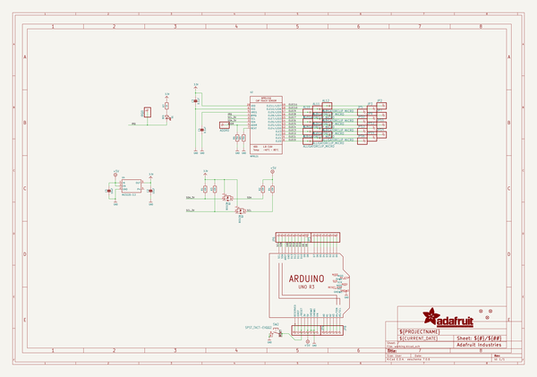
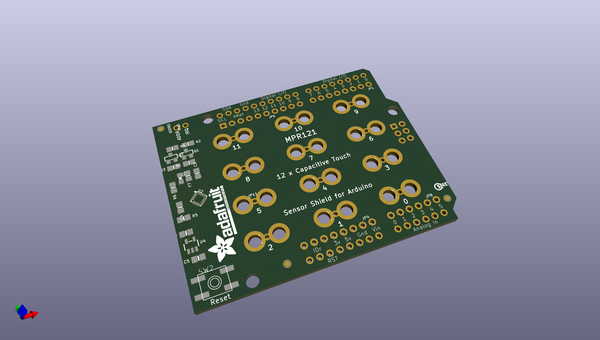
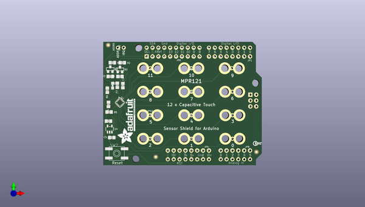
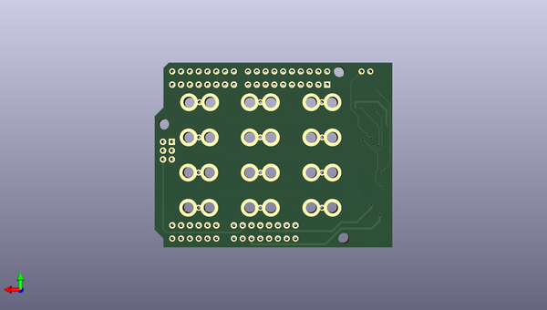

# adafruit_mpr121_capacitive_touch_shield_pcb
 
## summary 
* id: adafruit_adafruit_mpr121_capacitive_touch_shield_pcb_adafruit_mpr121_capacitive_touch_shield
* user: adafruit
* name: adafruit_mpr121_capacitive_touch_shield_pcb
* board: adafruit_mpr121_capacitive_touch_shield
* repo: https://github.com/adafruit/Adafruit-MPR121-Capacitive-Touch-Shield-PCB

* src_file_repo_sch: 
* src_file_repo_sch_link: https://github.com/adafruit/Adafruit-MPR121-Capacitive-Touch-Shield-PCB/tree/master/
* full details link: https://github.com/oomlout/oomlout_oomp_project_bot_v_2/tree/main/projects/adafruit_adafruit_mpr121_capacitive_touch_shield_pcb_adafruit_mpr121_capacitive_touch_shield/current_version/working  

## schematic  
  
[schematic (pdf)](working_schematic.pdf)  

## pcb  
 
  
  
  
[board (pdf)](working.pdf)  

## working_bom
| Id | Designator | Footprint | Quantity | Designation | Supplier and ref |  | None | 
| --- | --- | --- | --- | --- | --- | --- | --- | 
| 1 | FID3,FID1,FID2 | FIDUCIAL_1MM | 3 | FIDUCIAL" |  |  | [''] | 
| 2 | AL4,AL11,AL12,AL6,AL8,AL10,AL3,AL1,AL5,AL2,AL7,AL9 | ALLIGATORCLIP | 12 | ALLIGATORCLIP_MICRO |  |  | [''] | 
| 3 | @HOLE0,@HOLE2,@HOLE1 |  | 3 |  |  |  | [''] | 
| 4 | Q1,Q2 | SOT23-WIDE | 2 | BSS138 |  |  | [''] | 
| 5 | D1 | CHIPLED_0805_NOOUTLINE | 1 | RED |  |  | [''] | 
| 6 | JP3,JP11,JP10,ADDR0,JP5,JP13,JP9,JP16,JP12,JP2,JP15,IRQ0,JP7,JP14 | 1X01_ROUND | 14 |  |  |  | [''] | 
| 7 | C3,C4 | 0805-NO | 2 | 0.1uF |  |  | [''] | 
| 8 | C5,C2 | 0805-NO | 2 | 10uF |  |  | [''] | 
| 9 | JP1,JP4 | 1X08-CLEANBIG | 2 |  |  |  | [''] | 
| 10 | JP6 | 1X10_ROUND70 | 1 |  |  |  | [''] | 
| 11 | R6,R5 | 0805-NO | 2 | 75K |  |  | [''] | 
| 12 | R4,R2,R1,R3 | 0805-NO | 4 | 10K |  |  | [''] | 
| 13 | R7 | 0805-NO | 1 | 1K |  |  | [''] | 
| 14 | U$9 | ADAFRUIT_TEXT_20MM | 1 |  |  |  | [''] | 
| 15 | U2 | QFN20_3MM_NOTHERMAL | 1 | MPR121 |  |  | [''] | 
| 16 | SW2 | EVQ-Q2 | 1 | SPST_TACT-EVQQ2 |  |  | [''] | 
| 17 | U4 | SOT23-5 | 1 | MIC5225-3.3 |  |  | [''] | 
| 18 | U$8 | PCBFEAT-REV-040 | 1 |  |  |  | [''] | 
| 19 | U$41 | ARDUINOR3_ICSP | 1 | ARDUINO_R3_ICSP |  |  | [''] | 
| 20 | JP8 | 1X06-CLEANBIG | 1 |  |  |  | [''] | 

## bom_schematic
| Ref | Qnty | Value | Cmp name | Footprint | Description | Vendor | DNP | 
| --- | --- | --- | --- | --- | --- | --- | --- | 
| ADDR0 | 1 | HEADER-1X1ROUND | HEADER-1X1ROUND | working:1X01_ROUND |  |  |  | 
| AL1, AL2, AL3, AL4, AL5, AL6, AL7, AL8, AL9, AL10, AL11, AL12 | 12 | ALLIGATORCLIP_MICRO | ALLIGATORCLIP_MICRO | working:ALLIGATORCLIP |  |  |  | 
| C2, C5 | 2 | 10uF | CAP_CERAMIC0805-NOOUTLINE | working:0805-NO |  |  |  | 
| C3, C4 | 2 | 0.1uF | CAP_CERAMIC0805-NOOUTLINE | working:0805-NO |  |  |  | 
| D1 | 1 | RED | LED0805_NOOUTLINE | working:CHIPLED_0805_NOOUTLINE |  |  |  | 
| FID1, FID2, FID3 | 3 | FIDUCIAL"" | FIDUCIAL{dblquote}{dblquote} | working:FIDUCIAL_1MM |  |  |  | 
| IRQ0 | 1 | HEADER-1X1ROUND | HEADER-1X1ROUND | working:1X01_ROUND |  |  |  | 
| JP1, JP4 | 2 | PINHD-1X8CLEANBIG | PINHD-1X8CLEANBIG | working:1X08-CLEANBIG |  |  |  | 
| JP2, JP3, JP5, JP7, JP9, JP10, JP11, JP12, JP13, JP14, JP15, JP16 | 12 | HEADER-1X1ROUND | HEADER-1X1ROUND | working:1X01_ROUND |  |  |  | 
| JP6 | 1 | HEADER-1X1070MIL | HEADER-1X1070MIL | working:1X10_ROUND70 |  |  |  | 
| JP8 | 1 | PINHD-1X6CB | PINHD-1X6CB | working:1X06-CLEANBIG |  |  |  | 
| Q1, Q2 | 2 | BSS138 | MOSFET-NWIDE | working:SOT23-WIDE |  |  |  | 
| R1, R2, R3, R4 | 4 | 10K | RESISTOR0805_NOOUTLINE | working:0805-NO |  |  |  | 
| R5, R6 | 2 | 75K | RESISTOR0805_NOOUTLINE | working:0805-NO |  |  |  | 
| R7 | 1 | 1K | RESISTOR0805_NOOUTLINE | working:0805-NO |  |  |  | 
| SW2 | 1 | SPST_TACT-EVQQ2 | SPST_TACT-EVQQ2 | working:EVQ-Q2 |  |  |  | 
| U2 | 1 | MPR121 | MPR121Q | working:QFN20_3MM_NOTHERMAL |  |  |  | 
| U4 | 1 | MIC5225-3.3 | VREG_SOT23-5 | working:SOT23-5 |  |  |  | 
| U$41 | 1 | ARDUINO_R3_ICSP | ARDUINO_R3_ICSP | working:ARDUINOR3_ICSP |  |  |  | 

