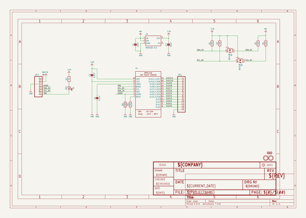
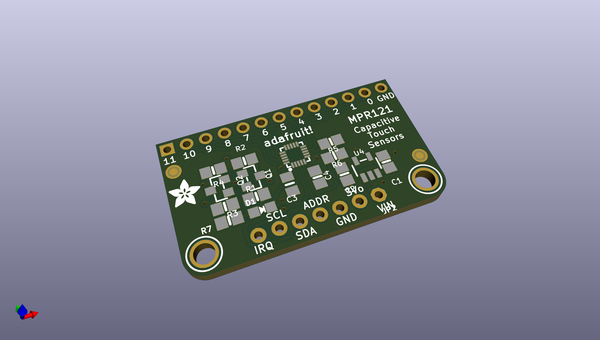
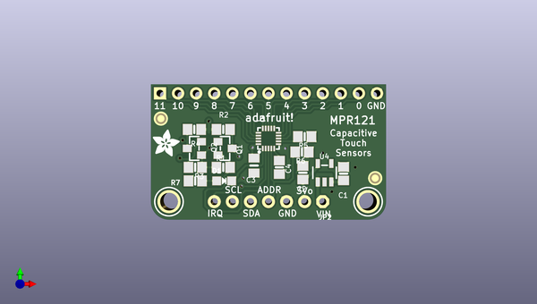
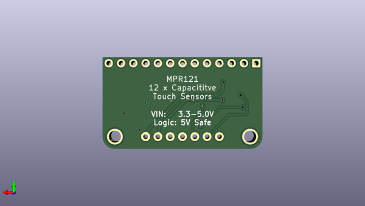

# adafruit_mpr121_pcb
 
## summary 
* id: adafruit_adafruit_mpr121_pcb_adafruit_mpr121_breakout
* user: adafruit
* name: adafruit_mpr121_pcb
* board: adafruit_mpr121_breakout
* repo: https://github.com/adafruit/Adafruit-MPR121-PCB

* src_file_repo_sch: 
* src_file_repo_sch_link: https://github.com/adafruit/Adafruit-MPR121-PCB/tree/master/
* full details link: https://github.com/oomlout/oomlout_oomp_project_bot_v_2/tree/main/projects/adafruit_adafruit_mpr121_pcb_adafruit_mpr121_breakout/current_version/working  

## schematic  
  
[schematic (pdf)](working_schematic.pdf) 

## pcb  
 
  
  
  
[board (pdf)](working.pdf)  

## working_bom
| Id | Designator | Footprint | Quantity | Designation | Supplier and ref |  | None | 
| --- | --- | --- | --- | --- | --- | --- | --- | 
| 1 | C2,C1 | 0805-NO | 2 | 10uF |  |  | [''] | 
| 2 | U$10,U$11 | MOUNTINGHOLE_2.5_PLATED | 2 | MOUNTINGHOLE2.5 |  |  | [''] | 
| 3 | D1 | CHIPLED_0805_NOOUTLINE | 1 | RED |  |  | [''] | 
| 4 | FID2,FID1 | FIDUCIAL_1MM | 2 | FIDUCIAL" |  |  | [''] | 
| 5 | R7 | 0805-NO | 1 | 1K |  |  | [''] | 
| 6 | C3 | 0805_10MGAP | 1 | 0.1uF |  |  | [''] | 
| 7 | JP1 | 1X13_ROUND_70 | 1 |  |  |  | [''] | 
| 8 | R1,R4,R3,R2 | 0805-NO | 4 | 10K |  |  | [''] | 
| 9 | C4 | 0805-NO | 1 | 0.1uF |  |  | [''] | 
| 10 | R6 | 0805-NO | 1 | 100K |  |  | [''] | 
| 11 | U4 | SOT23-5 | 1 | MIC5225-3.3 |  |  | [''] | 
| 12 | Q2,Q1 | SOT23-WIDE | 2 | BSS138 |  |  | [''] | 
| 13 | JP2 | 1X07_ROUND_70 | 1 |  |  |  | [''] | 
| 14 | U1 | QFN20_3MM_NOTHERMAL | 1 |  |  |  | [''] | 
| 15 | U$14 | ADAFRUIT_3.5MM | 1 |  |  |  | [''] | 
| 16 | R5 | 0805-NO | 1 | 75K |  |  | [''] | 

## bom_schematic
| Ref | Qnty | Value | Cmp name | Footprint | Description | Vendor | DNP | 
| --- | --- | --- | --- | --- | --- | --- | --- | 
| C1, C2 | 2 | 10uF | CAP_CERAMIC0805-NOOUTLINE | working:0805-NO |  |  |  | 
| C3 | 1 | 0.1uF | CAP_CERAMIC0805_10MGAP | working:0805_10MGAP |  |  |  | 
| C4 | 1 | 0.1uF | CAP_CERAMIC0805-NOOUTLINE | working:0805-NO |  |  |  | 
| D1 | 1 | RED | LED0805_NOOUTLINE | working:CHIPLED_0805_NOOUTLINE |  |  |  | 
| FID1, FID2 | 2 | FIDUCIAL"" | FIDUCIAL{dblquote}{dblquote} | working:FIDUCIAL_1MM |  |  |  | 
| JP1 | 1 | HEADER-1X13 | HEADER-1X13 | working:1X13_ROUND_70 |  |  |  | 
| JP2 | 1 | HEADER-1X770MIL | HEADER-1X770MIL | working:1X07_ROUND_70 |  |  |  | 
| Q1, Q2 | 2 | BSS138 | MOSFET-NWIDE | working:SOT23-WIDE |  |  |  | 
| R1, R2, R3, R4 | 4 | 10K | RESISTOR0805_NOOUTLINE | working:0805-NO |  |  |  | 
| R5 | 1 | 75K | RESISTOR0805_NOOUTLINE | working:0805-NO |  |  |  | 
| R6 | 1 | 100K | RESISTOR0805_NOOUTLINE | working:0805-NO |  |  |  | 
| R7 | 1 | 1K | RESISTOR0805_NOOUTLINE | working:0805-NO |  |  |  | 
| U1 | 1 | MPR121Q | MPR121Q | working:QFN20_3MM_NOTHERMAL |  |  |  | 
| U4 | 1 | MIC5225-3.3 | VREG_SOT23-5 | working:SOT23-5 |  |  |  | 
| U$10, U$11 | 2 | MOUNTINGHOLE2.5 | MOUNTINGHOLE2.5 | working:MOUNTINGHOLE_2.5_PLATED |  |  |  | 

## mounting_holes
| x | y | package | value | ref | size | 
| --- | --- | --- | --- | --- | --- | 
| 0.0 | 0.0 | MOUNTINGHOLE_2.5_PLATED | MOUNTINGHOLE2.5 | U$10 | m3 | 
| 27.94 | 0.0 | MOUNTINGHOLE_2.5_PLATED | MOUNTINGHOLE2.5 | U$11 | m3 | 

