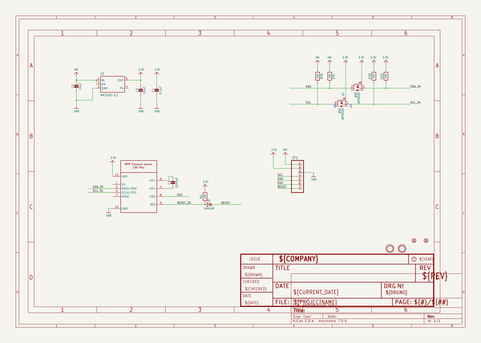
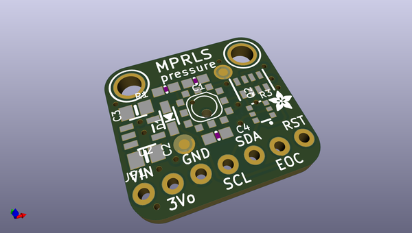
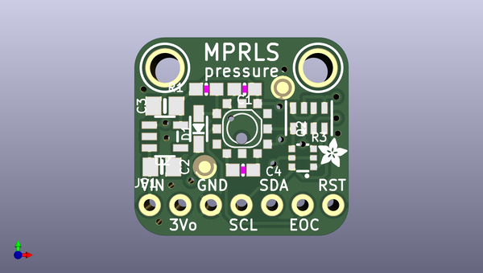
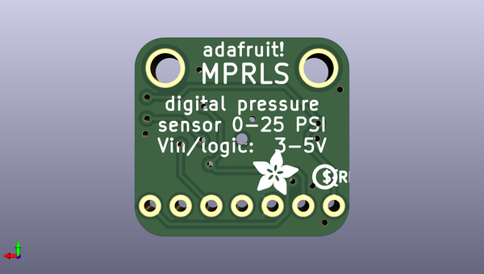

# adafruit_mprls_pressure_sensor_breakout_pcb
 
## summary 
* id: adafruit_adafruit_mprls_pressure_sensor_breakout_pcb_adafruit_mpr_pressure_sensor
* user: adafruit
* name: adafruit_mprls_pressure_sensor_breakout_pcb
* board: adafruit_mpr_pressure_sensor
* repo: https://github.com/adafruit/Adafruit-MPRLS-Pressure-Sensor-Breakout-PCB

* src_file_repo_sch: 
* src_file_repo_sch_link: https://github.com/adafruit/Adafruit-MPRLS-Pressure-Sensor-Breakout-PCB/tree/master/
* full details link: https://github.com/oomlout/oomlout_oomp_project_bot_v_2/tree/main/projects/adafruit_adafruit_mprls_pressure_sensor_breakout_pcb_adafruit_mpr_pressure_sensor/current_version/working  

## schematic  
  
[schematic (pdf)](working_schematic.pdf) 

## pcb  
 
  
  
  
[board (pdf)](working.pdf)  

## working_bom
| Id | Designator | Footprint | Quantity | Designation | Supplier and ref |  | None | 
| --- | --- | --- | --- | --- | --- | --- | --- | 
| 1 | U2 | SOT23-5 | 1 | MIC5225-3.3 |  |  | [''] | 
| 2 | FID2,FID1 | FIDUCIAL_1MM | 2 | FIDUCIAL_1MM |  |  | [''] | 
| 3 | JP1 | 1X07_ROUND_70 | 1 |  |  |  | [''] | 
| 4 | Q2 | SOT363 | 1 | 2N7002D |  |  | [''] | 
| 5 | C1 | 0603-NO | 1 | 0.1uF |  |  | [''] | 
| 6 | U$4,U$3 | MOUNTINGHOLE_2.5_PLATED | 2 | MOUNTINGHOLE2.5 |  |  | [''] | 
| 7 | C3,C2 | 0805-NO | 2 | 10uF |  |  | [''] | 
| 8 | C4 | 0603-NO | 1 | 1000pF |  |  | [''] | 
| 9 | U$18 | MPR_SERIES_I2C_PRESSURE | 1 | MPR_SERIES_I2C_PRESSURE |  |  | [''] | 
| 10 | R1 | 0603-NO | 1 | 10K |  |  | [''] | 
| 11 | U$8 | ADAFRUIT_2.5MM | 1 |  |  |  | [''] | 
| 12 | R3 | RESPACK_4X0603 | 1 | 10K |  |  | [''] | 
| 13 | D1 | SOD-323 | 1 | 1N4148 |  |  | [''] | 
| 14 | U$1 | ADAFRUIT_3.5MM | 1 |  |  |  | [''] | 
| 15 | U$27 | PCBFEAT-REV-040 | 1 |  |  |  | [''] | 

## bom_schematic
| Ref | Qnty | Value | Cmp name | Footprint | Description | Vendor | DNP | 
| --- | --- | --- | --- | --- | --- | --- | --- | 
| C1 | 1 | 0.1uF | CAP_CERAMIC0603_NO | working:0603-NO |  |  |  | 
| C2, C3 | 2 | 10uF | CAP_CERAMIC0805-NOOUTLINE | working:0805-NO |  |  |  | 
| C4 | 1 | 1000pF | CAP_CERAMIC0603_NO | working:0603-NO |  |  |  | 
| D1 | 1 | 1N4148 | DIODESOD-323 | working:SOD-323 |  |  |  | 
| FID1, FID2 | 2 | FIDUCIAL_1MM | FIDUCIAL_1MM | working:FIDUCIAL_1MM |  |  |  | 
| JP1 | 1 | HEADER-1X770MIL | HEADER-1X770MIL | working:1X07_ROUND_70 |  |  |  | 
| Q2 | 1 | 2N7002D | MOSFET-N_DUAL | working:SOT363 |  |  |  | 
| R1 | 1 | 10K | RESISTOR_0603_NOOUT | working:0603-NO |  |  |  | 
| R3 | 1 | 10K | RESISTOR_4PACK | working:RESPACK_4X0603 |  |  |  | 
| U2 | 1 | MIC5225-3.3 | VREG_SOT23-5 | working:SOT23-5 |  |  |  | 
| U$3, U$4 | 2 | MOUNTINGHOLE2.5 | MOUNTINGHOLE2.5 | working:MOUNTINGHOLE_2.5_PLATED |  |  |  | 
| U$18 | 1 | MPR_SERIES_I2C_PRESSURE | MPR_SERIES_I2C_PRESSURE | working:MPR_SERIES_I2C_PRESSURE |  |  |  | 

## mounting_holes
| x | y | package | value | ref | size | 
| --- | --- | --- | --- | --- | --- | 
| 0.0 | 0.0 | MOUNTINGHOLE_2.5_PLATED | MOUNTINGHOLE2.5 | U$3 | m3 | 
| 12.7 | 0.0 | MOUNTINGHOLE_2.5_PLATED | MOUNTINGHOLE2.5 | U$4 | m3 | 

