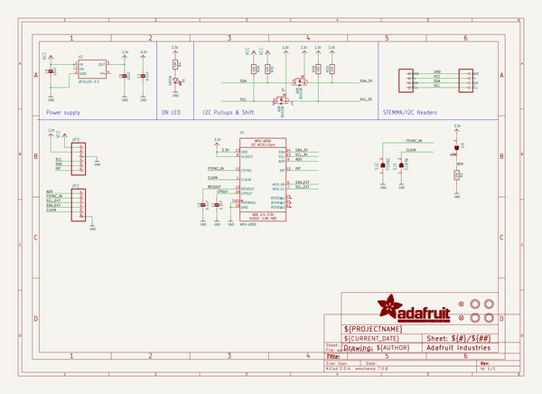
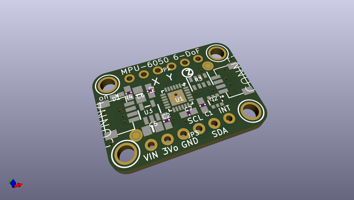
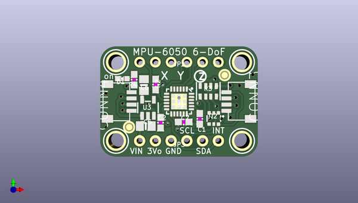
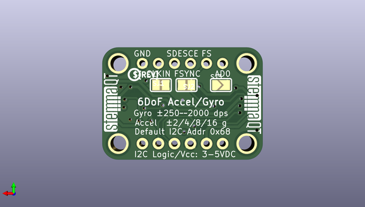

# adafruit_mpu6050_pcb
 
## summary 
* id: adafruit_adafruit_mpu6050_pcb_adafruit_mpu6050
* user: adafruit
* name: adafruit_mpu6050_pcb
* board: adafruit_mpu6050
* repo: https://github.com/adafruit/Adafruit-MPU6050-PCB

* src_file_repo_sch: 
* src_file_repo_sch_link: https://github.com/adafruit/Adafruit-MPU6050-PCB/tree/master/
* full details link: https://github.com/oomlout/oomlout_oomp_project_bot_v_2/tree/main/projects/adafruit_adafruit_mpu6050_pcb_adafruit_mpu6050/current_version/working  

## schematic  
  
[schematic (pdf)](working_schematic.pdf)  

## pcb  
 
  
  
  
[board (pdf)](working.pdf)  

## working_bom
| Id | Designator | Footprint | Quantity | Designation | Supplier and ref |  | None | 
| --- | --- | --- | --- | --- | --- | --- | --- | 
| 1 | C7,C2 | 0603-NO | 2 | 0.1uF |  |  | [''] | 
| 2 | FID4,FID3 | FIDUCIAL_1MM | 2 | FIDUCIAL_1MM |  |  | [''] | 
| 3 | R3 | RESPACK_4X0603 | 1 | 10K |  |  | [''] | 
| 4 | R2,R4 | 0603-NO | 2 | 10K |  |  | [''] | 
| 5 | JP3 | 1X06_ROUND_70 | 1 |  |  |  | [''] | 
| 6 | C5,C6 | 0805-NO | 2 | 10uF |  |  | [''] | 
| 7 | CONN4,CONN3 | JST_SH4 | 2 | STEMMA_I2C_QT |  |  | [''] | 
| 8 | D1 | CHIPLED_0603_NOOUTLINE | 1 | GREEN |  |  | [''] | 
| 9 | U$39,U$40,U$43,U$42 | MOUNTINGHOLE_2.5_PLATED | 4 | MOUNTINGHOLE2.5 |  |  | [''] | 
| 10 | JP2 | 1X06_ROUND | 1 |  |  |  | [''] | 
| 11 | U3 | SOT23-5 | 1 | AP2112K-3.3 |  |  | [''] | 
| 12 | C1 | 0603-NO | 1 | 2.2nF |  |  | [''] | 
| 13 | U1 | QFN24_4MM_SMSC | 1 | MPU-6050 |  |  | [''] | 
| 14 | Q2 | SOT363 | 1 | BSS138 |  |  | [''] | 
| 15 | SJ3 | SOLDERJUMPER_ARROW_NOPASTE | 1 |  |  |  | [''] | 
| 16 | SJ2 | SOLDERJUMPER_CLOSEDWIRE | 1 | FSYNC |  |  | [''] | 
| 17 | SJ1 | SOLDERJUMPER_CLOSEDWIRE | 1 | CLKIN |  |  | [''] | 
| 18 | U$48,U$47 | STEMMAQT | 2 |  |  |  | [''] | 
| 19 | U$46 | PCBFEAT-REV-040 | 1 |  |  |  | [''] | 

## bom_schematic
| Ref | Qnty | Value | Cmp name | Footprint | Description | Vendor | DNP | 
| --- | --- | --- | --- | --- | --- | --- | --- | 
| C1 | 1 | 2.2nF | CAP_CERAMIC0603_NO | working:0603-NO |  |  |  | 
| C2, C7 | 2 | 0.1uF | CAP_CERAMIC0603_NO | working:0603-NO |  |  |  | 
| C5, C6 | 2 | 10uF | CAP_CERAMIC0805-NOOUTLINE | working:0805-NO |  |  |  | 
| CONN3, CONN4 | 2 | STEMMA_I2C_QT | STEMMA_I2C_QT | working:JST_SH4 |  |  |  | 
| D1 | 1 | GREEN | LED0603_NOOUTLINE | working:CHIPLED_0603_NOOUTLINE |  |  |  | 
| FID3, FID4 | 2 | FIDUCIAL_1MM | FIDUCIAL_1MM | working:FIDUCIAL_1MM |  |  |  | 
| JP2 | 1 | HEADER-1X6ROUND | HEADER-1X6ROUND | working:1X06_ROUND |  |  |  | 
| JP3 | 1 | HEADER-1X670MIL | HEADER-1X670MIL | working:1X06_ROUND_70 |  |  |  | 
| Q2 | 1 | BSS138 | MOSFET-N_DUAL | working:SOT363 |  |  |  | 
| R2, R4 | 2 | 10K | RESISTOR_0603_NOOUT | working:0603-NO |  |  |  | 
| R3 | 1 | 10K | RESISTOR_4PACK | working:RESPACK_4X0603 |  |  |  | 
| SJ1 | 1 | CLKIN | SOLDERJUMPER_CLOSED | working:SOLDERJUMPER_CLOSEDWIRE |  |  |  | 
| SJ2 | 1 | FSYNC | SOLDERJUMPER_CLOSED | working:SOLDERJUMPER_CLOSEDWIRE |  |  |  | 
| SJ3 | 1 | SOLDERJUMPER | SOLDERJUMPER | working:SOLDERJUMPER_ARROW_NOPASTE |  |  |  | 
| U1 | 1 | MPU-6050 | MPU-6050 | working:QFN24_4MM_SMSC |  |  |  | 
| U3 | 1 | AP2112K-3.3 | VREG_SOT23-5 | working:SOT23-5 |  |  |  | 
| U$39, U$40, U$42, U$43 | 4 | MOUNTINGHOLE2.5 | MOUNTINGHOLE2.5 | working:MOUNTINGHOLE_2.5_PLATED |  |  |  | 

## mounting_holes
| x | y | package | value | ref | size | 
| --- | --- | --- | --- | --- | --- | 
| 0.0 | 12.700000000000003 | MOUNTINGHOLE_2.5_PLATED | MOUNTINGHOLE2.5 | U$39 | m3 | 
| 20.319999999999993 | 12.700000000000003 | MOUNTINGHOLE_2.5_PLATED | MOUNTINGHOLE2.5 | U$40 | m3 | 
| 0.0 | 0.0 | MOUNTINGHOLE_2.5_PLATED | MOUNTINGHOLE2.5 | U$42 | m3 | 
| 20.319999999999993 | 0.0 | MOUNTINGHOLE_2.5_PLATED | MOUNTINGHOLE2.5 | U$43 | m3 | 

