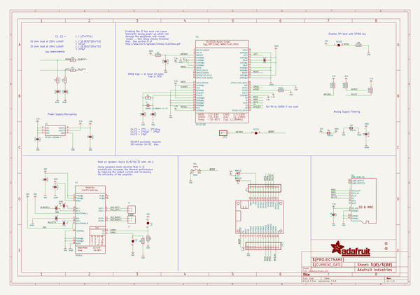
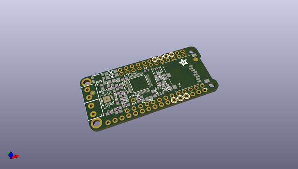
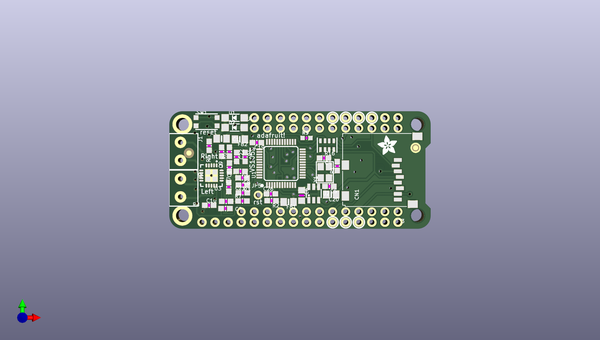
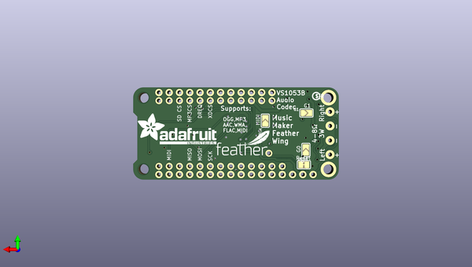

# adafruit_music_maker_featherwing_pcb
 
## summary 
* id: adafruit_adafruit_music_maker_featherwing_pcb_adafruit_vs1053_amp_featherwing
* user: adafruit
* name: adafruit_music_maker_featherwing_pcb
* board: adafruit_vs1053_amp_featherwing
* repo: https://github.com/adafruit/Adafruit-Music-Maker-FeatherWing-PCB

* src_file_repo_sch: 
* src_file_repo_sch_link: https://github.com/adafruit/Adafruit-Music-Maker-FeatherWing-PCB/tree/master/
* full details link: https://github.com/oomlout/oomlout_oomp_project_bot_v_2/tree/main/projects/adafruit_adafruit_music_maker_featherwing_pcb_adafruit_vs1053_amp_featherwing/current_version/working  

## schematic  
  
[schematic (pdf)](working_schematic.pdf)  

## pcb  
 
  
  
  
[board (pdf)](working.pdf)  

## working_bom
| Id | Designator | Footprint | Quantity | Designation | Supplier and ref |  | None | 
| --- | --- | --- | --- | --- | --- | --- | --- | 
| 1 | J1,J2 | TERMBLOCK_1X2-3.5MM | 2 | 3.5mm |  |  | [''] | 
| 2 | C19,C9,C11,C7,C10 | 0603-NO | 5 | 1µF |  |  | [''] | 
| 3 | R6,R7 | 0603-NO | 2 | 100 |  |  | [''] | 
| 4 | R2,R5,R8 | 0603-NO | 3 | 100K |  |  | [''] | 
| 5 | R4,R3 | 0603-NO | 2 | 22 |  |  | [''] | 
| 6 | R16 | RESPACK_4X0603 | 1 | 100K |  |  | [''] | 
| 7 | R1 | 0603-NO | 1 | 1M |  |  | [''] | 
| 8 | C20,C1 | 0805-NO | 2 | 10µF |  |  | [''] | 
| 9 | C4,C5 | 0603-NO | 2 | 22pF |  |  | [''] | 
| 10 | D2,D1 | SOD-123 | 2 | MBR120 |  |  | [''] | 
| 11 | Y1 | CRYSTAL_3.2X2.5 | 1 | ABM8G-12.288MHZ-4Y-T3 |  |  | [''] | 
| 12 | U1 | LQFP48 | 1 | VS1053B |  |  | [''] | 
| 13 | FID2,FID1 | FIDUCIAL_1MM | 2 | FIDUCIAL" |  |  | [''] | 
| 14 | JP5 | 1X01_ROUND | 1 |  |  |  | [''] | 
| 15 | MS1 | FEATHERWING_NODIM | 1 | FEATHERWING_NODIM |  |  | [''] | 
| 16 | U3 | WQFN20 | 1 | TPA2012 |  |  | [''] | 
| 17 | C6 | _0805MP | 1 | 10µF |  |  | [''] | 
| 18 | CN1 | MICROSD | 1 | 2908-05WB-M6 |  |  | [''] | 
| 19 | R9 | _0603MP | 1 | 100K |  |  | [''] | 
| 20 | C26,C8,C2 | 0603-NO | 3 | 0.1µF |  |  | [''] | 
| 21 | C22,C21 | 0603-NO | 2 | 10nF |  |  | [''] | 
| 22 | U2 | SOT23-6 | 1 | AP7312-1833W6-7 |  |  | [''] | 
| 23 | SW1 | BTN_KMR2_4.6X2.8 | 1 | KMR2 |  |  | [''] | 
| 24 | C3 | 0603-NO | 1 | 1uF |  |  | [''] | 
| 25 | FB2,FB1 | 0805-NO | 2 | FERITTE |  |  | [''] | 
| 26 | U$36 | ADAFRUIT_3.5MM | 1 |  |  |  | [''] | 
| 27 | JP3 | 1X13_ROUND_70 | 1 |  |  |  | [''] | 
| 28 | JP1 | 1X12_ROUND | 1 |  |  |  | [''] | 
| 29 | MIDI0,G1,G0 | SOLDERJUMPER_ARROW_NOPASTE | 3 |  |  |  | [''] | 
| 30 | U$37 | FEATHERLOGO_SMALL | 1 |  |  |  | [''] | 
| 31 | RST0 | SOLDERJUMPER_CLOSEDWIRE | 1 |  |  |  | [''] | 
| 32 | U$43 | PCBFEAT-REV-040 | 1 |  |  |  | [''] | 
| 33 | U$55 | ADAFRUIT_TEXT_20MM | 1 |  |  |  | [''] | 

## bom_schematic
| Ref | Qnty | Value | Cmp name | Footprint | Description | Vendor | DNP | 
| --- | --- | --- | --- | --- | --- | --- | --- | 
| C1, C20 | 2 | 10µF | CAP_CERAMIC0805-NOOUTLINE | working:0805-NO |  |  |  | 
| C2, C8, C26 | 3 | 0.1µF | CAP_CERAMIC0603_NO | working:0603-NO |  |  |  | 
| C3 | 1 | 1uF | CAP_CERAMIC0603_NO | working:0603-NO |  |  |  | 
| C4, C5 | 2 | 22pF | CAP_CERAMIC0603_NO | working:0603-NO |  |  |  | 
| C6 | 1 | 10µF | CAP_CERAMIC_0805MP | working:_0805MP |  |  |  | 
| C7, C9, C10, C11, C19 | 5 | 1µF | CAP_CERAMIC0603_NO | working:0603-NO |  |  |  | 
| C21, C22 | 2 | 10nF | CAP_CERAMIC0603_NO | working:0603-NO |  |  |  | 
| CN1 | 1 | 2908-05WB-M6 | MICROSD | working:MICROSD |  |  |  | 
| D1, D2 | 2 | MBR120 | DIODE-SCHOTTKYSOD-123 | working:SOD-123 |  |  |  | 
| FB1, FB2 | 2 | FERITTE | FERRITE-0805NO | working:0805-NO |  |  |  | 
| FID1, FID2 | 2 | FIDUCIAL"" | FIDUCIAL{dblquote}{dblquote} | working:FIDUCIAL_1MM |  |  |  | 
| G0, G1 | 2 | SOLDERJUMPER | SOLDERJUMPER | working:SOLDERJUMPER_ARROW_NOPASTE |  |  |  | 
| J1, J2 | 2 | 3.5mm | TERMBLOCK_1X2 | working:TERMBLOCK_1X2-3.5MM |  |  |  | 
| JP1 | 1 | HEADER-1X12 | HEADER-1X12 | working:1X12_ROUND |  |  |  | 
| JP3 | 1 | HEADER-1X13 | HEADER-1X13 | working:1X13_ROUND_70 |  |  |  | 
| JP5 | 1 | HEADER-1X1ROUND | HEADER-1X1ROUND | working:1X01_ROUND |  |  |  | 
| MIDI0 | 1 | SOLDERJUMPER | SOLDERJUMPER | working:SOLDERJUMPER_ARROW_NOPASTE |  |  |  | 
| MS1 | 1 | FEATHERWING_NODIM | FEATHERWING_NODIM | working:FEATHERWING_NODIM |  |  |  | 
| R1 | 1 | 1M | RESISTOR_0603_NOOUT | working:0603-NO |  |  |  | 
| R2, R5, R8 | 3 | 100K | RESISTOR_0603_NOOUT | working:0603-NO |  |  |  | 
| R3, R4 | 2 | 22 | RESISTOR_0603_NOOUT | working:0603-NO |  |  |  | 
| R6, R7 | 2 | 100 | RESISTOR_0603_NOOUT | working:0603-NO |  |  |  | 
| R9 | 1 | 100K | RESISTOR_0603MP | working:_0603MP |  |  |  | 
| R16 | 1 | 100K | RESISTOR_4PACK | working:RESPACK_4X0603 |  |  |  | 
| RST0 | 1 | SOLDERJUMPERCLOSED | SOLDERJUMPERCLOSED | working:SOLDERJUMPER_CLOSEDWIRE |  |  |  | 
| SW1 | 1 | KMR2 | SWITCH_TACT_SMT4.6X2.8 | working:BTN_KMR2_4.6X2.8 |  |  |  | 
| U1 | 1 | VS1053B | VS1053B | working:LQFP48 |  |  |  | 
| U2 | 1 | AP7312-1833W6-7 | VREG_SOT23-6_DUALAP7312 | working:SOT23-6 |  |  |  | 
| U3 | 1 | TPA2012 | AUDIOAMP_TPA2012D2 | working:WQFN20 |  |  |  | 
| Y1 | 1 | ABM8G-12.288MHZ-4Y-T3 | CRYSTAL3.2X2.5 | working:CRYSTAL_3.2X2.5 |  |  |  | 

