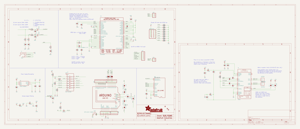
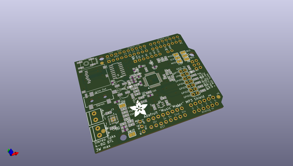
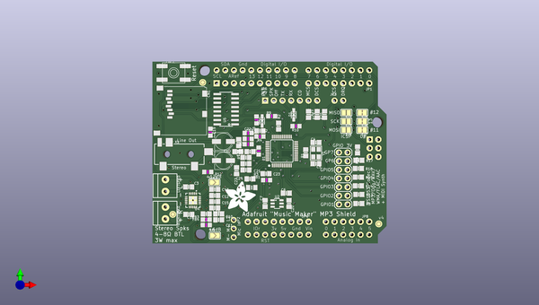
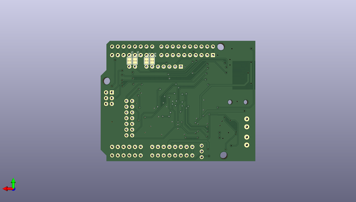

# adafruit_music_maker_mp3_shield_pcb
 
## summary 
* id: adafruit_adafruit_music_maker_mp3_shield_pcb_adafruit_music_maker_mp3_shield
* user: adafruit
* name: adafruit_music_maker_mp3_shield_pcb
* board: adafruit_music_maker_mp3_shield
* repo: https://github.com/adafruit/Adafruit-Music-Maker-MP3-Shield-PCB

* src_file_repo_sch: 
* src_file_repo_sch_link: https://github.com/adafruit/Adafruit-Music-Maker-MP3-Shield-PCB/tree/master/
* full details link: https://github.com/oomlout/oomlout_oomp_project_bot_v_2/tree/main/projects/adafruit_adafruit_music_maker_mp3_shield_pcb_adafruit_music_maker_mp3_shield/current_version/working  

## schematic  
  
[schematic (pdf)](working_schematic.pdf)  

## pcb  
 
  
  
  
[board (pdf)](working.pdf)  

## working_bom
| Id | Designator | Footprint | Quantity | Designation | Supplier and ref |  | None | 
| --- | --- | --- | --- | --- | --- | --- | --- | 
| 1 | FB1,FB2 | _0805MP | 2 | FERITTE |  |  | [''] | 
| 2 | LEFTSPK0,RIGHTSPK0 | TERMBLOCK_1X2-3.5MM | 2 | 3.5mm Term |  |  | [''] | 
| 3 | FID2,FID1,FID3 | FIDUCIAL_1MM | 3 | FIDUCIAL" |  |  | [''] | 
| 4 | C10,C9,C11 | 0805-NO | 3 | 0.1µF |  |  | [''] | 
| 5 | @HOLE1,@HOLE2,@HOLE0 |  | 3 |  |  |  | [''] | 
| 6 | R13,R8,R17,R2,R18,R15,R14,R16 | 0805-NO | 8 | 100K |  |  | [''] | 
| 7 | C15,C12,C13,C14,C17 | 0805-NO | 5 | 1µF |  |  | [''] | 
| 8 | SJ5 | SOLDERJUMPER_CLOSEDWIRE | 1 | D12_MISO |  |  | [''] | 
| 9 | C6,C7,C3,C20,C16 | 0805-NO | 5 | 10µF |  |  | [''] | 
| 10 | U$41 | ARDUINOR3_ICSP | 1 | ARDUINO_R3_ICSP |  |  | [''] | 
| 11 | C27,C28,C21 | 0805-NO | 3 | 0.01uF |  |  | [''] | 
| 12 | R1 | 0805-NO | 1 | 1M |  |  | [''] | 
| 13 | C4,C5 | 0805-NO | 2 | 15pF |  |  | [''] | 
| 14 | JP1,JP4 | 1X08-CLEANBIG | 2 |  |  |  | [''] | 
| 15 | R7 | 0805-NO | 1 | 100 |  |  | [''] | 
| 16 | X1 | 4UCONN_19269 | 1 | 19621 |  |  | [''] | 
| 17 | SJ2 | SOLDERJUMPER_REFLOW_NOPASTE | 1 | ICSP_MISO |  |  | [''] | 
| 18 | C8,C26 | _0805MP | 2 | 0.1µF |  |  | [''] | 
| 19 | R3 | 0805-NO | 1 | 22 |  |  | [''] | 
| 20 | C24 | 0805_10MGAP | 1 | 0.1uF |  |  | [''] | 
| 21 | C1,C2 | PANASONIC_C | 2 | 220uF |  |  | [''] | 
| 22 | JP3 | 1X02_ROUND | 1 |  |  |  | [''] | 
| 23 | U$50 | ADAFRUIT_9MM | 1 |  |  |  | [''] | 
| 24 | SW2 | EVQ-Q2 | 1 | SPST_TACT-EVQQ2 |  |  | [''] | 
| 25 | R21,R20,R19 | 0805-NO | 3 | 10K |  |  | [''] | 
| 26 | U1 | LQFP48 | 1 | VS1053B |  |  | [''] | 
| 27 | FB3,FB4 | _0805MP | 2 | ferrite |  |  | [''] | 
| 28 | R5 | 0805-NO | 1 | 10 |  |  | [''] | 
| 29 | MP3GPIO0 | 2X07_ROUND_70MIL | 1 |  |  |  | [''] | 
| 30 | SJ4 | SOLDERJUMPER_REFLOW_NOPASTE | 1 | ICSP_MOSI |  |  | [''] | 
| 31 | SJ1 | SOLDERJUMPER_ARROW_NOPASTE | 1 | +6dB |  |  | [''] | 
| 32 | JP7 | 1X07_ROUND_70 | 1 |  |  |  | [''] | 
| 33 | JP2 | 1X03-CLEANBIG | 1 |  |  |  | [''] | 
| 34 | C22 | _0805MP | 1 | 0.01uF |  |  | [''] | 
| 35 | Y1 | CRYSTAL_3.2X2.5 | 1 | ABM8G-12.288MHZ-4Y-T3 |  |  | [''] | 
| 36 | JP8 | 1X06-CLEANBIG | 1 |  |  |  | [''] | 
| 37 | R10,R9 | _0805MP | 2 | 10K |  |  | [''] | 
| 38 | C18 | 0805-NO | 1 | 0.047uF |  |  | [''] | 
| 39 | JP6 | 1X10_ROUND70 | 1 |  |  |  | [''] | 
| 40 | D2,D1 | SOD-323 | 2 | 1N4148 |  |  | [''] | 
| 41 | SJ12 | SOLDERJUMPER_ARROW_NOPASTE | 1 | +12dB |  |  | [''] | 
| 42 | R12 | _0805MP | 1 | 100K |  |  | [''] | 
| 43 | CN1 | MICROSD | 1 | 2908-05WB-M6 |  |  | [''] | 
| 44 | C23,C25 | 0805-NO | 2 | 0.1uF |  |  | [''] | 
| 45 | R6 | _0805MP | 1 | 100 |  |  | [''] | 
| 46 | U4 | WQFN20 | 1 | TS2012 |  |  | [''] | 
| 47 | SJ7 | SOLDERJUMPER_CLOSEDWIRE | 1 | D11_MOSI |  |  | [''] | 
| 48 | SJ6 | SOLDERJUMPER_CLOSEDWIRE | 1 | D13_SCLK |  |  | [''] | 
| 49 | SJ3 | SOLDERJUMPER_REFLOW_NOPASTE | 1 | ISCP_SCLK |  |  | [''] | 
| 50 | U2 | SOT23-6 | 1 | AP7312-1833W6-7 |  |  | [''] | 
| 51 | U5 | SOIC16 | 1 | 74HC4050D |  |  | [''] | 
| 52 | R4 | _0805MP | 1 | 22 |  |  | [''] | 
| 53 | C19 | _0805MP | 1 | 10µF |  |  | [''] | 
| 54 | SJ11,SJ10,SJ8,SJ9 | SOLDERJUMPER_CLOSEDWIRE | 4 |  |  |  | [''] | 

## bom_schematic
| Ref | Qnty | Value | Cmp name | Footprint | Description | Vendor | DNP | 
| --- | --- | --- | --- | --- | --- | --- | --- | 
| C1, C2 | 2 | 220uF | CPOL-USC | working:PANASONIC_C |  |  |  | 
| C3, C6, C7, C16, C20 | 5 | 10µF | CAP_CERAMIC0805-NOOUTLINE | working:0805-NO |  |  |  | 
| C4, C5 | 2 | 15pF | CAP_CERAMIC0805-NOOUTLINE | working:0805-NO |  |  |  | 
| C8, C26 | 2 | 0.1µF | CAP_CERAMIC_0805MP | working:_0805MP |  |  |  | 
| C9, C10, C11 | 3 | 0.1µF | CAP_CERAMIC0805-NOOUTLINE | working:0805-NO |  |  |  | 
| C12, C13, C14, C15, C17 | 5 | 1µF | CAP_CERAMIC0805-NOOUTLINE | working:0805-NO |  |  |  | 
| C18 | 1 | 0.047uF | CAP_CERAMIC0805-NOOUTLINE | working:0805-NO |  |  |  | 
| C19 | 1 | 10µF | CAP_CERAMIC_0805MP | working:_0805MP |  |  |  | 
| C21, C27, C28 | 3 | 0.01uF | CAP_CERAMIC0805-NOOUTLINE | working:0805-NO |  |  |  | 
| C22 | 1 | 0.01uF | CAP_CERAMIC_0805MP | working:_0805MP |  |  |  | 
| C23, C25 | 2 | 0.1uF | CAP_CERAMIC0805-NOOUTLINE | working:0805-NO |  |  |  | 
| C24 | 1 | 0.1uF | CAP_CERAMIC0805_10MGAP | working:0805_10MGAP |  |  |  | 
| CN1 | 1 | 2908-05WB-M6 | MICROSD | working:MICROSD |  |  |  | 
| D1, D2 | 2 | 1N4148 | DIODESOD-323 | working:SOD-323 |  |  |  | 
| FB1, FB2 | 2 | FERITTE | FERRITE_0805MP | working:_0805MP |  |  |  | 
| FB3, FB4 | 2 | ferrite | FERRITE_0805MP | working:_0805MP |  |  |  | 
| FID1, FID2, FID3 | 3 | FIDUCIAL"" | FIDUCIAL{dblquote}{dblquote} | working:FIDUCIAL_1MM |  |  |  | 
| JP1, JP4 | 2 | PINHD-1X8CLEANBIG | PINHD-1X8CLEANBIG | working:1X08-CLEANBIG |  |  |  | 
| JP2 | 1 | PINHD-1X3CB | PINHD-1X3CB | working:1X03-CLEANBIG |  |  |  | 
| JP3 | 1 | HEADER-1X2ROUND | HEADER-1X2ROUND | working:1X02_ROUND |  |  |  | 
| JP6 | 1 | HEADER-1X1070MIL | HEADER-1X1070MIL | working:1X10_ROUND70 |  |  |  | 
| JP7 | 1 | HEADER-1X770MIL | HEADER-1X770MIL | working:1X07_ROUND_70 |  |  |  | 
| JP8 | 1 | PINHD-1X6CB | PINHD-1X6CB | working:1X06-CLEANBIG |  |  |  | 
| LEFTSPK0 | 1 | 3.5mm Term | TERMBLOCK_1X2 | working:TERMBLOCK_1X2-3.5MM |  |  |  | 
| MP3GPIO0 | 1 | HEADER-2X7_ROUND_70MIL | HEADER-2X7_ROUND_70MIL | working:2X07_ROUND_70MIL |  |  |  | 
| R1 | 1 | 1M | RESISTOR0805_NOOUTLINE | working:0805-NO |  |  |  | 
| R2, R8, R13, R14, R15, R16, R17, R18 | 8 | 100K | RESISTOR0805_NOOUTLINE | working:0805-NO |  |  |  | 
| R3 | 1 | 22 | RESISTOR0805_NOOUTLINE | working:0805-NO |  |  |  | 
| R4 | 1 | 22 | RESISTOR_0805MP | working:_0805MP |  |  |  | 
| R5 | 1 | 10 | RESISTOR0805_NOOUTLINE | working:0805-NO |  |  |  | 
| R6 | 1 | 100 | RESISTOR_0805MP | working:_0805MP |  |  |  | 
| R7 | 1 | 100 | RESISTOR0805_NOOUTLINE | working:0805-NO |  |  |  | 
| R9, R10 | 2 | 10K | RESISTOR_0805MP | working:_0805MP |  |  |  | 
| R12 | 1 | 100K | RESISTOR_0805MP | working:_0805MP |  |  |  | 
| R19, R20, R21 | 3 | 10K | RESISTOR0805_NOOUTLINE | working:0805-NO |  |  |  | 
| RIGHTSPK0 | 1 | 3.5mm Term | TERMBLOCK_1X2 | working:TERMBLOCK_1X2-3.5MM |  |  |  | 
| SJ1 | 1 | +6dB | SOLDERJUMPER | working:SOLDERJUMPER_ARROW_NOPASTE |  |  |  | 
| SJ2 | 1 | ICSP_MISO | SOLDERJUMPERREFLOW_NOPASTE | working:SOLDERJUMPER_REFLOW_NOPASTE |  |  |  | 
| SJ3 | 1 | ISCP_SCLK | SOLDERJUMPERREFLOW_NOPASTE | working:SOLDERJUMPER_REFLOW_NOPASTE |  |  |  | 
| SJ4 | 1 | ICSP_MOSI | SOLDERJUMPERREFLOW_NOPASTE | working:SOLDERJUMPER_REFLOW_NOPASTE |  |  |  | 
| SJ5 | 1 | D12_MISO | SOLDERJUMPERCLOSED | working:SOLDERJUMPER_CLOSEDWIRE |  |  |  | 
| SJ6 | 1 | D13_SCLK | SOLDERJUMPERCLOSED | working:SOLDERJUMPER_CLOSEDWIRE |  |  |  | 
| SJ7 | 1 | D11_MOSI | SOLDERJUMPERCLOSED | working:SOLDERJUMPER_CLOSEDWIRE |  |  |  | 
| SJ8, SJ9, SJ10, SJ11 | 4 | SOLDERJUMPERCLOSED | SOLDERJUMPERCLOSED | working:SOLDERJUMPER_CLOSEDWIRE |  |  |  | 
| SJ12 | 1 | +12dB | SOLDERJUMPER | working:SOLDERJUMPER_ARROW_NOPASTE |  |  |  | 
| SW2 | 1 | SPST_TACT-EVQQ2 | SPST_TACT-EVQQ2 | working:EVQ-Q2 |  |  |  | 
| U1 | 1 | VS1053B | VS1053B | working:LQFP48 |  |  |  | 
| U2 | 1 | AP7312-1833W6-7 | VREG_SOT23-6_DUALAP7312 | working:SOT23-6 |  |  |  | 
| U4 | 1 | TS2012 | AUDIOAMP_TPA2012D2 | working:WQFN20 |  |  |  | 
| U5 | 1 | 74HC4050D | 74HC4050D | working:SOIC16 |  |  |  | 
| U$41 | 1 | ARDUINO_R3_ICSP | ARDUINO_R3_ICSP | working:ARDUINOR3_ICSP |  |  |  | 
| X1 | 1 | 19621 | AUDIO_3.5MMJACK | working:4UCONN_19269 |  |  |  | 
| Y1 | 1 | ABM8G-12.288MHZ-4Y-T3 | CRYSTAL3.2X2.5 | working:CRYSTAL_3.2X2.5 |  |  |  | 

