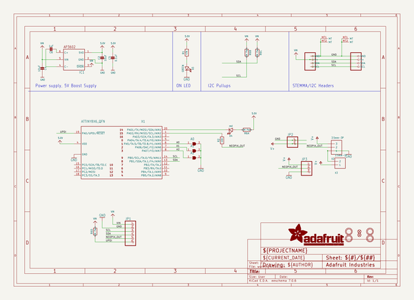
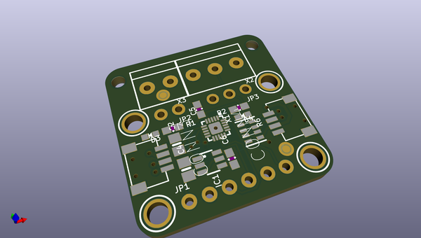
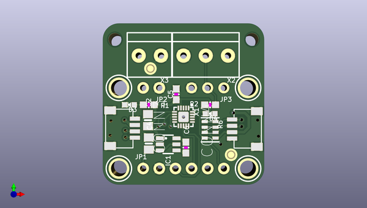
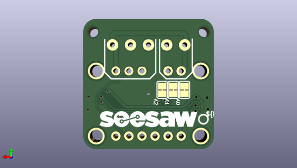

# adafruit_neodriver_stemma_qt_pcb
 
## summary 
* id: adafruit_adafruit_neodriver_stemma_qt_pcb_adafruit_neodriver_stemma_qt
* user: adafruit
* name: adafruit_neodriver_stemma_qt_pcb
* board: adafruit_neodriver_stemma_qt
* repo: https://github.com/adafruit/Adafruit-NeoDriver-STEMMA-QT-PCB

* src_file_repo_sch: 
* src_file_repo_sch_link: https://github.com/adafruit/Adafruit-NeoDriver-STEMMA-QT-PCB/tree/main/
* full details link: https://github.com/oomlout/oomlout_oomp_project_bot_v_2/tree/main/projects/adafruit_adafruit_neodriver_stemma_qt_pcb_adafruit_neodriver_stemma_qt/current_version/working  

## schematic  
  
[schematic (pdf)](working_schematic.pdf) 

## pcb  
 
  
  
  
[board (pdf)](working.pdf)  

## working_bom
| Id | Designator | Footprint | Quantity | Designation | Supplier and ref |  | None | 
| --- | --- | --- | --- | --- | --- | --- | --- | 
| 1 | FID2,FID1 | FIDUCIAL_1MM | 2 | FIDUCIAL_1MM |  |  | [''] | 
| 2 | PLABEL13 | PLABEL13 | 1 |  |  |  | [''] | 
| 3 | PLABEL15 | PLABEL15 | 1 |  |  |  | [''] | 
| 4 | PLABEL10 | PLABEL10 | 1 |  |  |  | [''] | 
| 5 | PLABEL4 | PLABEL4 | 1 |  |  |  | [''] | 
| 6 | JP3 | 1X03_ROUND | 1 |  |  |  | [''] | 
| 7 | PLABEL12 | PLABEL12 | 1 |  |  |  | [''] | 
| 8 | R6 | RESPACK_4X0603 | 1 | 10K Pack |  |  | [''] | 
| 9 | PLABEL7 | PLABEL7 | 1 |  |  |  | [''] | 
| 10 | CONN4,CONN3 | JST_SH4 | 2 | STEMMA_I2C_QT |  |  | [''] | 
| 11 | PLABEL6 | PLABEL6 | 1 |  |  |  | [''] | 
| 12 | R2 | 0603-NO | 1 | 100 |  |  | [''] | 
| 13 | X2 | TERMBLOCK_1X3-3.5MM | 1 | 3.5mm-3P |  |  | [''] | 
| 14 | C6 | 0603-NO | 1 | 1uF |  |  | [''] | 
| 15 | PLABEL2 | PLABEL2 | 1 |  |  |  | [''] | 
| 16 | U$1,U$9,U$6,U$18 | MOUNTINGHOLE_2.5_PLATED | 4 | MOUNTINGHOLE2.5 |  |  | [''] | 
| 17 | PLABEL0 | PLABEL0 | 1 |  |  |  | [''] | 
| 18 | PLABEL3 | PLABEL3 | 1 |  |  |  | [''] | 
| 19 | PLABEL9 | PLABEL9 | 1 |  |  |  | [''] | 
| 20 | C4,C2 | 0805-NO | 2 | 10uF |  |  | [''] | 
| 21 | PLABEL16 | PLABEL16 | 1 |  |  |  | [''] | 
| 22 | PLABEL8 | PLABEL8 | 1 |  |  |  | [''] | 
| 23 | D4 | CHIPLED_0603_NOOUTLINE | 1 | red |  |  | [''] | 
| 24 | PLABEL14 | PLABEL14 | 1 |  |  |  | [''] | 
| 25 | IC1 | SOT23-6 | 1 | AP3602 |  |  | [''] | 
| 26 | X3 | TERMBLOCK_1X2-3.5MM | 1 | 3.5mm-2P |  |  | [''] | 
| 27 | PLABEL11 | PLABEL11 | 1 |  |  |  | [''] | 
| 28 | JP2 | 1X02_ROUND | 1 |  |  |  | [''] | 
| 29 | PLABEL5 | PLABEL5 | 1 |  |  |  | [''] | 
| 30 | @HOLE0,@HOLE1 |  | 2 |  |  |  | [''] | 
| 31 | D3 | CHIPLED_0603_NOOUTLINE | 1 | GREEN |  |  | [''] | 
| 32 | PLABEL17 | PLABEL17 | 1 |  |  |  | [''] | 
| 33 | R1 | 0603-NO | 1 | 47K |  |  | [''] | 
| 34 | PLABEL1 | PLABEL1 | 1 |  |  |  | [''] | 
| 35 | X1 | QFN20_3MM | 1 | ATTINY1616_QFN |  |  | [''] | 
| 36 | JP1 | 1X06_ROUND_70 | 1 |  |  |  | [''] | 
| 37 | C5 | 0603-NO | 1 | 0.1uF |  |  | [''] | 
| 38 | PLABEL22 | PLABEL22 | 1 |  |  |  | [''] | 
| 39 | PLABEL26 | PLABEL26 | 1 |  |  |  | [''] | 
| 40 | PLABEL28 | PLABEL28 | 1 |  |  |  | [''] | 
| 41 | PLABEL19 | PLABEL19 | 1 |  |  |  | [''] | 
| 42 | PLABEL25 | PLABEL25 | 1 |  |  |  | [''] | 
| 43 | U$12 | PCBFEAT-REV-040 | 1 |  |  |  | [''] | 
| 44 | A2,A1,A0 | SOLDERJUMPER_CLOSEDWIRE | 3 |  |  |  | [''] | 
| 45 | PLABEL27 | PLABEL27 | 1 |  |  |  | [''] | 
| 46 | PLABEL24 | PLABEL24 | 1 |  |  |  | [''] | 
| 47 | U$7 | SEESAW_LOGO | 1 |  |  |  | [''] | 
| 48 | PLABEL20 | PLABEL20 | 1 |  |  |  | [''] | 
| 49 | PLABEL23 | PLABEL23 | 1 |  |  |  | [''] | 
| 50 | PLABEL18 | PLABEL18 | 1 |  |  |  | [''] | 
| 51 | PLABEL21 | PLABEL21 | 1 |  |  |  | [''] | 
| 52 | PLABEL29 | PLABEL29 | 1 |  |  |  | [''] | 

## bom_schematic
| Ref | Qnty | Value | Cmp name | Footprint | Description | Vendor | DNP | 
| --- | --- | --- | --- | --- | --- | --- | --- | 
| A0, A1, A2 | 3 | SOLDERJUMPER_CLOSED | SOLDERJUMPER_CLOSED | working:SOLDERJUMPER_CLOSEDWIRE |  |  |  | 
| C2, C4 | 2 | 10uF | CAP_CERAMIC0805-NOOUTLINE | working:0805-NO |  |  |  | 
| C5 | 1 | 0.1uF | CAP_CERAMIC0603_NO | working:0603-NO |  |  |  | 
| C6 | 1 | 1uF | CAP_CERAMIC0603_NO | working:0603-NO |  |  |  | 
| CONN3, CONN4 | 2 | STEMMA_I2C_QT | STEMMA_I2C_QT | working:JST_SH4 |  |  |  | 
| D3 | 1 | GREEN | LED0603_NOOUTLINE | working:CHIPLED_0603_NOOUTLINE |  |  |  | 
| D4 | 1 | red | LED0603_NOOUTLINE | working:CHIPLED_0603_NOOUTLINE |  |  |  | 
| FID1, FID2 | 2 | FIDUCIAL_1MM | FIDUCIAL_1MM | working:FIDUCIAL_1MM |  |  |  | 
| IC1 | 1 | AP3602 | AP3602 | working:SOT23-6 |  |  |  | 
| JP1 | 1 | HEADER-1X670MIL | HEADER-1X670MIL | working:1X06_ROUND_70 |  |  |  | 
| JP2 | 1 | HEADER-1X2ROUND | HEADER-1X2ROUND | working:1X02_ROUND |  |  |  | 
| JP3 | 1 | HEADER-1X3ROUND | HEADER-1X3ROUND | working:1X03_ROUND |  |  |  | 
| R1 | 1 | 47K | RESISTOR_0603_NOOUT | working:0603-NO |  |  |  | 
| R2 | 1 | 100 | RESISTOR_0603_NOOUT | working:0603-NO |  |  |  | 
| R6 | 1 | 10K Pack | RESISTOR_4PACK | working:RESPACK_4X0603 |  |  |  | 
| U$1, U$6, U$9, U$18 | 4 | MOUNTINGHOLE2.5 | MOUNTINGHOLE2.5 | working:MOUNTINGHOLE_2.5_PLATED |  |  |  | 
| X1 | 1 | ATTINY8X6_QFN | ATTINY8X6_QFN | working:QFN20_3MM |  |  |  | 
| X2 | 1 | 3.5mm-3P | TERMBLOCK_1X3 | working:TERMBLOCK_1X3-3.5MM |  |  |  | 
| X3 | 1 | 3.5mm-2P | TERMBLOCK_1X2_3.5MM | working:TERMBLOCK_1X2-3.5MM |  |  |  | 

## mounting_holes
| x | y | package | value | ref | size | 
| --- | --- | --- | --- | --- | --- | 
| 0.0 | 12.7 | MOUNTINGHOLE_2.5_PLATED | MOUNTINGHOLE2.5 | U$1 | m3 | 
| 0.0 | 0.0 | MOUNTINGHOLE_2.5_PLATED | MOUNTINGHOLE2.5 | U$6 | m3 | 
| 20.32 | 12.7 | MOUNTINGHOLE_2.5_PLATED | MOUNTINGHOLE2.5 | U$9 | m3 | 
| 20.32 | 0.0 | MOUNTINGHOLE_2.5_PLATED | MOUNTINGHOLE2.5 | U$18 | m3 | 

