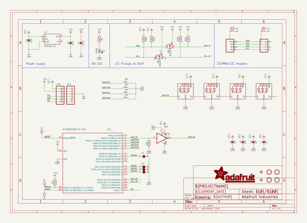
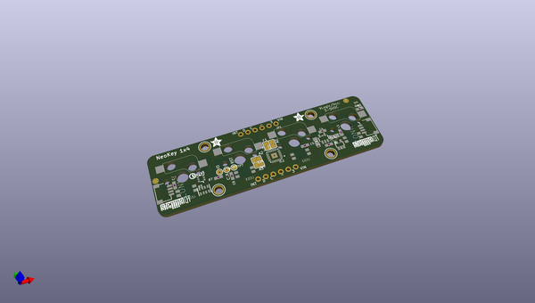

# adafruit_neokey_1x4_pcb
 
## summary 
* id: adafruit_adafruit_neokey_1x4_pcb_adafruit_neokey_1x4_qt_i2c
* user: adafruit
* name: adafruit_neokey_1x4_pcb
* board: adafruit_neokey_1x4_qt_i2c
* repo: https://github.com/adafruit/Adafruit-NeoKey-1x4-PCB

* src_file_repo_sch: 
* src_file_repo_sch_link: https://github.com/adafruit/Adafruit-NeoKey-1x4-PCB/tree/main/
* full details link: https://github.com/oomlout/oomlout_oomp_project_bot_v_2/tree/main/projects/adafruit_adafruit_neokey_1x4_pcb_adafruit_neokey_1x4_qt_i2c/current_version/working  

## schematic  
  
[schematic (pdf)](working_schematic.pdf) 

## pcb  
 
  
  
  
[board (pdf)](working.pdf)  

## working_bom
| Id | Designator | Footprint | Quantity | Designation | Supplier and ref |  | None | 
| --- | --- | --- | --- | --- | --- | --- | --- | 
| 1 | U2 | SOT23-5 | 1 | AP2112K-3.3 |  |  | [''] | 
| 2 | C2,C3 | 0805-NO | 2 | 10uF |  |  | [''] | 
| 3 | U$17,U$3,U$21,U$19 | MOUNTINGHOLE_2.5_PLATED | 4 | MOUNTINGHOLE2.5 |  |  | [''] | 
| 4 | R2,R1,R7 | 0603-NO | 3 | 10K |  |  | [''] | 
| 5 | U$2,U$9 | ADAFRUIT_3.5MM | 2 |  |  |  | [''] | 
| 6 | TP7,TP5,TP6 | TESTPOINT_ROUND_1.5MM | 3 |  |  |  | [''] | 
| 7 | IC2 | QFN24_4MM | 1 | ATSAMD09D14A-MU |  |  | [''] | 
| 8 | JP1,JP5 | 1X06_ROUND_70 | 2 |  |  |  | [''] | 
| 9 | FID1,FID2 | FIDUCIAL_1MM | 2 | FIDUCIAL_1MM |  |  | [''] | 
| 10 | U$31,U$30 | STEMMAQT | 2 |  |  |  | [''] | 
| 11 | C4 | 0603-NO | 1 | 0.1uF |  |  | [''] | 
| 12 | IC3 | SOT23-5 | 1 | 74AHCT1G125DBV |  |  | [''] | 
| 13 | CONN4,CONN3 | JST_SH4 | 2 | STEMMA_I2C_QT |  |  | [''] | 
| 14 | SJ2,SJ5,SJ4,SJ3 | SOLDERJUMPER_ARROW_NOPASTE | 4 |  |  |  | [''] | 
| 15 | R3 | RESPACK_4X0603 | 1 | 10K |  |  | [''] | 
| 16 | D2 | CHIPLED_0603_NOOUTLINE | 1 | GREEN |  |  | [''] | 
| 17 | C5,C6,C1,C7 | 0603-NO | 4 | 1uF |  |  | [''] | 
| 18 | Q2 | SOT363 | 1 | BSS138 |  |  | [''] | 
| 19 | U$25 | PCBFEAT-REV-040 | 1 |  |  |  | [''] | 
| 20 | LED2,LED3,LED4,LED1 | NEO3535_REVERSE | 4 | WS2812B_SK6812E |  |  | [''] | 
| 21 | SW4,SW2,SW3,SW1 | KAILH_SOCKET | 4 |  |  |  | [''] | 

## bom_schematic
| Ref | Qnty | Value | Cmp name | Footprint | Description | Vendor | DNP | 
| --- | --- | --- | --- | --- | --- | --- | --- | 
| C1, C5, C6, C7 | 4 | 1uF | CAP_CERAMIC0603_NO | working:0603-NO |  |  |  | 
| C2, C3 | 2 | 10uF | CAP_CERAMIC0805-NOOUTLINE | working:0805-NO |  |  |  | 
| C4 | 1 | 0.1uF | CAP_CERAMIC0603_NO | working:0603-NO |  |  |  | 
| CONN3, CONN4 | 2 | STEMMA_I2C_QT | STEMMA_I2C_QT | working:JST_SH4 |  |  |  | 
| D2 | 1 | GREEN | LED0603_NOOUTLINE | working:CHIPLED_0603_NOOUTLINE |  |  |  | 
| FID1, FID2 | 2 | FIDUCIAL_1MM | FIDUCIAL_1MM | working:FIDUCIAL_1MM |  |  |  | 
| IC2 | 1 | ATSAMD09D14A-MU | ATSAMD09D14A-MU | working:QFN24_4MM |  |  |  | 
| IC3 | 1 | 741G125DBV | 741G125DBV | working:SOT23-5 |  |  |  | 
| JP1, JP5 | 2 | HEADER-1X670MIL | HEADER-1X670MIL | working:1X06_ROUND_70 |  |  |  | 
| LED1, LED2, LED3, LED4 | 4 | WS2812B_SK6812E | WS2812B_SK6812E | working:NEO3535_REVERSE |  |  |  | 
| Q2 | 1 | BSS138 | MOSFET-N_DUAL | working:SOT363 |  |  |  | 
| R1, R2, R7 | 3 | 10K | RESISTOR_0603_NOOUT | working:0603-NO |  |  |  | 
| R3 | 1 | 10K | RESISTOR_4PACK | working:RESPACK_4X0603 |  |  |  | 
| SJ2, SJ3, SJ4, SJ5 | 4 | SOLDERJUMPER | SOLDERJUMPER | working:SOLDERJUMPER_ARROW_NOPASTE |  |  |  | 
| SW1, SW2, SW3, SW4 | 4 | SWITCH_PUSHBUTTON_KAILH_SOCKET | SWITCH_PUSHBUTTON_KAILH_SOCKET | working:KAILH_SOCKET |  |  |  | 
| TP5, TP6, TP7 | 3 | TESTPOINTROUND1.5MM | TESTPOINTROUND1.5MM | working:TESTPOINT_ROUND_1.5MM |  |  |  | 
| U2 | 1 | AP2112K-3.3 | VREG_SOT23-5 | working:SOT23-5 |  |  |  | 
| U$3, U$17, U$19, U$21 | 4 | MOUNTINGHOLE2.5 | MOUNTINGHOLE2.5 | working:MOUNTINGHOLE_2.5_PLATED |  |  |  | 

## mounting_holes
| x | y | package | value | ref | size | 
| --- | --- | --- | --- | --- | --- | 
| 38.1 | 16.51 | MOUNTINGHOLE_2.5_PLATED | MOUNTINGHOLE2.5 | U$3 | m3 | 
| 0.0 | 16.51 | MOUNTINGHOLE_2.5_PLATED | MOUNTINGHOLE2.5 | U$17 | m3 | 
| 38.1 | 0.0 | MOUNTINGHOLE_2.5_PLATED | MOUNTINGHOLE2.5 | U$19 | m3 | 
| 0.0 | 0.0 | MOUNTINGHOLE_2.5_PLATED | MOUNTINGHOLE2.5 | U$21 | m3 | 

