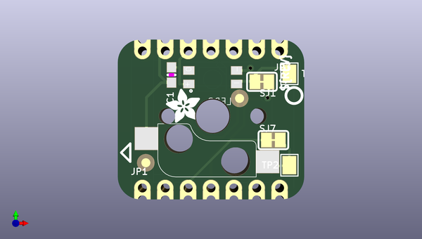

# adafruit_neokey_bff_pcb
 
## summary 
* id: adafruit_adafruit_neokey_bff_pcb_adafruit_neokey_bff
* user: adafruit
* name: adafruit_neokey_bff_pcb
* board: adafruit_neokey_bff
* repo: https://github.com/adafruit/Adafruit-NeoKey-BFF-PCB

* src_file_repo_sch: 
* src_file_repo_sch_link: https://github.com/adafruit/Adafruit-NeoKey-BFF-PCB/tree/main/
* full details link: https://github.com/oomlout/oomlout_oomp_project_bot_v_2/tree/main/projects/adafruit_adafruit_neokey_bff_pcb_adafruit_neokey_bff/current_version/working  

## schematic  
  
[schematic (pdf)](working_schematic.pdf) 

## pcb  
 
  
  
  
[board (pdf)](working.pdf)  

## working_bom
| Id | Designator | Footprint | Quantity | Designation | Supplier and ref |  | None | 
| --- | --- | --- | --- | --- | --- | --- | --- | 
| 1 | SJ1,SJ7 | SOLDERJUMPER_CLOSEDWIRE | 2 |  |  |  | [''] | 
| 2 | PLABEL9 | PLABEL9 | 1 |  |  |  | [''] | 
| 3 | PLABEL3 | PLABEL3 | 1 |  |  |  | [''] | 
| 4 | PLABEL6 | PLABEL6 | 1 |  |  |  | [''] | 
| 5 | C1 | 0603-NO | 1 | 1uF |  |  | [''] | 
| 6 | PLABEL7 | PLABEL7 | 1 |  |  |  | [''] | 
| 7 | TP2,TP1 | PAD-1.5X2.0 | 2 |  |  |  | [''] | 
| 8 | JP1,JP3 | 1X07_CASTEL | 2 |  |  |  | [''] | 
| 9 | PLABEL2 | PLABEL2 | 1 |  |  |  | [''] | 
| 10 | U$2 | ADAFRUIT_3.5MM | 1 |  |  |  | [''] | 
| 11 | PLABEL1 | PLABEL1 | 1 |  |  |  | [''] | 
| 12 | PLABEL8 | PLABEL8 | 1 |  |  |  | [''] | 
| 13 | U$6,U$8 | FIDUCIAL_1MM | 2 | FIDUCIAL_1MM |  |  | [''] | 
| 14 | PLABEL5 | PLABEL5 | 1 |  |  |  | [''] | 
| 15 | U$3 | PCBFEAT-REV-040 | 1 |  |  |  | [''] | 
| 16 | PLABEL4 | PLABEL4 | 1 |  |  |  | [''] | 
| 17 | PLABEL0 | PLABEL0 | 1 |  |  |  | [''] | 
| 18 | LED2 | NEO3535_REVERSE | 1 | WS2812B_SK6812E |  |  | [''] | 
| 19 | SW2 | KAILH_SOCKET | 1 | MX SOCKET |  |  | [''] | 

## bom_schematic
| Ref | Qnty | Value | Cmp name | Footprint | Description | Vendor | DNP | 
| --- | --- | --- | --- | --- | --- | --- | --- | 
| C1 | 1 | 1uF | CAP_CERAMIC0603_NO | working:0603-NO |  |  |  | 
| JP1, JP3 | 2 | HEADER-1X7_CASTEL | HEADER-1X7_CASTEL | working:1X07_CASTEL |  |  |  | 
| LED2 | 1 | WS2812B_SK6812E | WS2812B_SK6812E | working:NEO3535_REVERSE |  |  |  | 
| SJ1, SJ7 | 2 | SOLDERJUMPERCLOSED | SOLDERJUMPERCLOSED | working:SOLDERJUMPER_CLOSEDWIRE |  |  |  | 
| SW2 | 1 | MX SOCKET | SWITCH_PUSHBUTTON_KAILH_SOCKET | working:KAILH_SOCKET |  |  |  | 
| TP1, TP2 | 2 | TESTPOINT1.5X2.0MM_NOCREAM | TESTPOINT1.5X2.0MM_NOCREAM | working:PAD-1.5X2.0 |  |  |  | 
| U$6, U$8 | 2 | FIDUCIAL_1MM | FIDUCIAL_1MM | working:FIDUCIAL_1MM |  |  |  | 

