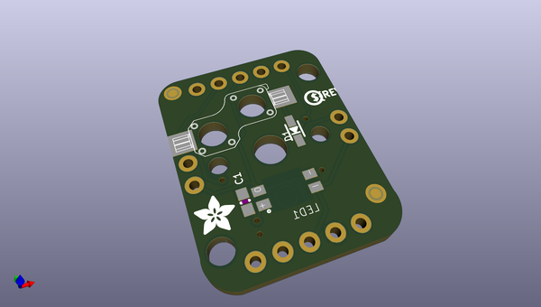

# adafruit_neokey_choc_breakout_pcb
 
## summary 
* id: adafruit_adafruit_neokey_choc_breakout_pcb_adafruit_neokey_choc_socket_breakout
* user: adafruit
* name: adafruit_neokey_choc_breakout_pcb
* board: adafruit_neokey_choc_socket_breakout
* repo: https://github.com/adafruit/Adafruit-NeoKey-CHOC-Breakout-PCB

* src_file_repo_sch: 
* src_file_repo_sch_link: https://github.com/adafruit/Adafruit-NeoKey-CHOC-Breakout-PCB/tree/main/
* full details link: https://github.com/oomlout/oomlout_oomp_project_bot_v_2/tree/main/projects/adafruit_adafruit_neokey_choc_breakout_pcb_adafruit_neokey_choc_socket_breakout/current_version/working  

## schematic  
  
[schematic (pdf)](working_schematic.pdf)  

## pcb  
 
  
  
  
[board (pdf)](working.pdf)  

## working_bom
| Id | Designator | Footprint | Quantity | Designation | Supplier and ref |  | None | 
| --- | --- | --- | --- | --- | --- | --- | --- | 
| 1 | U$2 | ADAFRUIT_3.5MM | 1 |  |  |  | [''] | 
| 2 | PLABEL2 | PLABEL2 | 1 |  |  |  | [''] | 
| 3 | FID4,FID3 | FIDUCIAL_1MM | 2 | FIDUCIAL_1MM |  |  | [''] | 
| 4 | PLABEL23,PLABEL9 | PLABEL9 | 2 |  |  |  | [''] | 
| 5 | PLABEL7 | PLABEL7 | 1 |  |  |  | [''] | 
| 6 | PLABEL3 | PLABEL3 | 1 |  |  |  | [''] | 
| 7 | @HOLE1,@HOLE0 |  | 2 |  |  |  | [''] | 
| 8 | PLABEL6,PLABEL21 | PLABEL6 | 2 |  |  |  | [''] | 
| 9 | D1 | SOD-323 | 1 | 1N4148 |  |  | [''] | 
| 10 | PLABEL22,PLABEL8 | PLABEL8 | 2 |  |  |  | [''] | 
| 11 | C1 | 0603-NO | 1 | 1uF |  |  | [''] | 
| 12 | PLABEL4 | PLABEL4 | 1 |  |  |  | [''] | 
| 13 | PLABEL0,PLABEL20 | PLABEL0 | 2 |  |  |  | [''] | 
| 14 | PLABEL200 | PLABEL200 | 1 |  |  |  | [''] | 
| 15 | PLABEL5 | PLABEL5 | 1 |  |  |  | [''] | 
| 16 | U$1 | PCBFEAT-REV-040 | 1 |  |  |  | [''] | 
| 17 | PLABEL1 | PLABEL1 | 1 |  |  |  | [''] | 
| 18 | PLABEL16 | PLABEL16 | 1 |  |  |  | [''] | 
| 19 | JP1,JP3 | 1X05_ROUND_70 | 2 |  |  |  | [''] | 
| 20 | PLABEL12 | PLABEL12 | 1 |  |  |  | [''] | 
| 21 | PLABEL14 | PLABEL14 | 1 |  |  |  | [''] | 
| 22 | PLABEL10 | PLABEL10 | 1 |  |  |  | [''] | 
| 23 | SW1 | KAILH_CHOC_SOCKET | 1 | MX SOCKET |  |  | [''] | 
| 24 | JP4,JP2 | 1X02_ROUND | 2 |  |  |  | [''] | 
| 25 | PLABEL18 | PLABEL18 | 1 |  |  |  | [''] | 
| 26 | PLABEL15 | PLABEL15 | 1 |  |  |  | [''] | 
| 27 | PLABEL17 | PLABEL17 | 1 |  |  |  | [''] | 
| 28 | PLABEL11 | PLABEL11 | 1 |  |  |  | [''] | 
| 29 | PLABEL13 | PLABEL13 | 1 |  |  |  | [''] | 
| 30 | PLABEL19 | PLABEL19 | 1 |  |  |  | [''] | 
| 31 | LED1 | NEO3535_REVERSE | 1 | WS2812B_SK6812E |  |  | [''] | 

## bom_schematic
| Ref | Qnty | Value | Cmp name | Footprint | Description | Vendor | DNP | 
| --- | --- | --- | --- | --- | --- | --- | --- | 
| C1 | 1 | 1uF | CAP_CERAMIC0603_NO | working:0603-NO |  |  |  | 
| D1 | 1 | 1N4148 | DIODESOD-323 | working:SOD-323 |  |  |  | 
| FID3, FID4 | 2 | FIDUCIAL_1MM | FIDUCIAL_1MM | working:FIDUCIAL_1MM |  |  |  | 
| JP1, JP3 | 2 | HEADER-1X570MIL | HEADER-1X570MIL | working:1X05_ROUND_70 |  |  |  | 
| JP2, JP4 | 2 | HEADER-1X2ROUND | HEADER-1X2ROUND | working:1X02_ROUND |  |  |  | 
| LED1 | 1 | WS2812B_SK6812E | WS2812B_SK6812E | working:NEO3535_REVERSE |  |  |  | 
| SW1 | 1 | MX SOCKET | SWITCH_PUSHBUTTON_CHOCSOCKET | working:KAILH_CHOC_SOCKET |  |  |  | 

