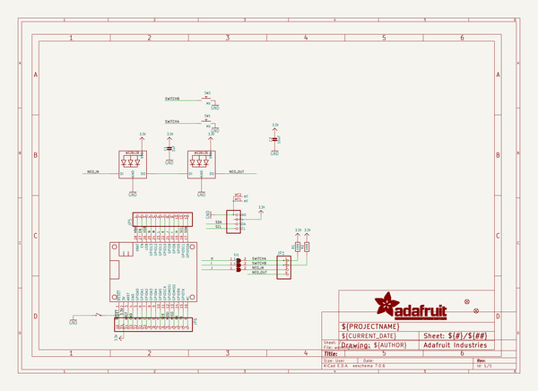
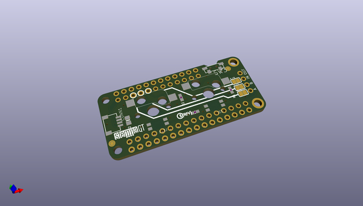
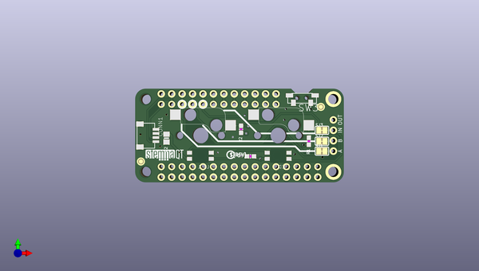
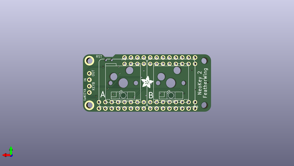

# adafruit_neokey_featherwing_pcb
 
## summary 
* id: adafruit_adafruit_neokey_featherwing_pcb_adafruit_neokey_featherwing
* user: adafruit
* name: adafruit_neokey_featherwing_pcb
* board: adafruit_neokey_featherwing
* repo: https://github.com/adafruit/Adafruit-NeoKey-FeatherWing-PCB

* src_file_repo_sch: 
* src_file_repo_sch_link: https://github.com/adafruit/Adafruit-NeoKey-FeatherWing-PCB/tree/main/
* full details link: https://github.com/oomlout/oomlout_oomp_project_bot_v_2/tree/main/projects/adafruit_adafruit_neokey_featherwing_pcb_adafruit_neokey_featherwing/current_version/working  

## schematic  
  
[schematic (pdf)](working_schematic.pdf) 

## pcb  
 
  
  
  
[board (pdf)](working.pdf)  

## working_bom
| Id | Designator | Footprint | Quantity | Designation | Supplier and ref |  | None | 
| --- | --- | --- | --- | --- | --- | --- | --- | 
| 1 | C1 | 0603-NO | 1 | 1uF |  |  | [''] | 
| 2 | R2,R1 | 0603-NO | 2 | 100K |  |  | [''] | 
| 3 | SW3 | SPST_TACTILE_RA | 1 |  |  |  | [''] | 
| 4 | U$11 | STEMMAQT | 1 |  |  |  | [''] | 
| 5 | SJ3,SJ2,SJ1 | SOLDERJUMPER_CLOSEDWIRE | 3 |  |  |  | [''] | 
| 6 | FID1,FID2 | FIDUCIAL_1MM | 2 | FIDUCIAL_1MM |  |  | [''] | 
| 7 | CONN1 | JST_SH4 | 1 | STEMMA_I2C_QT |  |  | [''] | 
| 8 | U$8 | PCBFEAT-REV-040 | 1 |  |  |  | [''] | 
| 9 | C2 | 0805-NO | 1 | 10uF |  |  | [''] | 
| 10 | U$7 | ADAFRUIT_5MM | 1 |  |  |  | [''] | 
| 11 | JP6 | 1X16_ROUND | 1 |  |  |  | [''] | 
| 12 | JP1 | 1X04_ROUND | 1 |  |  |  | [''] | 
| 13 | MS1 | FEATHERWING_NODIM | 1 | FEATHERWING_NODIM |  |  | [''] | 
| 14 | SW2,SW1 | KAILH_SOCKET | 2 | MX |  |  | [''] | 
| 15 | LED1,LED2 | NEO3535_REVERSE | 2 | WS2812B_SK6812E |  |  | [''] | 
| 16 | JP5 | 1X12_ROUND | 1 |  |  |  | [''] | 

## bom_schematic
| Ref | Qnty | Value | Cmp name | Footprint | Description | Vendor | DNP | 
| --- | --- | --- | --- | --- | --- | --- | --- | 
| C1 | 1 | 1uF | CAP_CERAMIC0603_NO | working:0603-NO |  |  |  | 
| C2 | 1 | 10uF | CAP_CERAMIC0805-NOOUTLINE | working:0805-NO |  |  |  | 
| CONN1 | 1 | STEMMA_I2C_QT | STEMMA_I2C_QT | working:JST_SH4 |  |  |  | 
| FID1, FID2 | 2 | FIDUCIAL_1MM | FIDUCIAL_1MM | working:FIDUCIAL_1MM |  |  |  | 
| JP1 | 1 | HEADER-1X4ROUND | HEADER-1X4ROUND | working:1X04_ROUND |  |  |  | 
| JP5 | 1 | HEADER-1X12 | HEADER-1X12 | working:1X12_ROUND |  |  |  | 
| JP6 | 1 | HEADER-1X16ROUND | HEADER-1X16ROUND | working:1X16_ROUND |  |  |  | 
| LED1, LED2 | 2 | WS2812B_SK6812E | WS2812B_SK6812E | working:NEO3535_REVERSE |  |  |  | 
| MS1 | 1 | FEATHERWING_NODIM | FEATHERWING_NODIM | working:FEATHERWING_NODIM |  |  |  | 
| R1, R2 | 2 | 100K | RESISTOR_0603_NOOUT | working:0603-NO |  |  |  | 
| SJ1, SJ2, SJ3 | 3 | SOLDERJUMPERCLOSED | SOLDERJUMPERCLOSED | working:SOLDERJUMPER_CLOSEDWIRE |  |  |  | 
| SW1, SW2 | 2 | MX | SWITCH_PUSHBUTTON_KAILH_SOCKET | working:KAILH_SOCKET |  |  |  | 
| SW3 | 1 | SWITCH_SPST_TACT_RA | SWITCH_SPST_TACT_RA | working:SPST_TACTILE_RA |  |  |  | 

