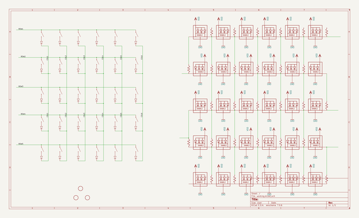
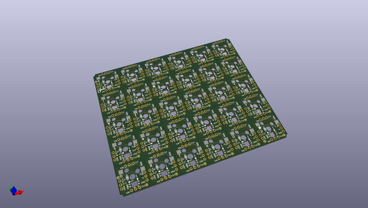
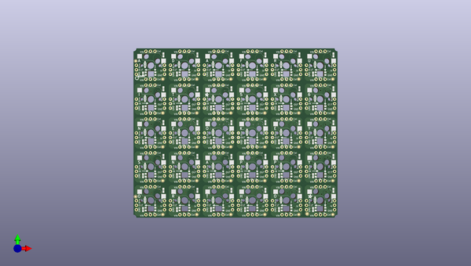
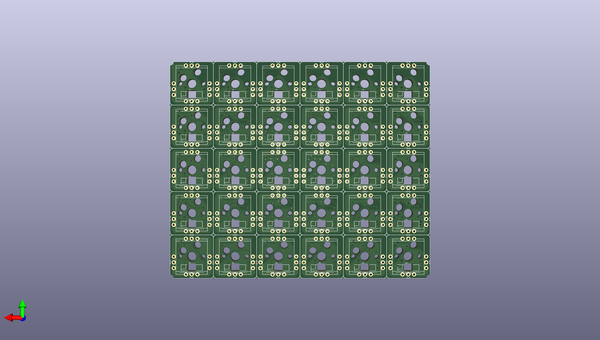

# adafruit_neokey_snap_apart_pcb
 
## summary 
* id: adafruit_adafruit_neokey_snap_apart_pcb_neokey_5x6_ortho_snap_apart
* user: adafruit
* name: adafruit_neokey_snap_apart_pcb
* board: neokey_5x6_ortho_snap_apart
* repo: https://github.com/adafruit/Adafruit-NeoKey-Snap-Apart-PCB

* src_file_repo_sch: 
* src_file_repo_sch_link: https://github.com/adafruit/Adafruit-NeoKey-Snap-Apart-PCB/tree/main/
* full details link: https://github.com/oomlout/oomlout_oomp_project_bot_v_2/tree/main/projects/adafruit_adafruit_neokey_snap_apart_pcb_neokey_5x6_ortho_snap_apart/current_version/working  

## schematic  
  
[schematic (pdf)](working_schematic.pdf) 

## pcb  
 
  
  
  
[board (pdf)](working.pdf)  

## working_bom
| Id | Designator | Footprint | Quantity | Designation | Supplier and ref |  | None | 
| --- | --- | --- | --- | --- | --- | --- | --- | 
| 1 | @HOLE84,@HOLE67,@HOLE49,@HOLE47,@HOLE3,@HOLE89,@HOLE87,@HOLE19,@HOLE22,@HOLE54,@HOLE95,@HOLE40,@HOLE5,@HOLE36,@HOLE59,@HOLE38,@HOLE80,@HOLE82,@HOLE30,@HOLE73,@HOLE69,@HOLE93,@HOLE14,@HOLE97,@HOLE27,@HOLE28,@HOLE39,@HOLE90,@HOLE0,@HOLE15,@HOLE70,@HOLE96,@HOLE76,@HOLE33,@HOLE66,@HOLE56,@HOLE6,@HOLE31,@HOLE77,@HOLE75,@HOLE72,@HOLE81,@HOLE53,@HOLE4,@HOLE92,@HOLE50,@HOLE83,@HOLE10,@HOLE42,@HOLE35,@HOLE71,@HOLE7,@HOLE12,@HOLE55,@HOLE21,@HOLE17,@HOLE74,@HOLE1,@HOLE94,@HOLE58,@HOLE79,@HOLE60,@HOLE44,@HOLE11,@HOLE61,@HOLE2,@HOLE34,@HOLE29,@HOLE51,@HOLE65,@HOLE78,@HOLE86,@HOLE57,@HOLE26,@HOLE13,@HOLE8,@HOLE23,@HOLE64,@HOLE37,@HOLE63,@HOLE25,@HOLE85,@HOLE68,@HOLE46,@HOLE88,@HOLE48,@HOLE62,@HOLE43,@HOLE20,@HOLE24,@HOLE41,@HOLE9,@HOLE45,@HOLE52,@HOLE18,@HOLE16,@HOLE32,@HOLE91 |  | 98 |  |  |  | [''] | 
| 2 | U$5,U$4 | ADAFRUIT_2.5MM | 2 |  |  |  | [''] | 
| 3 | U$2,U$1,U$3 | FIDUCIAL_1MM | 3 | FIDUCIAL |  |  | [''] | 
| 4 | U$6 | PCBFEAT-REV-040 | 1 |  |  |  | [''] | 
| 5 | X13,X3,X18,X2,X25,X15,X17,X28,X14,X27,X30,X29,X5,X1,X26,X4,X6,X16 | KAILH_SOCKET_TILE | 18 | KAILH_SOCKET_TILE |  |  | [''] | 
| 6 | X21,X9,X12,X20,X10,X7,X8,X24,X19,X22,X23,X11 | KAILH_SOCKET_TILE_REV | 12 | KAILH_SOCKET_TILE_REVERSE |  |  | [''] | 

## bom_schematic
| Ref | Qnty | Value | Cmp name | Footprint | Description | Vendor | DNP | 
| --- | --- | --- | --- | --- | --- | --- | --- | 
| U$1, U$2, U$3 | 3 | FIDUCIAL | FIDUCIAL | working:FIDUCIAL_1MM |  |  |  | 
| X1, X2, X3, X4, X5, X6, X13, X14, X15, X16, X17, X18, X25, X26, X27, X28, X29, X30 | 18 | KAILH_SOCKET_TILE | KAILH_SOCKET_TILE | working:KAILH_SOCKET_TILE |  |  |  | 
| X7, X8, X9, X10, X11, X12, X19, X20, X21, X22, X23, X24 | 12 | KAILH_SOCKET_TILE_REVERSE | KAILH_SOCKET_TILE_REVERSE | working:KAILH_SOCKET_TILE_REV |  |  |  | 

