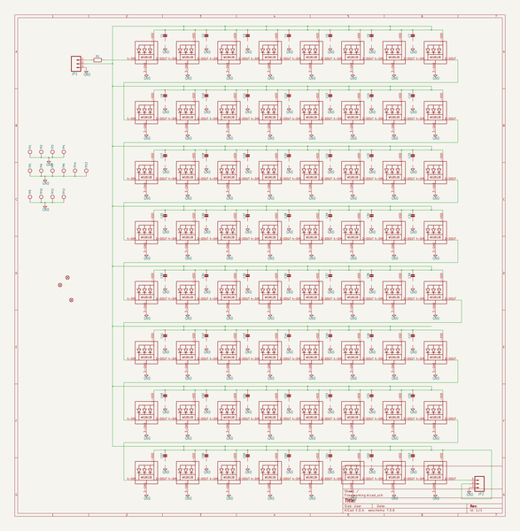
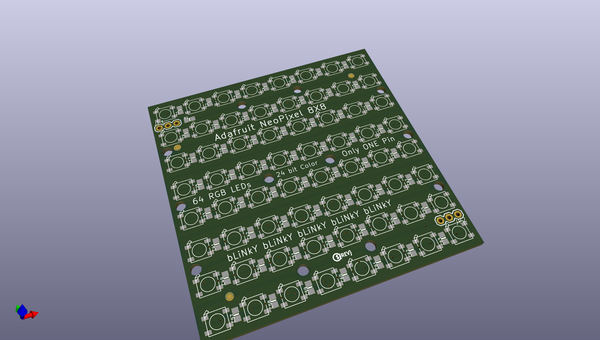
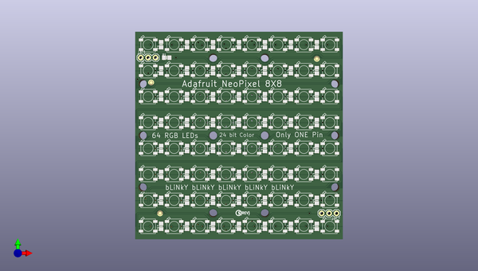
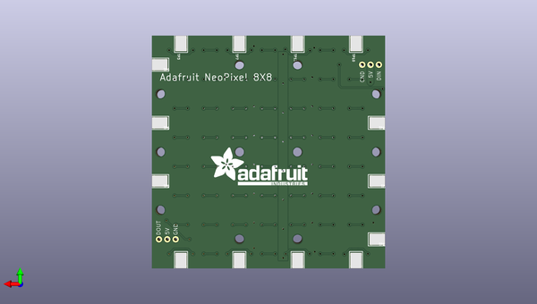

# adafruit_neopixel_8x8_matrix
 
## summary 
* id: adafruit_adafruit_neopixel_8x8_matrix_adafruit_neomatrix_8x8
* user: adafruit
* name: adafruit_neopixel_8x8_matrix
* board: adafruit_neomatrix_8x8
* repo: https://github.com/adafruit/Adafruit-NeoPixel-8x8-Matrix

* src_file_repo_sch: 
* src_file_repo_sch_link: https://github.com/adafruit/Adafruit-NeoPixel-8x8-Matrix/tree/master/
* full details link: https://github.com/oomlout/oomlout_oomp_project_bot_v_2/tree/main/projects/adafruit_adafruit_neopixel_8x8_matrix_adafruit_neomatrix_8x8/current_version/working  

## schematic  
  
[schematic (pdf)](working_schematic.pdf) 

## pcb  
 
  
  
  
[board (pdf)](working.pdf)  

## working_bom
| Id | Designator | Footprint | Quantity | Designation | Supplier and ref |  | None | 
| --- | --- | --- | --- | --- | --- | --- | --- | 
| 1 | C47,C55,C41,C30,C10,C7,C29,C1,C50,C19,C28,C2,C3,C12,C5,C33,C15,R1,C27,C57,C62,C46,C25,C35,C43,C31,C37,C58,C39,C59,C44,C26,C23,C34,C45,C49,C9,C61,C52,C51,C36,C63,C21,C11,C17,C4,C38,C6,C22,C13,C54,C42,C18,C60,C20,C14,C53 | 0805-NO | 57 |  |  |  | [''] | 
| 2 | LED52,LED12,LED31,LED28,LED60,LED62,LED34,LED44,LED1,LED51,LED61,LED14,LED49,LED46,LED2,LED3,LED4,LED43,LED55,LED32,LED17,LED58,LED37,LED63,LED30,LED53,LED18,LED22,LED40,LED45,LED20,LED29,LED15,LED11,LED41,LED8,LED50,LED48,LED57,LED39,LED26,LED13,LED7,LED35,LED38,LED25,LED24,LED23,LED10,LED64,LED9,LED16,LED21,LED54,LED47,LED42,LED56,LED36,LED6,LED27,LED5,LED19,LED59,LED33 | WS2812B | 64 | WS2812B5050 |  |  | [''] | 
| 3 | @HOLE0,@HOLE9,@HOLE1,@HOLE5,@HOLE4,@HOLE10,@HOLE6,@HOLE11,@HOLE2,@HOLE3,@HOLE8,@HOLE7 |  | 12 |  |  |  | [''] | 
| 4 | JP2,JP1 | 1X03 | 2 |  |  |  | [''] | 
| 5 | U$2 | PCBFEAT-REV-040 | 1 |  |  |  | [''] | 
| 6 | FID3,FID2,FID1 | FIDUCIAL_1MM | 3 | FIDUCIAL" |  |  | [''] | 
| 7 | TP11,TP3,TP4,TP14,TP9,TP12,TP1,TP6,TP8,TP10,TP7,TP13,TP2,TP5 | TESTPOINT_SMT | 14 |  |  |  | [''] | 
| 8 | U$1 | ADAFRUIT_TEXT_30MM | 1 |  |  |  | [''] | 

## bom_schematic
| Ref | Qnty | Value | Cmp name | Footprint | Description | Vendor | DNP | 
| --- | --- | --- | --- | --- | --- | --- | --- | 
| C1, C2, C3, C4, C5, C6, C7, C9, C10, C11, C12, C13, C14, C15, C17, C18, C19, C20, C21, C22, C23, C25, C26, C27, C28, C29, C30, C31, C33, C34, C35, C36, C37, C38, C39, C41, C42, C43, C44, C45, C46, C47, C49, C50, C51, C52, C53, C54, C55, C57, C58, C59, C60, C61, C62, C63 | 56 | CAP_CERAMIC0805-NOOUTLINE | CAP_CERAMIC0805-NOOUTLINE | working:0805-NO |  |  |  | 
| FID1, FID2, FID3 | 3 | FIDUCIAL"" | FIDUCIAL{dblquote}{dblquote} | working:FIDUCIAL_1MM |  |  |  | 
| JP1, JP2 | 2 | M03PTH | M03PTH | working:1X03 |  |  |  | 
| LED1, LED2, LED3, LED4, LED5, LED6, LED7, LED8, LED9, LED10, LED11, LED12, LED13, LED14, LED15, LED16, LED17, LED18, LED19, LED20, LED21, LED22, LED23, LED24, LED25, LED26, LED27, LED28, LED29, LED30, LED31, LED32, LED33, LED34, LED35, LED36, LED37, LED38, LED39, LED40, LED41, LED42, LED43, LED44, LED45, LED46, LED47, LED48, LED49, LED50, LED51, LED52, LED53, LED54, LED55, LED56, LED57, LED58, LED59, LED60, LED61, LED62, LED63, LED64 | 64 | WS2812B5050 | WS2812B5050 | working:WS2812B |  |  |  | 
| R1 | 1 | RESISTOR0805_NOOUTLINE | RESISTOR0805_NOOUTLINE | working:0805-NO |  |  |  | 
| TP1, TP2, TP3, TP4, TP5, TP6, TP7, TP8, TP9, TP10, TP11, TP12, TP13, TP14 | 14 | TESTPOINT | TESTPOINT | working:TESTPOINT_SMT |  |  |  | 

