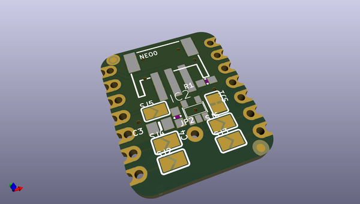

# adafruit_neopixel_driver_bff_pcb
 
## summary 
* id: adafruit_adafruit_neopixel_driver_bff_pcb_adafruit_neopixel_driver_bff
* user: adafruit
* name: adafruit_neopixel_driver_bff_pcb
* board: adafruit_neopixel_driver_bff
* repo: https://github.com/adafruit/Adafruit-NeoPixel-Driver-BFF-PCB

* src_file_repo_sch: 
* src_file_repo_sch_link: https://github.com/adafruit/Adafruit-NeoPixel-Driver-BFF-PCB/tree/main/
* full details link: https://github.com/oomlout/oomlout_oomp_project_bot_v_2/tree/main/projects/adafruit_adafruit_neopixel_driver_bff_pcb_adafruit_neopixel_driver_bff/current_version/working  

## schematic  
  
[schematic (pdf)](working_schematic.pdf)  

## pcb  
 
  
  
  
[board (pdf)](working.pdf)  

## working_bom
| Id | Designator | Footprint | Quantity | Designation | Supplier and ref |  | None | 
| --- | --- | --- | --- | --- | --- | --- | --- | 
| 1 | PLABEL12 | PLABEL12 | 1 |  |  |  | [''] | 
| 2 | SJ6,SJ5,SJ2,SJ4,SJ3 | SOLDERJUMPER_ARROW_NOPASTE | 5 |  |  |  | [''] | 
| 3 | PLABEL0 | PLABEL0 | 1 |  |  |  | [''] | 
| 4 | U$8,U$6 | FIDUCIAL_1MM | 2 | FIDUCIAL_1MM |  |  | [''] | 
| 5 | PLABEL7 | PLABEL7 | 1 |  |  |  | [''] | 
| 6 | C4 | 0603-NO | 1 | 1uF |  |  | [''] | 
| 7 | PLABEL14 | PLABEL14 | 1 |  |  |  | [''] | 
| 8 | PLABEL15 | PLABEL15 | 1 |  |  |  | [''] | 
| 9 | IC2 | SOT23-5 | 1 | 74AHCT1G125DBV |  |  | [''] | 
| 10 | PLABEL17 | PLABEL17 | 1 |  |  |  | [''] | 
| 11 | SJ1 | SOLDERJUMPER_CLOSEDWIRE | 1 |  |  |  | [''] | 
| 12 | NEO0 | JSTPH3 | 1 | JST PH 3 |  |  | [''] | 
| 13 | JP2 | 1X01_ROUND_76MIL | 1 |  |  |  | [''] | 
| 14 | PLABEL9 | PLABEL9 | 1 |  |  |  | [''] | 
| 15 | PLABEL2 | PLABEL2 | 1 |  |  |  | [''] | 
| 16 | C3 | 0805-NO | 1 | 10uF |  |  | [''] | 
| 17 | PLABEL16 | PLABEL16 | 1 |  |  |  | [''] | 
| 18 | PLABEL3 | PLABEL3 | 1 |  |  |  | [''] | 
| 19 | PLABEL10 | PLABEL10 | 1 |  |  |  | [''] | 
| 20 | PLABEL8 | PLABEL8 | 1 |  |  |  | [''] | 
| 21 | PLABEL13 | PLABEL13 | 1 |  |  |  | [''] | 
| 22 | R1 | 0603-NO | 1 | 100 |  |  | [''] | 
| 23 | PLABEL6 | PLABEL6 | 1 |  |  |  | [''] | 
| 24 | PLABEL18 | PLABEL18 | 1 |  |  |  | [''] | 
| 25 | PLABEL11 | PLABEL11 | 1 |  |  |  | [''] | 
| 26 | PLABEL5 | PLABEL5 | 1 |  |  |  | [''] | 
| 27 | PLABEL4 | PLABEL4 | 1 |  |  |  | [''] | 
| 28 | PLABEL1 | PLABEL1 | 1 |  |  |  | [''] | 
| 29 | U$2 | ADAFRUIT_3.5MM | 1 |  |  |  | [''] | 
| 30 | PLABEL19 | PLABEL19 | 1 |  |  |  | [''] | 
| 31 | U$3 | PCBFEAT-REV-040 | 1 |  |  |  | [''] | 
| 32 | JP3,JP1 | 1X07_CASTEL | 2 |  |  |  | [''] | 
| 33 | PLABEL20 | PLABEL20 | 1 |  |  |  | [''] | 

## bom_schematic
| Ref | Qnty | Value | Cmp name | Footprint | Description | Vendor | DNP | 
| --- | --- | --- | --- | --- | --- | --- | --- | 
| C3 | 1 | 10uF | CAP_CERAMIC0805-NOOUTLINE | working:0805-NO |  |  |  | 
| C4 | 1 | 1uF | CAP_CERAMIC0603_NO | working:0603-NO |  |  |  | 
| IC2 | 1 | 741G125DBV | 741G125DBV | working:SOT23-5 |  |  |  | 
| JP1, JP3 | 2 | HEADER-1X7_CASTEL | HEADER-1X7_CASTEL | working:1X07_CASTEL |  |  |  | 
| JP2 | 1 | HEADER-1X1ROUND_76MIL | HEADER-1X1ROUND_76MIL | working:1X01_ROUND_76MIL |  |  |  | 
| NEO0 | 1 | JST PH 3 | CON_JST_PH_3PIN | working:JSTPH3 |  |  |  | 
| R1 | 1 | 100 | RESISTOR_0603_NOOUT | working:0603-NO |  |  |  | 
| SJ1 | 1 | SOLDERJUMPERCLOSED | SOLDERJUMPERCLOSED | working:SOLDERJUMPER_CLOSEDWIRE |  |  |  | 
| SJ2, SJ3, SJ4, SJ5, SJ6 | 5 | SOLDERJUMPER | SOLDERJUMPER | working:SOLDERJUMPER_ARROW_NOPASTE |  |  |  | 
| U$6, U$8 | 2 | FIDUCIAL_1MM | FIDUCIAL_1MM | working:FIDUCIAL_1MM |  |  |  | 

