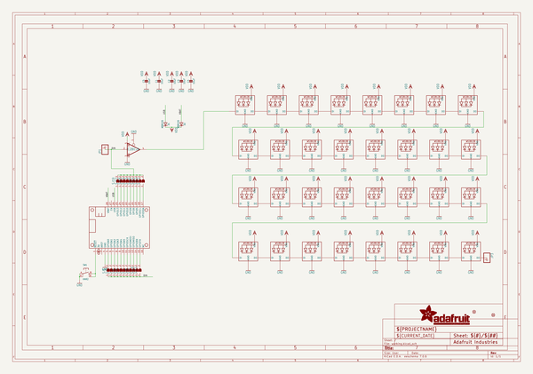
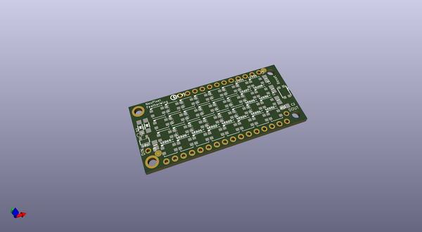
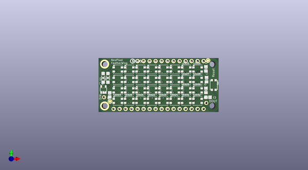
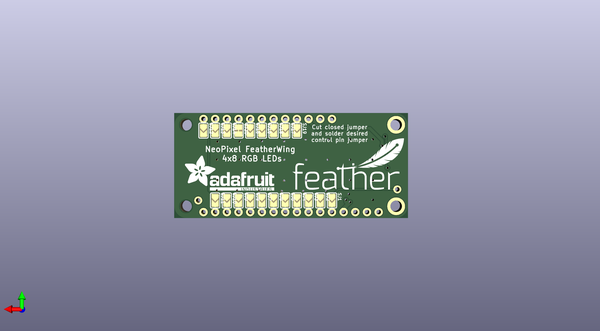

# adafruit_neopixel_featherwing_pcb
 
## summary 
* id: adafruit_adafruit_neopixel_featherwing_pcb_adafruit_neopixel_featherwing
* user: adafruit
* name: adafruit_neopixel_featherwing_pcb
* board: adafruit_neopixel_featherwing
* repo: https://github.com/adafruit/Adafruit-NeoPixel-FeatherWing-PCB

* src_file_repo_sch: 
* src_file_repo_sch_link: https://github.com/adafruit/Adafruit-NeoPixel-FeatherWing-PCB/tree/master/
* full details link: https://github.com/oomlout/oomlout_oomp_project_bot_v_2/tree/main/projects/adafruit_adafruit_neopixel_featherwing_pcb_adafruit_neopixel_featherwing/current_version/working  

## schematic  
  
[schematic (pdf)](working_schematic.pdf)  

## pcb  
 
  
  
  
[board (pdf)](working.pdf)  

## working_bom
| Id | Designator | Footprint | Quantity | Designation | Supplier and ref |  | None | 
| --- | --- | --- | --- | --- | --- | --- | --- | 
| 1 | LED6,LED19,LED32,LED26,LED23,LED8,LED9,LED12,LED11,LED28,LED2,LED31,LED25,LED18,LED21,LED5,LED24,LED20,LED16,LED29,LED1,LED4,LED14,LED27,LED13,LED10,LED15,LED17,LED30,LED3,LED22,LED7 | LED3535 | 32 | WS2812B3535 |  |  | [''] | 
| 2 | C3,C2,C1,C4,C5 | 0805-NO | 5 | 10uF |  |  | [''] | 
| 3 | JP3,JP1 | 1X01_ROUND | 2 |  |  |  | [''] | 
| 4 | FID3,FID1 | FIDUCIAL_1MM | 2 | FIDUCIAL" |  |  | [''] | 
| 5 | U$2 | PCBFEAT-REV-040 | 1 |  |  |  | [''] | 
| 6 | D1,D2 | SOD-123 | 2 | MBR120 |  |  | [''] | 
| 7 | IC2 | SOT23-5 | 1 | 74AHCT1G125DBV |  |  | [''] | 
| 8 | SW1 | BTN_KMR2_4.6X2.8 | 1 | KMR2 |  |  | [''] | 
| 9 | MS1 | FEATHERWING | 1 | FEATHERWING |  |  | [''] | 
| 10 | SJ10,SJ7,SJ2,SJ18,SJ11,SJ19,SJ9,SJ1,SJ5,SJ16,SJ12,SJ3,SJ17,SJ8,SJ14,SJ4,SJ15,SJ6,SJ13 | SOLDERJUMPER_ARROW_NOPASTE | 19 |  |  |  | [''] | 
| 11 | U$4 | ADAFRUIT_TEXT_20MM | 1 |  |  |  | [''] | 
| 12 | U$3 | FEATHERLOGO | 1 |  |  |  | [''] | 
| 13 | SJ20 | SOLDERJUMPER_CLOSEDWIRE | 1 |  |  |  | [''] | 

## bom_schematic
| Ref | Qnty | Value | Cmp name | Footprint | Description | Vendor | DNP | 
| --- | --- | --- | --- | --- | --- | --- | --- | 
| C1, C2, C3, C4, C5 | 5 | 10uF | CAP_CERAMIC0805-NOOUTLINE | working:0805-NO |  |  |  | 
| D1, D2 | 2 | MBR120 | DIODE-SCHOTTKYSOD-123 | working:SOD-123 |  |  |  | 
| FID1, FID3 | 2 | FIDUCIAL"" | FIDUCIAL{dblquote}{dblquote} | working:FIDUCIAL_1MM |  |  |  | 
| IC2 | 1 | 741G125DBV | 741G125DBV | working:SOT23-5 |  |  |  | 
| JP1, JP3 | 2 | HEADER-1X1ROUND | HEADER-1X1ROUND | working:1X01_ROUND |  |  |  | 
| LED1, LED2, LED3, LED4, LED5, LED6, LED7, LED8, LED9, LED10, LED11, LED12, LED13, LED14, LED15, LED16, LED17, LED18, LED19, LED20, LED21, LED22, LED23, LED24, LED25, LED26, LED27, LED28, LED29, LED30, LED31, LED32 | 32 | WS2812B3535 | WS2812B3535 | working:LED3535 |  |  |  | 
| MS1 | 1 | FEATHERWING | FEATHERWING | working:FEATHERWING |  |  |  | 
| SJ1, SJ2, SJ3, SJ4, SJ5, SJ6, SJ7, SJ8, SJ9, SJ10, SJ11, SJ12, SJ13, SJ14, SJ15, SJ16, SJ17, SJ18, SJ19 | 19 | SOLDERJUMPER | SOLDERJUMPER | working:SOLDERJUMPER_ARROW_NOPASTE |  |  |  | 
| SJ20 | 1 | SOLDERJUMPERCLOSED | SOLDERJUMPERCLOSED | working:SOLDERJUMPER_CLOSEDWIRE |  |  |  | 
| SW1 | 1 | KMR2 | SWITCH_TACT_SMT4.6X2.8 | working:BTN_KMR2_4.6X2.8 |  |  |  | 

