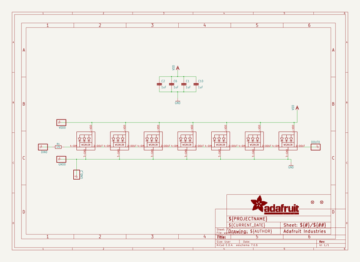
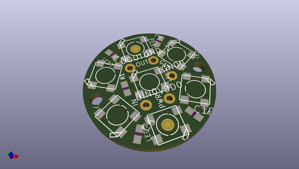
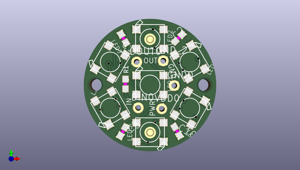
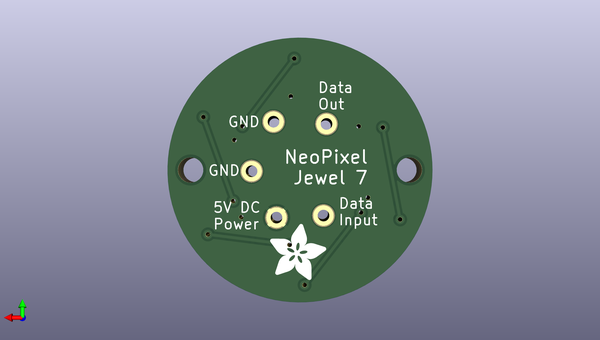

# adafruit_neopixel_jewel_7
 
## summary 
* id: adafruit_adafruit_neopixel_jewel_7_adafruit_neojewel_7
* user: adafruit
* name: adafruit_neopixel_jewel_7
* board: adafruit_neojewel_7
* repo: https://github.com/adafruit/Adafruit-NeoPixel-Jewel-7

* src_file_repo_sch: 
* src_file_repo_sch_link: https://github.com/adafruit/Adafruit-NeoPixel-Jewel-7/tree/master/
* full details link: https://github.com/oomlout/oomlout_oomp_project_bot_v_2/tree/main/projects/adafruit_adafruit_neopixel_jewel_7_adafruit_neojewel_7/current_version/working  

## schematic  
  
[schematic (pdf)](working_schematic.pdf)  

## pcb  
 
  
  
  
[board (pdf)](working.pdf)  

## working_bom
| Id | Designator | Footprint | Quantity | Designation | Supplier and ref |  | None | 
| --- | --- | --- | --- | --- | --- | --- | --- | 
| 1 | C10,C1,C6,C2 | C0603 | 4 | 1uF |  |  | [''] | 
| 2 | LED3,LED6,LED5,LED1,LED4,LED2,LED7 | WS2812B-NARROW | 7 | WS2812B5050 |  |  | [''] | 
| 3 | FID2,FID1 | FIDUCIAL_1MM | 2 | FIDUCIAL" |  |  | [''] | 
| 4 | VDD0,GND_2,GND0,DIN0,DOUT0 | 1X01-CLEANBIG | 5 |  |  |  | [''] | 
| 5 | @HOLE0,@HOLE1 |  | 2 |  |  |  | [''] | 
| 6 | R1 | 0603-NO | 1 | 470 |  |  | [''] | 
| 7 | U$3 | ADAFRUIT_5MM | 1 |  |  |  | [''] | 

## bom_schematic
| Ref | Qnty | Value | Cmp name | Footprint | Description | Vendor | DNP | 
| --- | --- | --- | --- | --- | --- | --- | --- | 
| C1, C2, C6, C10 | 4 | 1uF | C-EUC0603 | working:C0603 |  |  |  | 
| DIN0 | 1 | PINHD-1X1CB | PINHD-1X1CB | working:1X01-CLEANBIG |  |  |  | 
| DOUT0 | 1 | PINHD-1X1CB | PINHD-1X1CB | working:1X01-CLEANBIG |  |  |  | 
| FID1, FID2 | 2 | FIDUCIAL"" | FIDUCIAL{dblquote}{dblquote} | working:FIDUCIAL_1MM |  |  |  | 
| GND0 | 1 | PINHD-1X1CB | PINHD-1X1CB | working:1X01-CLEANBIG |  |  |  | 
| GND_2 | 1 | PINHD-1X1CB | PINHD-1X1CB | working:1X01-CLEANBIG |  |  |  | 
| LED1, LED2, LED3, LED4, LED5, LED6, LED7 | 7 | WS2812B5050 | WS2812B5050 | working:WS2812B |  |  |  | 
| R1 | 1 | 470 | RESISTOR_0603_NOOUT | working:0603-NO |  |  |  | 
| VDD0 | 1 | PINHD-1X1CB | PINHD-1X1CB | working:1X01-CLEANBIG |  |  |  | 

