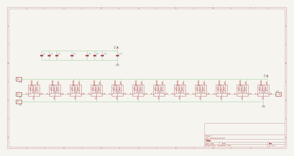
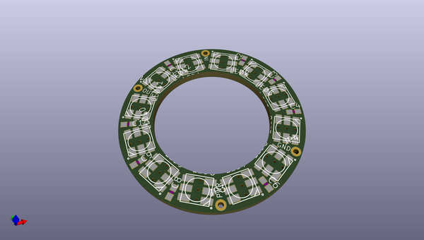
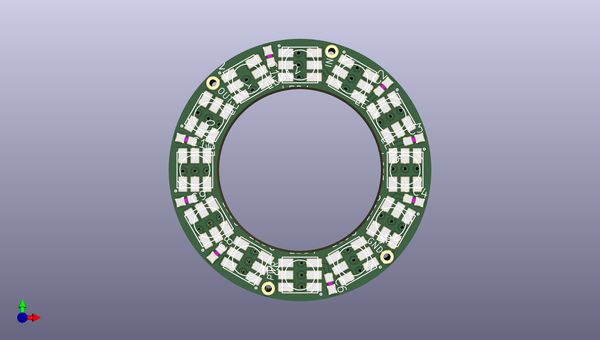
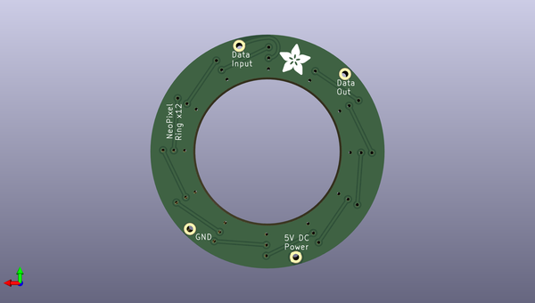

# adafruit_neopixel_ring
 
## summary 
* id: adafruit_adafruit_neopixel_ring_adafruit_neopixel_ring_16
* user: adafruit
* name: adafruit_neopixel_ring
* board: adafruit_neopixel_ring_16
* repo: https://github.com/adafruit/Adafruit-NeoPixel-Ring

* src_file_repo_sch: 
* src_file_repo_sch_link: https://github.com/adafruit/Adafruit-NeoPixel-Ring/tree/master/
* full details link: https://github.com/oomlout/oomlout_oomp_project_bot_v_2/tree/main/projects/adafruit_adafruit_neopixel_ring_adafruit_neopixel_ring_16/current_version/working  

## schematic  
  
[schematic (pdf)](working_schematic.pdf)  

## pcb  
 
  
  
  
[board (pdf)](working.pdf)  

## working_bom
| Id | Designator | Footprint | Quantity | Designation | Supplier and ref |  | None | 
| --- | --- | --- | --- | --- | --- | --- | --- | 
| 1 | JP4,JP1,JP2,JP3 | 1X01-CLEANBIG | 4 |  |  |  | [''] | 
| 2 | C8,C2,C12,C3,C9,C4,C6,C10 | C0603 | 8 |  |  |  | [''] | 
| 3 | LED11,LED1,LED2,LED9,LED8,LED7,LED6,LED12,LED5,LED3,LED10,LED4 | WS28115050 | 12 | WS28115050 |  |  | [''] | 
| 4 | U$2,U$1 | GUIDE-STAR-12 | 2 |  |  |  | [''] | 
| 5 | U$3 | ADAFRUIT_5MM | 1 |  |  |  | [''] | 

## bom_schematic
| Ref | Qnty | Value | Cmp name | Footprint | Description | Vendor | DNP | 
| --- | --- | --- | --- | --- | --- | --- | --- | 
| C2, C3, C4, C6, C8, C9, C10, C12 | 8 | C-EUC0603 | C-EUC0603 | working:C0603 |  |  |  | 
| JP1, JP2, JP3, JP4 | 4 | PINHD-1X1CB | PINHD-1X1CB | working:1X01-CLEANBIG |  |  |  | 
| LED1, LED2, LED3, LED4, LED5, LED6, LED7, LED8, LED9, LED10, LED11, LED12 | 12 | WS28115050 | WS28115050 | working:WS28115050 |  |  |  | 

