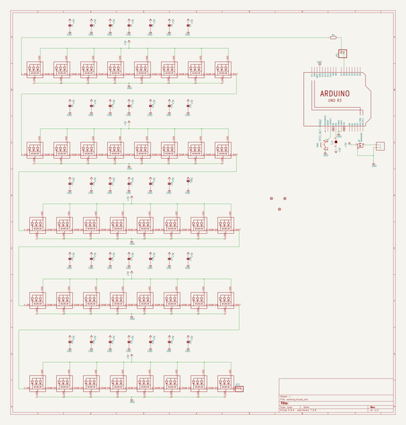
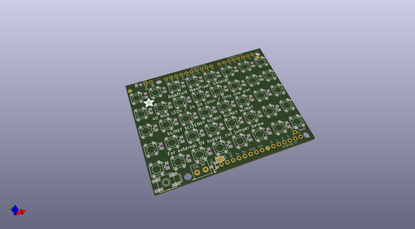
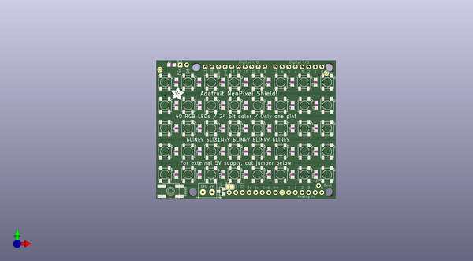
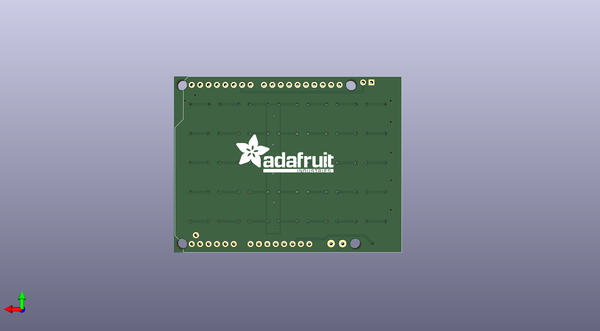

# adafruit_neopixel_shield_pcb
 
## summary 
* id: adafruit_adafruit_neopixel_shield_pcb_adafruit_neopixel_shield_v2
* user: adafruit
* name: adafruit_neopixel_shield_pcb
* board: adafruit_neopixel_shield_v2
* repo: https://github.com/adafruit/Adafruit-NeoPixel-Shield-PCB

* src_file_repo_sch: 
* src_file_repo_sch_link: https://github.com/adafruit/Adafruit-NeoPixel-Shield-PCB/tree/master/
* full details link: https://github.com/oomlout/oomlout_oomp_project_bot_v_2/tree/main/projects/adafruit_adafruit_neopixel_shield_pcb_adafruit_neopixel_shield_v2/current_version/working  

## schematic  
  
[schematic (pdf)](working_schematic.pdf)  

## pcb  
 
  
  
  
[board (pdf)](working.pdf)  

## working_bom
| Id | Designator | Footprint | Quantity | Designation | Supplier and ref |  | None | 
| --- | --- | --- | --- | --- | --- | --- | --- | 
| 1 | C28,C15,R1,C12,C11,C33,C17,C3,C27,C14,C20,C32,C6,C7,C26,C23,C8,C5,C24,C30,C29,C35,C18,C13,C1,C25,C2,C21,C34,C4,C22,C9,C16,C10,C19,C31 | _0805NO | 36 |  |  |  | [''] | 
| 2 | @HOLE3,@HOLE2,@HOLE0,@HOLE1 |  | 4 |  |  |  | [''] | 
| 3 | Q1 | SOT23-WIDE | 1 | IRLML6401 |  |  | [''] | 
| 4 | LED36,LED24,LED6,LED22,LED16,LED1,LED40,LED31,LED19,LED38,LED10,LED7,LED15,LED25,LED21,LED17,LED30,LED3,LED39,LED27,LED12,LED4,LED29,LED23,LED5,LED28,LED26,LED18,LED2,LED14,LED34,LED35,LED9,LED8,LED37,LED11,LED13,LED33,LED32,LED20 | WS2812B | 40 | WS2812B5050 |  |  | [''] | 
| 5 | FID2,FID1,FID3 | FIDUCIAL_1MM | 3 | FIDUCIAL" |  |  | [''] | 
| 6 | U$1 | ADAFRUIT_5MM | 1 |  |  |  | [''] | 
| 7 | SW1 | EVQ-Q2 | 1 | SPST_TACT-EVQQ2 |  |  | [''] | 
| 8 | JP1 | 1X02_ROUND | 1 |  |  |  | [''] | 
| 9 | JP2 | 1X01-CLEANBIG | 1 |  |  |  | [''] | 
| 10 | U1 | ARDUINOR3-BPLACE | 1 | ARDUINOR3-BPLACE |  |  | [''] | 
| 11 | J1 | 1X2-3.5MM | 1 | 1X2-3.5MM |  |  | [''] | 
| 12 | SJ1 | SOLDERJUMPER_CLOSEDWIRE | 1 |  |  |  | [''] | 
| 13 | U$2 | ADAFRUIT_TEXT_30MM | 1 |  |  |  | [''] | 

## bom_schematic
| Ref | Qnty | Value | Cmp name | Footprint | Description | Vendor | DNP | 
| --- | --- | --- | --- | --- | --- | --- | --- | 
| C1, C2, C3, C4, C5, C6, C7, C8, C9, C10, C11, C12, C13, C14, C15, C16, C17, C18, C19, C20, C21, C22, C23, C24, C25, C26, C27, C28, C29, C30, C31, C32, C33, C34, C35 | 35 | CAP_CERAMIC_0805NO | CAP_CERAMIC_0805NO | working:_0805NO |  |  |  | 
| FID1, FID2, FID3 | 3 | FIDUCIAL"" | FIDUCIAL{dblquote}{dblquote} | working:FIDUCIAL_1MM |  |  |  | 
| J1 | 1 | 1X2-3.5MM | 1X2-3.5MM | working:1X2-3.5MM |  |  |  | 
| JP1 | 1 | HEADER-1X2ROUND | HEADER-1X2ROUND | working:1X02_ROUND |  |  |  | 
| JP2 | 1 | PINHD-1X1CB | PINHD-1X1CB | working:1X01-CLEANBIG |  |  |  | 
| LED1, LED2, LED3, LED4, LED5, LED6, LED7, LED8, LED9, LED10, LED11, LED12, LED13, LED14, LED15, LED16, LED17, LED18, LED19, LED20, LED21, LED22, LED23, LED24, LED25, LED26, LED27, LED28, LED29, LED30, LED31, LED32, LED33, LED34, LED35, LED36, LED37, LED38, LED39, LED40 | 40 | WS2812B5050 | WS2812B5050 | working:WS2812B |  |  |  | 
| Q1 | 1 | IRLML6401 | MOSFET-PWIDE | working:SOT23-WIDE |  |  |  | 
| R1 | 1 | RESISTOR_0805NO | RESISTOR_0805NO | working:_0805NO |  |  |  | 
| SJ1 | 1 | SOLDERJUMPERCLOSED | SOLDERJUMPERCLOSED | working:SOLDERJUMPER_CLOSEDWIRE |  |  |  | 
| SW1 | 1 | SPST_TACT-EVQQ2 | SPST_TACT-EVQQ2 | working:EVQ-Q2 |  |  |  | 
| U1 | 1 | ARDUINOR3-BPLACE | ARDUINOR3-BPLACE | working:ARDUINOR3-BPLACE |  |  |  | 

