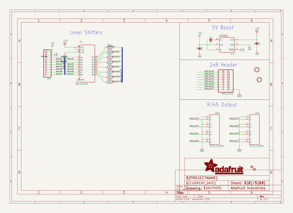
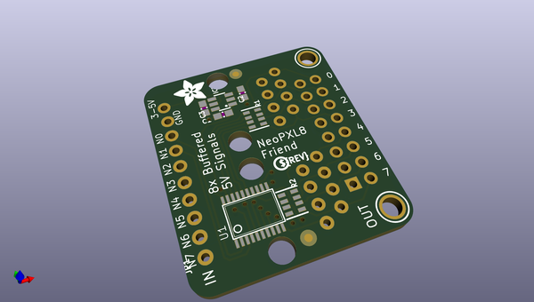
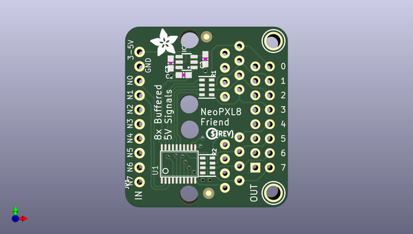
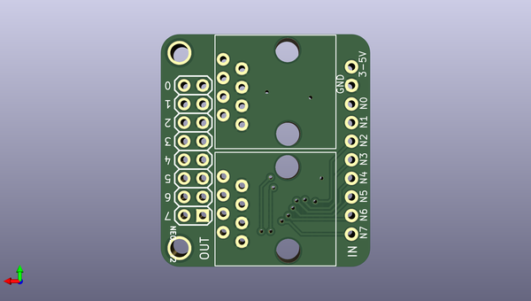

# adafruit_neopxl8_pcbs
 
## summary 
* id: adafruit_adafruit_neopxl8_pcbs_adafruit_neopxl8_friend
* user: adafruit
* name: adafruit_neopxl8_pcbs
* board: adafruit_neopxl8_friend
* repo: https://github.com/adafruit/Adafruit-NeoPXL8-PCBs

* src_file_repo_sch: 
* src_file_repo_sch_link: https://github.com/adafruit/Adafruit-NeoPXL8-PCBs/tree/master/
* full details link: https://github.com/oomlout/oomlout_oomp_project_bot_v_2/tree/main/projects/adafruit_adafruit_neopxl8_pcbs_adafruit_neopxl8_friend/current_version/working  

## schematic  
  
[schematic (pdf)](working_schematic.pdf) 

## pcb  
 
  
  
  
[board (pdf)](working.pdf)  

## working_bom
| Id | Designator | Footprint | Quantity | Designation | Supplier and ref |  | None | 
| --- | --- | --- | --- | --- | --- | --- | --- | 
| 1 | C1,C2,C3 | 0603-NO | 3 | 1uF |  |  | [''] | 
| 2 | IC3 | SOT23-6 | 1 | AP3602 |  |  | [''] | 
| 3 | JP1 | 1X10_ROUND70 | 1 |  |  |  | [''] | 
| 4 | FID2,FID1 | FIDUCIAL_1MM | 2 | FIDUCIAL_1MM |  |  | [''] | 
| 5 | R1,R2 | RESPACK_4X0603 | 2 | 100 |  |  | [''] | 
| 6 | U$3,U$7 | MOUNTINGHOLE_2.5_PLATED | 2 | MOUNTINGHOLE2.5 |  |  | [''] | 
| 7 | U$11 | PCBFEAT-REV-040 | 1 |  |  |  | [''] | 
| 8 | U1 | TSSOP20 | 1 | 74HCT245 |  |  | [''] | 
| 9 | U$12 | ADAFRUIT_5MM | 1 |  |  |  | [''] | 
| 10 | CN1,CN2 | RJ45_VERTICAL_UNSHIELDED | 2 | RJ45_V_UNSH |  |  | [''] | 
| 11 | NEO_OUT2 | 2X08 | 1 |  |  |  | [''] | 

## bom_schematic
| Ref | Qnty | Value | Cmp name | Footprint | Description | Vendor | DNP | 
| --- | --- | --- | --- | --- | --- | --- | --- | 
| C1, C2, C3 | 3 | 1uF | CAP_CERAMIC0603_NO | working:0603-NO |  |  |  | 
| CN1, CN2 | 2 | RJ45_V_UNSH | RJ45_V_UNSH | working:RJ45_VERTICAL_UNSHIELDED |  |  |  | 
| FID1, FID2 | 2 | FIDUCIAL_1MM | FIDUCIAL_1MM | working:FIDUCIAL_1MM |  |  |  | 
| IC3 | 1 | AP3602 | AP3602 | working:SOT23-6 |  |  |  | 
| JP1 | 1 | HEADER-1X1070MIL | HEADER-1X1070MIL | working:1X10_ROUND70 |  |  |  | 
| NEO_OUT2 | 1 | HEADER-2X8 | HEADER-2X8 | working:2X08 |  |  |  | 
| R1, R2 | 2 | 100 | RESISTOR_4PACK | working:RESPACK_4X0603 |  |  |  | 
| U1 | 1 | 74HCT245 | 74LCX245 | working:TSSOP20 |  |  |  | 
| U$3, U$7 | 2 | MOUNTINGHOLE2.5 | MOUNTINGHOLE2.5 | working:MOUNTINGHOLE_2.5_PLATED |  |  |  | 

## mounting_holes
| x | y | package | value | ref | size | 
| --- | --- | --- | --- | --- | --- | 
| 0.0 | 26.67 | MOUNTINGHOLE_2.5_PLATED | MOUNTINGHOLE2.5 | U$3 | m3 | 
| 0.0 | 0.0 | MOUNTINGHOLE_2.5_PLATED | MOUNTINGHOLE2.5 | U$7 | m3 | 

