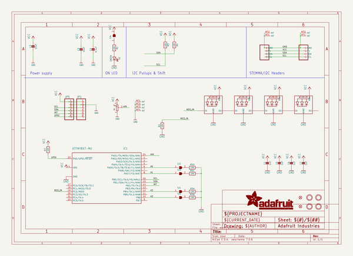

# adafruit_neoslider_pcb
 
## summary 
* id: adafruit_adafruit_neoslider_pcb_adafruit_neoslider
* user: adafruit
* name: adafruit_neoslider_pcb
* board: adafruit_neoslider
* repo: https://github.com/adafruit/Adafruit-NeoSlider-PCB

* src_file_repo_sch: 
* src_file_repo_sch_link: https://github.com/adafruit/Adafruit-NeoSlider-PCB/tree/main/
* full details link: https://github.com/oomlout/oomlout_oomp_project_bot_v_2/tree/main/projects/adafruit_adafruit_neoslider_pcb_adafruit_neoslider/current_version/working  

## schematic  
  
[schematic (pdf)](working_schematic.pdf) 

## pcb  
 
  
  
  
[board (pdf)](working.pdf)  

## working_bom
| Id | Designator | Footprint | Quantity | Designation | Supplier and ref |  | None | 
| --- | --- | --- | --- | --- | --- | --- | --- | 
| 1 | R1,R7,R4,R2,R3 | 0603-NO | 5 | 10K |  |  | [''] | 
| 2 | C7,C1,C5,C6 | 0603-NO | 4 | 1uF |  |  | [''] | 
| 3 | C2,C3 | 0805-NO | 2 | 10uF |  |  | [''] | 
| 4 | U$30,U$31,U$7 | STEMMAQT | 3 |  |  |  | [''] | 
| 5 | U$2,U$9,U$1 | ADAFRUIT_3.5MM | 3 |  |  |  | [''] | 
| 6 | CONN3,CONN4 | JST_SH4 | 2 | STEMMA_I2C_QT |  |  | [''] | 
| 7 | U$17,U$21,U$19,U$3 | MOUNTINGHOLE_2.5_PLATED | 4 | MOUNTINGHOLE2.5 |  |  | [''] | 
| 8 | C4 | 0603-NO | 1 | 0.1uF |  |  | [''] | 
| 9 | SJ1,SJ4,SJ5,SJ2,SJ3 | SOLDERJUMPER_CLOSEDWIRE | 5 |  |  |  | [''] | 
| 10 | D2 | CHIPLED_0603_NOOUTLINE | 1 | GREEN |  |  | [''] | 
| 11 | U$25 | PCBFEAT-REV-040 | 1 |  |  |  | [''] | 
| 12 | JP1,JP5 | 1X06_ROUND_70 | 2 |  |  |  | [''] | 
| 13 | FID1,FID2 | FIDUCIAL_1MM | 2 | FIDUCIAL_1MM |  |  | [''] | 
| 14 | IC1 | QFN24_4MM | 1 | ATTINY8X7-MU |  |  | [''] | 
| 15 | R5 | RESPACK_4X0603 | 1 | 10K |  |  | [''] | 
| 16 | LED2,LED4,LED3,LED1 | NEO3535_REVERSE | 4 | WS2812B_SK6812E |  |  | [''] | 
| 17 | POT1 | SLIDE_POT_75MM | 1 | SLIDE_POT_75MM |  |  | [''] | 

## bom_schematic
| Ref | Qnty | Value | Cmp name | Footprint | Description | Vendor | DNP | 
| --- | --- | --- | --- | --- | --- | --- | --- | 
| C1, C5, C6, C7 | 4 | 1uF | CAP_CERAMIC0603_NO | working:0603-NO |  |  |  | 
| C2, C3 | 2 | 10uF | CAP_CERAMIC0805-NOOUTLINE | working:0805-NO |  |  |  | 
| C4 | 1 | 0.1uF | CAP_CERAMIC0603_NO | working:0603-NO |  |  |  | 
| CONN3, CONN4 | 2 | STEMMA_I2C_QT | STEMMA_I2C_QT | working:JST_SH4 |  |  |  | 
| D2 | 1 | GREEN | LED0603_NOOUTLINE | working:CHIPLED_0603_NOOUTLINE |  |  |  | 
| FID1, FID2 | 2 | FIDUCIAL_1MM | FIDUCIAL_1MM | working:FIDUCIAL_1MM |  |  |  | 
| IC1 | 1 | ATTINY8X7-MU | ATTINY8X7-MU | working:QFN24_4MM |  |  |  | 
| JP1, JP5 | 2 | HEADER-1X670MIL | HEADER-1X670MIL | working:1X06_ROUND_70 |  |  |  | 
| LED1, LED2, LED3, LED4 | 4 | WS2812B_SK6812E | WS2812B_SK6812E | working:NEO3535_REVERSE |  |  |  | 
| POT1 | 1 | SLIDE_POT_75MM | SLIDE_POT_75MM | working:SLIDE_POT_75MM |  |  |  | 
| R1, R2, R3, R4, R7 | 5 | 10K | RESISTOR_0603_NOOUT | working:0603-NO |  |  |  | 
| R5 | 1 | 10K | RESISTOR_4PACK | working:RESPACK_4X0603 |  |  |  | 
| SJ1, SJ2, SJ3, SJ4, SJ5 | 5 | SOLDERJUMPERCLOSED | SOLDERJUMPERCLOSED | working:SOLDERJUMPER_CLOSEDWIRE |  |  |  | 
| U$3, U$17, U$19, U$21 | 4 | MOUNTINGHOLE2.5 | MOUNTINGHOLE2.5 | working:MOUNTINGHOLE_2.5_PLATED |  |  |  | 

## mounting_holes
| x | y | package | value | ref | size | 
| --- | --- | --- | --- | --- | --- | 
| 38.1 | 16.51 | MOUNTINGHOLE_2.5_PLATED | MOUNTINGHOLE2.5 | U$3 | m3 | 
| 0.0 | 16.51 | MOUNTINGHOLE_2.5_PLATED | MOUNTINGHOLE2.5 | U$17 | m3 | 
| 38.1 | 0.0 | MOUNTINGHOLE_2.5_PLATED | MOUNTINGHOLE2.5 | U$19 | m3 | 
| 0.0 | 0.0 | MOUNTINGHOLE_2.5_PLATED | MOUNTINGHOLE2.5 | U$21 | m3 | 

