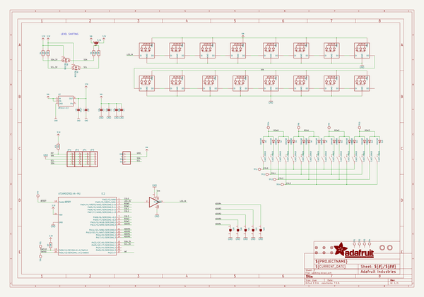
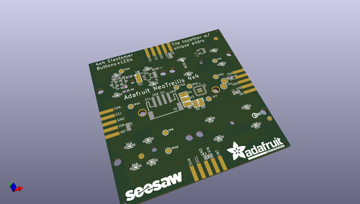
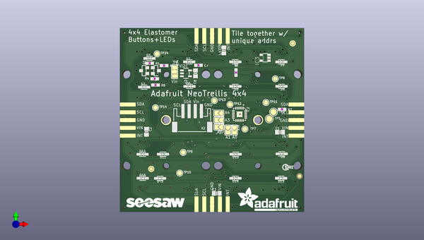
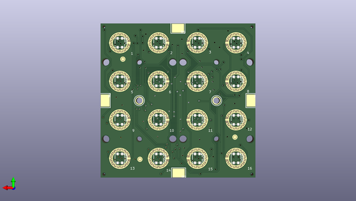

# adafruit_neotrellis_4x4_pcb
 
## summary 
* id: adafruit_adafruit_neotrellis_4x4_pcb_adafruit_neotrellis_4x4
* user: adafruit
* name: adafruit_neotrellis_4x4_pcb
* board: adafruit_neotrellis_4x4
* repo: https://github.com/adafruit/Adafruit-NeoTrellis-4x4-PCB

* src_file_repo_sch: 
* src_file_repo_sch_link: https://github.com/adafruit/Adafruit-NeoTrellis-4x4-PCB/tree/master/
* full details link: https://github.com/oomlout/oomlout_oomp_project_bot_v_2/tree/main/projects/adafruit_adafruit_neotrellis_4x4_pcb_adafruit_neotrellis_4x4/current_version/working  

## schematic  
  
[schematic (pdf)](working_schematic.pdf)  

## pcb  
 
  
  
  
[board (pdf)](working.pdf)  

## working_bom
| Id | Designator | Footprint | Quantity | Designation | Supplier and ref |  | None | 
| --- | --- | --- | --- | --- | --- | --- | --- | 
| 1 | D10,D15,D2,D3,D13,D4,D1,D8,D14,D6,D11,D16,D12,D5,D9,D7 | SOD-323 | 16 | 1N4148 |  |  | [''] | 
| 2 | IC2 | QFN24_4MM | 1 | ATSAMD09D14A-MU |  |  | [''] | 
| 3 | R8,R5,R4,R6,R7 | 0603-NO | 5 | 10K |  |  | [''] | 
| 4 | TP5,TP6 | TESTPOINT_ROUND_2MM | 2 |  |  |  | [''] | 
| 5 | C7 | 0603-NO | 1 | 1uF |  |  | [''] | 
| 6 | TP14,TP12,TP11,TP10,TP13,TP9,TP8,TP24,TP7 | TESTPOINT_ROUND_1.5MM | 9 |  |  |  | [''] | 
| 7 | C8 | 0805-NO | 1 | 10µF |  |  | [''] | 
| 8 | C1,C4,C2,C3 | 0805-NO | 4 | 10u |  |  | [''] | 
| 9 | JP2,JP4,JP1,JP3 | 5P_EDGECONNECT | 4 |  |  |  | [''] | 
| 10 | @HOLE2,@HOLE5,@HOLE11,@HOLE15,@HOLE7,@HOLE14,@HOLE12,@HOLE6,@HOLE0,@HOLE8,@HOLE10,@HOLE3,@HOLE9,@HOLE13,@HOLE4,@HOLE1 |  | 16 |  |  |  | [''] | 
| 11 | Q2,Q1 | SOT23-WIDE | 2 | BSS138 |  |  | [''] | 
| 12 | SJ1,SJ8,SJ2,SJ9,SJ3 | SOLDERJUMPER_ARROW_NOPASTE | 5 |  |  |  | [''] | 
| 13 | X2 | JSTPH4 | 1 | STEMMA_I2C_RASMT |  |  | [''] | 
| 14 | SJ4 | SOLDERJUMPER_2WAY_OPEN_NOPASTE | 1 |  |  |  | [''] | 
| 15 | U$3 | ADAFRUIT_TEXT_20MM | 1 |  |  |  | [''] | 
| 16 | FID1,FID2,FID3,FID4,FID5,FID6 | FIDUCIAL_1MM | 6 | FIDUCIAL_1MM |  |  | [''] | 
| 17 | U2 | SOT23-5 | 1 | AP2112-3.3 |  |  | [''] | 
| 18 | IC3 | SOT23-5 | 1 | 74AHCT1G125DBV |  |  | [''] | 
| 19 | U$14 | SEESAW_LOGO | 1 |  |  |  | [''] | 
| 20 | R3 | 0603-NO | 1 | 10k |  |  | [''] | 
| 21 | U$19 | PCBFEAT-REV-040 | 1 |  |  |  | [''] | 
| 22 | U$10,U$7,U$6,U$25,U$28,U$4,U$23,U$5,U$27,U$24,U$26,U$29,U$9,U$8,U$12,U$11 | ELAST_PAD_SQUARE_10MM_4X4WIDE | 16 | ELAST_10X10 |  |  | [''] | 
| 23 | LED14,LED7,LED4,LED8,LED16,LED5,LED15,LED13,LED12,LED2,LED10,LED9,LED3,LED11,LED6,LED1 | LED3535 | 16 | WS2812B3535 |  |  | [''] | 
| 24 | U$1,U$2 | MOUNTINGHOLE_2.5_PLATED | 2 | MOUNTINGHOLE2.5 |  |  | [''] | 
| 25 | TP1,TP2,TP4,TP3 | TESTPOINT_SMT | 4 |  |  |  | [''] | 

## bom_schematic
| Ref | Qnty | Value | Cmp name | Footprint | Description | Vendor | DNP | 
| --- | --- | --- | --- | --- | --- | --- | --- | 
| C1, C2, C3, C4 | 4 | 10u | CAP_CERAMIC0805-NOOUTLINE | working:0805-NO |  |  |  | 
| C7 | 1 | 1uF | CAP_CERAMIC0603_NO | working:0603-NO |  |  |  | 
| C8 | 1 | 10µF | CAP_CERAMIC0805-NOOUTLINE | working:0805-NO |  |  |  | 
| D1, D2, D3, D4, D5, D6, D7, D8, D9, D10, D11, D12, D13, D14, D15, D16 | 16 | 1N4148 | DIODESOD-323 | working:SOD-323 |  |  |  | 
| FID1, FID2, FID3, FID4, FID5, FID6 | 6 | FIDUCIAL_1MM | FIDUCIAL_1MM | working:FIDUCIAL_1MM |  |  |  | 
| IC2 | 1 | ATSAMD09D14A-MU | ATSAMD09D14A-MU | working:QFN24_4MM |  |  |  | 
| IC3 | 1 | 741G125DBV | 741G125DBV | working:SOT23-5 |  |  |  | 
| JP1, JP2, JP3, JP4 | 4 | HEADER-1X5EDGESMT | HEADER-1X5EDGESMT | working:5P_EDGECONNECT |  |  |  | 
| LED1, LED2, LED3, LED4, LED5, LED6, LED7, LED8, LED9, LED10, LED11, LED12, LED13, LED14, LED15, LED16 | 16 | WS2812B3535 | WS2812B3535 | working:LED3535 |  |  |  | 
| Q1, Q2 | 2 | BSS138 | MOSFET-NWIDE | working:SOT23-WIDE |  |  |  | 
| R3 | 1 | 10k | RESISTOR_0603_NOOUT | working:0603-NO |  |  |  | 
| R4, R5, R6, R7, R8 | 5 | 10K | RESISTOR_0603_NOOUT | working:0603-NO |  |  |  | 
| SJ1, SJ2, SJ3, SJ8, SJ9 | 5 | SOLDERJUMPER | SOLDERJUMPER | working:SOLDERJUMPER_ARROW_NOPASTE |  |  |  | 
| SJ4 | 1 | SOLDERJUMPER_2WAY | SOLDERJUMPER_2WAY | working:SOLDERJUMPER_2WAY_OPEN_NOPASTE |  |  |  | 
| TP1, TP2, TP3, TP4 | 4 | TESTPOINT | TESTPOINT | working:TESTPOINT_SMT |  |  |  | 
| TP5, TP6 | 2 | TESTPOINTROUND2MM | TESTPOINTROUND2MM | working:TESTPOINT_ROUND_2MM |  |  |  | 
| TP7, TP8, TP9, TP10, TP11, TP12, TP13, TP14, TP24 | 9 | TESTPOINTROUND1.5MM | TESTPOINTROUND1.5MM | working:TESTPOINT_ROUND_1.5MM |  |  |  | 
| U2 | 1 | AP2112-3.3 | VREG_SOT23-5 | working:SOT23-5 |  |  |  | 
| U$1, U$2 | 2 | MOUNTINGHOLE2.5 | MOUNTINGHOLE2.5 | working:MOUNTINGHOLE_2.5_PLATED |  |  |  | 
| U$4, U$5, U$6, U$7, U$8, U$9, U$10, U$11, U$12, U$23, U$24, U$25, U$26, U$27, U$28, U$29 | 16 | ELAST_10X10 | ELAST_10X10 | working:ELAST_PAD_SQUARE_10MM_4X4WIDE |  |  |  | 
| X2 | 1 | STEMMA_I2C_RASMT | STEMMA_I2C_RASMT | working:JSTPH4 |  |  |  | 

