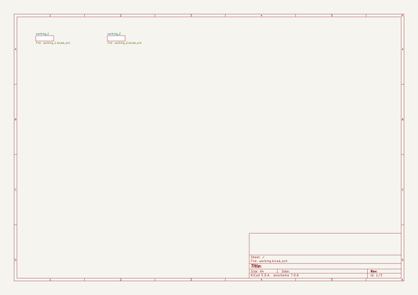

# adafruit_neotrellis_m4_pcb_and_enclosure
 
## summary 
* id: adafruit_adafruit_neotrellis_m4_pcb_and_enclosure_adafruit_neotrellis_m4
* user: adafruit
* name: adafruit_neotrellis_m4_pcb_and_enclosure
* board: adafruit_neotrellis_m4
* repo: https://github.com/adafruit/Adafruit-NeoTrellis-M4-PCB-and-Enclosure

* src_file_repo_sch: 
* src_file_repo_sch_link: https://github.com/adafruit/Adafruit-NeoTrellis-M4-PCB-and-Enclosure/tree/master/
* full details link: https://github.com/oomlout/oomlout_oomp_project_bot_v_2/tree/main/projects/adafruit_adafruit_neotrellis_m4_pcb_and_enclosure_adafruit_neotrellis_m4/current_version/working  

## schematic  
  
[schematic (pdf)](working_schematic.pdf) 

## pcb  
 
  
  
  
[board (pdf)](working.pdf)  

## working_bom
| Id | Designator | Footprint | Quantity | Designation | Supplier and ref |  | None | 
| --- | --- | --- | --- | --- | --- | --- | --- | 
| 1 | D6,D14,D5,D1,D11,D16,D2,D10,D19,D26,D25,D12,D32,D21,D18,D28,D31,D30,D24,D9,D17,D29,D7,D20,D8,D3,D4,D22,D13,D27,D23,D15 | SOD-323 | 32 | 1N4148 |  |  | [''] | 
| 2 | JP4,JP3,JP1,JP2 | 5P_EDGECONNECT | 4 |  |  |  | [''] | 
| 3 | @HOLE3,@HOLE0,@HOLE16,@HOLE6,@HOLE15,@HOLE8,@HOLE12,@HOLE11,@HOLE5,@HOLE14,@HOLE4,@HOLE2,@HOLE17,@HOLE1,@HOLE10,@HOLE9,@HOLE7,@HOLE13 |  | 18 |  |  |  | [''] | 
| 4 | C11,C9 | 0805-NO | 2 | 10µF |  |  | [''] | 
| 5 | FB3,FB4 | 0805-NO | 2 | FERRITE |  |  | [''] | 
| 6 | R11,R13,R12,R9 | 0603-NO | 4 | 10K |  |  | [''] | 
| 7 | C2,C1,C6,C4,C3,C5 | 0805-NO | 6 | 10u |  |  | [''] | 
| 8 | TP27,TP44,TP42,TP17,TP15,TP19,TP20,TP36,TP13,TP37,TP49,TP48,TP7,TP22,TP50,TP43,TP12,TP28,TP41,TP16,TP8,TP35,TP47,TP39,TP21,TP34,TP40,TP46,TP31,TP23,TP33,TP14,TP30,TP32,TP38,TP29,TP25,TP24,TP18,TP26,TP45 | TESTPOINT_ROUND_1.5MM | 41 |  |  |  | [''] | 
| 9 | R7,R6 | 0603-NO | 2 | 1M |  |  | [''] | 
| 10 | X2 | 2X05_1.27MM_BOX_POSTS | 1 | 2x5 0.05 SWD" |  |  | [''] | 
| 11 | R4,R3,R5 | 0603-NO | 3 | 1K |  |  | [''] | 
| 12 | C12,C22,C21,C14,C10 | 0603-NO | 5 | 1uF |  |  | [''] | 
| 13 | SW1 | KMR2 | 1 | SPST_TACT-KMR2 |  |  | [''] | 
| 14 | C18 | 0603-NO | 1 | 100pF |  |  | [''] | 
| 15 | U$78 | PCBFEAT-REV-040 | 1 |  |  |  | [''] | 
| 16 | U$48 | TRELLISLOGO | 1 |  |  |  | [''] | 
| 17 | C20,C19,C13 | 0805-NO | 3 | 10uF |  |  | [''] | 
| 18 | U$3 | ADAFRUIT_TEXT_20MM | 1 |  |  |  | [''] | 
| 19 | TP6,TP5 | TESTPOINT_ROUND_2MM | 2 |  |  |  | [''] | 
| 20 | X3 | 4UCONN_20329_NARROW | 1 | microUSB |  |  | [''] | 
| 21 | U1 | SOT23-5 | 1 | AP2112K-3.3 |  |  | [''] | 
| 22 | R2,R1 | RESPACK_4X0603 | 2 | 10K |  |  | [''] | 
| 23 | U4 | LGA14 | 1 |  |  |  | [''] | 
| 24 | C15,C23 | 0603-NO | 2 | 0.1uF |  |  | [''] | 
| 25 | IC4 | TQFN48_7MM | 1 | ATSAMD51G_TQFN48 |  |  | [''] | 
| 26 | FID2,FID1,FID3,FID6,FID4,FID5 | FIDUCIAL_1MM | 6 | FIDUCIAL_1MM |  |  | [''] | 
| 27 | C16 | 0603-NO | 1 | 0.1µF |  |  | [''] | 
| 28 | C17 | 0603-NO | 1 | 0.01uF |  |  | [''] | 
| 29 | CONN1 | JSTPH4 | 1 | STEMMA_I2C_RASMT |  |  | [''] | 
| 30 | D34 | SOD-123FL | 1 | MBR120 |  |  | [''] | 
| 31 | IC1 | SOT23-5 | 1 | 74HCT1G125DBV |  |  | [''] | 
| 32 | C7,C8 | C1210 | 2 | 100uF |  |  | [''] | 
| 33 | FB2,FB1 | 0805 | 2 | FERRITE |  |  | [''] | 
| 34 | U2 | SC70-5 | 1 | MAX4466EXK+T |  |  | [''] | 
| 35 | X4 | 4UCONN_18510 | 1 | 4UCONN_18510 |  |  | [''] | 
| 36 | U3 | SOIC8_208MIL | 1 | GD25x16 |  |  | [''] | 
| 37 | PTC1 | 1206 | 1 | 500mA Fuse |  |  | [''] | 
| 38 | R8 | 0603-NO | 1 | 100K |  |  | [''] | 
| 39 | L2 | APA102_2020 | 1 | AP102-2020 |  |  | [''] | 
| 40 | R10 | RESPACK_4X0603 | 1 | 100 |  |  | [''] | 
| 41 | LED4,LED31,LED20,LED7,LED10,LED6,LED16,LED2,LED23,LED14,LED11,LED28,LED15,LED13,LED3,LED22,LED21,LED18,LED9,LED1,LED27,LED30,LED25,LED24,LED17,LED32,LED26,LED8,LED5,LED29,LED12,LED19 | LED3535 | 32 | WS2812B3535 |  |  | [''] | 
| 42 | U$11,U$25,U$26,U$9,U$39,U$28,U$46,U$41,U$4,U$38,U$40,U$8,U$47,U$29,U$35,U$45,U$27,U$33,U$5,U$24,U$6,U$23,U$43,U$10,U$19,U$36,U$44,U$12,U$7,U$37,U$42,U$34 | ELAST_PAD_SQUARE_10MM_4X4WIDE | 32 | ELAST_10X10 |  |  | [''] | 
| 43 | TP1,TP3,TP2,TP4 | TESTPOINT_SMT | 4 |  |  |  | [''] | 

## bom_schematic
| Ref | Qnty | Value | Cmp name | Footprint | Description | Vendor | DNP | 
| --- | --- | --- | --- | --- | --- | --- | --- | 
| C1, C2, C3, C4, C5, C6 | 6 | 10u | CAP_CERAMIC0805-NOOUTLINE | working:0805-NO |  |  |  | 
| C7, C8 | 2 | 100uF | C-USC1210 | working:C1210 |  |  |  | 
| C9, C11 | 2 | 10µF | CAP_CERAMIC0805-NOOUTLINE | working:0805-NO |  |  |  | 
| C10, C12, C14, C21, C22 | 5 | 1uF | CAP_CERAMIC0603_NO | working:0603-NO |  |  |  | 
| C13, C19, C20 | 3 | 10uF | CAP_CERAMIC0805-NOOUTLINE | working:0805-NO |  |  |  | 
| C15, C23 | 2 | 0.1uF | CAP_CERAMIC0603_NO | working:0603-NO |  |  |  | 
| C16 | 1 | 0.1µF | CAP_CERAMIC0603_NO | working:0603-NO |  |  |  | 
| C17 | 1 | 0.01uF | CAP_CERAMIC0603_NO | working:0603-NO |  |  |  | 
| C18 | 1 | 100pF | CAP_CERAMIC0603_NO | working:0603-NO |  |  |  | 
| CONN1 | 1 | STEMMA_I2C_RASMT | STEMMA_I2C_RASMT | working:JSTPH4 |  |  |  | 
| D1, D2, D3, D4, D5, D6, D7, D8, D9, D10, D11, D12, D13, D14, D15, D16, D17, D18, D19, D20, D21, D22, D23, D24, D25, D26, D27, D28, D29, D30, D31, D32 | 32 | 1N4148 | DIODESOD-323 | working:SOD-323 |  |  |  | 
| D34 | 1 | MBR120 | DIODE_SOD-123FL | working:SOD-123FL |  |  |  | 
| FB1, FB2 | 2 | FERRITE | FERRITE0805 | working:0805 |  |  |  | 
| FB3, FB4 | 2 | FERRITE | FERRITE-0805NO | working:0805-NO |  |  |  | 
| FID1, FID2, FID3, FID4, FID5, FID6 | 6 | FIDUCIAL_1MM | FIDUCIAL_1MM | working:FIDUCIAL_1MM |  |  |  | 
| IC1 | 1 | 741G125DBV | 741G125DBV | working:SOT23-5 |  |  |  | 
| IC4 | 1 | ATSAMD51G_TQFN48 | ATSAMD51G_TQFN48 | working:TQFN48_7MM |  |  |  | 
| JP1, JP2, JP3, JP4 | 4 | HEADER-1X5EDGESMT | HEADER-1X5EDGESMT | working:5P_EDGECONNECT |  |  |  | 
| L2 | 1 | AP102-2020 | APA1022020 | working:APA102_2020 |  |  |  | 
| LED1, LED2, LED3, LED4, LED5, LED6, LED7, LED8, LED9, LED10, LED11, LED12, LED13, LED14, LED15, LED16, LED17, LED18, LED19, LED20, LED21, LED22, LED23, LED24, LED25, LED26, LED27, LED28, LED29, LED30, LED31, LED32 | 32 | WS2812B3535 | WS2812B3535 | working:LED3535 |  |  |  | 
| PTC1 | 1 | 500mA Fuse | PTC1206 | working:1206 |  |  |  | 
| R1, R2 | 2 | 10K | RESISTOR_4PACK | working:RESPACK_4X0603 |  |  |  | 
| R3, R4, R5 | 3 | 1K | RESISTOR_0603_NOOUT | working:0603-NO |  |  |  | 
| R6, R7 | 2 | 1M | RESISTOR_0603_NOOUT | working:0603-NO |  |  |  | 
| R8 | 1 | 100K | RESISTOR_0603_NOOUT | working:0603-NO |  |  |  | 
| R9, R11, R12, R13 | 4 | 10K | RESISTOR_0603_NOOUT | working:0603-NO |  |  |  | 
| R10 | 1 | 100 | RESISTOR_4PACK | working:RESPACK_4X0603 |  |  |  | 
| SW1 | 1 | SPST_TACT-KMR2 | SPST_TACT-KMR2 | working:KMR2 |  |  |  | 
| TP1, TP2, TP3, TP4 | 4 | TESTPOINT | TESTPOINT | working:TESTPOINT_SMT |  |  |  | 
| TP5, TP6 | 2 | TESTPOINTROUND2MM | TESTPOINTROUND2MM | working:TESTPOINT_ROUND_2MM |  |  |  | 
| TP7, TP8, TP12, TP13, TP14, TP15, TP16, TP17, TP18, TP19, TP20, TP21, TP22, TP23, TP24, TP25, TP26, TP27, TP28, TP29, TP30, TP31, TP32, TP33, TP34, TP35, TP36, TP37, TP38, TP39, TP40, TP41, TP42, TP43, TP44, TP45, TP46, TP47, TP48, TP49, TP50 | 41 | TESTPOINTROUND1.5MM | TESTPOINTROUND1.5MM | working:TESTPOINT_ROUND_1.5MM |  |  |  | 
| U1 | 1 | AP2112K-3.3 | VREG_SOT23-5 | working:SOT23-5 |  |  |  | 
| U2 | 1 | MAX4466EXK+T | AUDIOAMP_MAX4466 | working:SC70-5 |  |  |  | 
| U3 | 1 | GD25x16 | SPIFLASH_8PIN208MIL | working:SOIC8_208MIL |  |  |  | 
| U4 | 1 | ACCEL_ADXL343 | ACCEL_ADXL343 | working:LGA14 |  |  |  | 
| U$4, U$5, U$6, U$7, U$8, U$9, U$10, U$11, U$12, U$19, U$23, U$24, U$25, U$26, U$27, U$28, U$29, U$33, U$34, U$35, U$36, U$37, U$38, U$39, U$40, U$41, U$42, U$43, U$44, U$45, U$46, U$47 | 32 | ELAST_10X10 | ELAST_10X10 | working:ELAST_PAD_SQUARE_10MM_4X4WIDE |  |  |  | 
| X2 | 1 | 2x5 0.05" SWD | JTAG-CORTEXBOXPOSTS | working:2X05_1.27MM_BOX_POSTS |  |  |  | 
| X3 | 1 | microUSB | USB_MICRO_NARROW | working:4UCONN_20329_NARROW |  |  |  | 
| X4 | 1 | 4UCONN_18510 | AUDIO_3.5MMJACK_4POL | working:4UCONN_18510 |  |  |  | 

