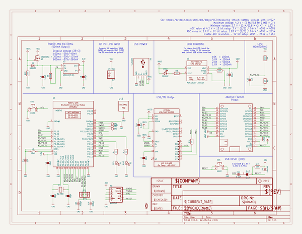

# adafruit_nrf52_bluefruit_feather_pcb
 
## summary 
* id: adafruit_adafruit_nrf52_bluefruit_feather_pcb_adafruit_nrf52840_bluefruit_feather_express_rev_d
* user: adafruit
* name: adafruit_nrf52_bluefruit_feather_pcb
* board: adafruit_nrf52840_bluefruit_feather_express_rev_d
* repo: https://github.com/adafruit/Adafruit-nRF52-Bluefruit-Feather-PCB

* src_file_repo_sch: 
* src_file_repo_sch_link: https://github.com/adafruit/Adafruit-nRF52-Bluefruit-Feather-PCB/tree/master/
* full details link: https://github.com/oomlout/oomlout_oomp_project_bot_v_2/tree/main/projects/adafruit_adafruit_nrf52_bluefruit_feather_pcb_adafruit_nrf52840_bluefruit_feather_express_rev_d/current_version/working  

## schematic  
  
[schematic (pdf)](working_schematic.pdf) 

## pcb  
 
  
  
  
[board (pdf)](working.pdf)  

## working_bom
| Id | Designator | Footprint | Quantity | Designation | Supplier and ref |  | None | 
| --- | --- | --- | --- | --- | --- | --- | --- | 
| 1 | CHG0 | CHIPLED_0805_NOOUTLINE | 1 | ORANGE |  |  | [''] | 
| 2 | D1 | CHIPLED_0805_NOOUTLINE | 1 | RED |  |  | [''] | 
| 3 | C1,C2 | 0603-NO | 2 | 22pF |  |  | [''] | 
| 4 | L2 | 0805-NO | 1 | 10uH |  |  | [''] | 
| 5 | C8,C5,C6 | 0805-NO | 3 | 10µF |  |  | [''] | 
| 6 | U2 | SOT23-5 | 1 | AP2112(3.3V) |  |  | [''] | 
| 7 | C3 | 0805-NO | 1 | 10uF |  |  | [''] | 
| 8 | C11,C10 | 0603-NO | 2 | 0.1uF |  |  | [''] | 
| 9 | X3 | 4UCONN_20329_V2 | 1 | 4u20329 |  |  | [''] | 
| 10 | R12 | 0603-NO | 1 | 100k |  |  | [''] | 
| 11 | R9,R2,R3,R1 | 0603-NO | 4 | 1K |  |  | [''] | 
| 12 | FID1,FID3 | FIDUCIAL_1MM | 2 | FIDUCIAL_1MM |  |  | [''] | 
| 13 | U4 | QFN24_4MM_SMSC | 1 | CP2104 |  |  | [''] | 
| 14 | R5 | 0603-NO | 1 | 100K |  |  | [''] | 
| 15 | U$49 | ADAFRUIT_3.5MM | 1 |  |  |  | [''] | 
| 16 | SW2,SW1 | BTN_KMR2_4.6X2.8 | 2 | KMR2 |  |  | [''] | 
| 17 | Q3 | SOT23-R | 1 | DMG3415U-7 |  |  | [''] | 
| 18 | R8,R7 | 0603-NO | 2 | 10K |  |  | [''] | 
| 19 | D5 | SOD-123 | 1 | MBR120 |  |  | [''] | 
| 20 | C12 | 0603-NO | 1 | 1nF |  |  | [''] | 
| 21 | X2 | JSTPH2 | 1 | JSTPH |  |  | [''] | 
| 22 | JP1,JP2 | 1X01_2MM | 2 |  |  |  | [''] | 
| 23 | X1 | 2X05_1.27MM_BOX_POSTS | 1 | 4u20317 |  |  | [''] | 
| 24 | R6 | 0603-NO | 1 | 2M |  |  | [''] | 
| 25 | C7 | 0805-NO | 1 | 10uf |  |  | [''] | 
| 26 | U1 | BLE_MODULE_RAYTAC_MDBT42 | 1 | MDBT42 |  |  | [''] | 
| 27 | U3 | SOT23-5 | 1 | MCP73831T-2ACI/OT |  |  | [''] | 
| 28 | R4 | 0603-NO | 1 | 806K |  |  | [''] | 
| 29 | C4 | 0603-NO | 1 | 1uF |  |  | [''] | 
| 30 | C9,C13 | _0603MP | 2 | 300pF |  |  | [''] | 
| 31 | D4 | SOD-323 | 1 | 1N4148 |  |  | [''] | 
| 32 | MS1 | FEATHERWING_NODIM | 1 | FEATHERWING_NODIM |  |  | [''] | 
| 33 | X4 | XTAL3215 | 1 | 32.768 |  |  | [''] | 
| 34 | D2 | CHIPLED_0805_NOOUTLINE | 1 | BLUE |  |  | [''] | 
| 35 | U$47 | ADAFRUIT_5MM | 1 |  |  |  | [''] | 
| 36 | TP4,TP3 | TESTPOINT_ROUND_2MM | 2 |  |  |  | [''] | 
| 37 | U$45 | BLUEFRUITLOGO_100MM | 1 |  |  |  | [''] | 
| 38 | U$17 | PCBFEAT-REV-040 | 1 |  |  |  | [''] | 
| 39 | SJ2 | SOLDERJUMPER_CLOSEDWIRE | 1 | BAT |  |  | [''] | 
| 40 | U$46 | FEATHERLOGO_MED | 1 |  |  |  | [''] | 
| 41 | TP2 | PAD-1.5X2.0 | 1 | FRST |  |  | [''] | 

## bom_schematic
| Ref | Qnty | Value | Cmp name | Footprint | Description | Vendor | DNP | 
| --- | --- | --- | --- | --- | --- | --- | --- | 
| C1, C2 | 2 | 22pF | CAP_CERAMIC0603_NO | working:0603-NO |  |  |  | 
| C3 | 1 | 10uF | CAP_CERAMIC0805-NOOUTLINE | working:0805-NO |  |  |  | 
| C4 | 1 | 1uF | CAP_CERAMIC0603_NO | working:0603-NO |  |  |  | 
| C5, C6, C8 | 3 | 10µF | CAP_CERAMIC0805-NOOUTLINE | working:0805-NO |  |  |  | 
| C7 | 1 | 10uf | CAP_CERAMIC0805-NOOUTLINE | working:0805-NO |  |  |  | 
| C9, C13 | 2 | 300pF | CAP_CERAMIC_0603MP | working:_0603MP |  |  |  | 
| C10, C11 | 2 | 0.1uF | CAP_CERAMIC0603_NO | working:0603-NO |  |  |  | 
| C12 | 1 | 1nF | CAP_CERAMIC0603_NO | working:0603-NO |  |  |  | 
| CHG0 | 1 | ORANGE | LED0805_NOOUTLINE | working:CHIPLED_0805_NOOUTLINE |  |  |  | 
| D1 | 1 | RED | LED0805_NOOUTLINE | working:CHIPLED_0805_NOOUTLINE |  |  |  | 
| D2 | 1 | BLUE | LED0805_NOOUTLINE | working:CHIPLED_0805_NOOUTLINE |  |  |  | 
| D4 | 1 | 1N4148 | DIODESOD-323 | working:SOD-323 |  |  |  | 
| D5 | 1 | MBR120 | DIODE-SCHOTTKYSOD-123 | working:SOD-123 |  |  |  | 
| FID1, FID3 | 2 | FIDUCIAL_1MM | FIDUCIAL_1MM | working:FIDUCIAL_1MM |  |  |  | 
| JP1, JP2 | 2 | HEADER-1X12MM | HEADER-1X12MM | working:1X01_2MM |  |  |  | 
| L2 | 1 | 10uH | INDUCTOR0805-NO | working:0805-NO |  |  |  | 
| MS1 | 1 | FEATHERWING_NODIM | FEATHERWING_NODIM | working:FEATHERWING_NODIM |  |  |  | 
| Q3 | 1 | DMG3415U-7 | MOSFET-P | working:SOT23-R |  |  |  | 
| R1, R2, R3, R9 | 4 | 1K | RESISTOR_0603_NOOUT | working:0603-NO |  |  |  | 
| R4 | 1 | 806K | RESISTOR_0603_NOOUT | working:0603-NO |  |  |  | 
| R5 | 1 | 100K | RESISTOR_0603_NOOUT | working:0603-NO |  |  |  | 
| R6 | 1 | 2M | RESISTOR_0603_NOOUT | working:0603-NO |  |  |  | 
| R7, R8 | 2 | 10K | RESISTOR_0603_NOOUT | working:0603-NO |  |  |  | 
| R12 | 1 | 100k | RESISTOR_0603_NOOUT | working:0603-NO |  |  |  | 
| SJ2 | 1 | BAT | SOLDERJUMPERCLOSED | working:SOLDERJUMPER_CLOSEDWIRE |  |  |  | 
| SW1, SW2 | 2 | KMR2 | SWITCH_TACT_SMT4.6X2.8 | working:BTN_KMR2_4.6X2.8 |  |  |  | 
| TP2 | 1 | FRST | TESTPOINT1.5X2.0MM_NOCREAM | working:PAD-1.5X2.0 |  |  |  | 
| TP3, TP4 | 2 | TESTPOINTROUND2MM | TESTPOINTROUND2MM | working:TESTPOINT_ROUND_2MM |  |  |  | 
| U1 | 1 | MDBT42 | NRF52832_MODULE_MDBT42 | working:BLE_MODULE_RAYTAC_MDBT42 |  |  |  | 
| U2 | 1 | AP2112(3.3V) | VREG_SOT23-5 | working:SOT23-5 |  |  |  | 
| U3 | 1 | MCP73831T-2ACI/OT | MCP73831/2 | working:SOT23-5 |  |  |  | 
| U4 | 1 | CP2104 | CP2104 | working:QFN24_4MM_SMSC |  |  |  | 
| X1 | 1 | 4u20317 | JTAG-CORTEXBOXPOSTS | working:2X05_1.27MM_BOX_POSTS |  |  |  | 
| X2 | 1 | JSTPH | CON_JST_PH_2PIN | working:JSTPH2 |  |  |  | 
| X3 | 1 | 4u20329 | USB_MICRO_20329_V2 | working:4UCONN_20329_V2 |  |  |  | 
| X4 | 1 | 32.768 | XTAL-3.2X1.5 | working:XTAL3215 |  |  |  | 

