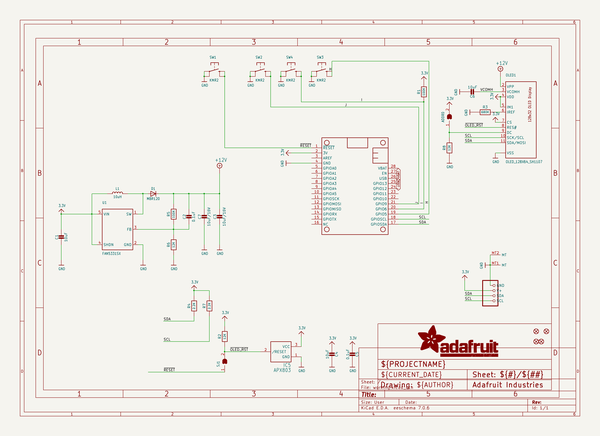
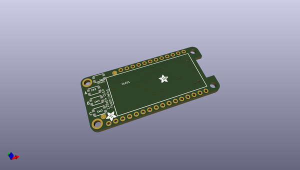
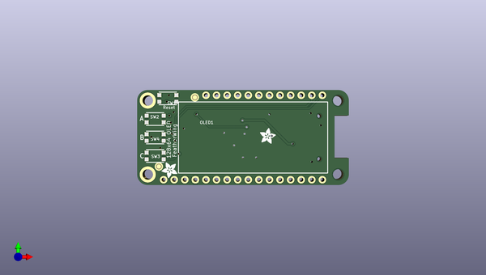
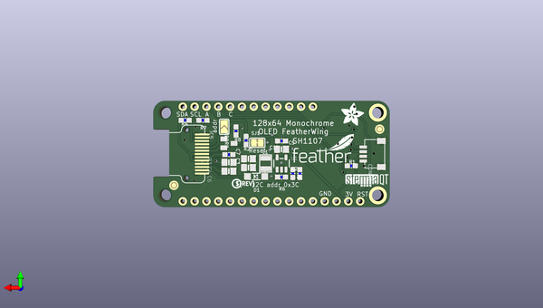

# adafruit_oled_featherwing_pcb
 
## summary 
* id: adafruit_adafruit_oled_featherwing_pcb_adafruit_oled_featherwing
* user: adafruit
* name: adafruit_oled_featherwing_pcb
* board: adafruit_oled_featherwing
* repo: https://github.com/adafruit/Adafruit-OLED-FeatherWing-PCB

* src_file_repo_sch: 
* src_file_repo_sch_link: https://github.com/adafruit/Adafruit-OLED-FeatherWing-PCB/tree/master/
* full details link: https://github.com/oomlout/oomlout_oomp_project_bot_v_2/tree/main/projects/adafruit_adafruit_oled_featherwing_pcb_adafruit_oled_featherwing/current_version/working  

## schematic  
  
[schematic (pdf)](working_schematic.pdf)  

## pcb  
 
  
  
  
[board (pdf)](working.pdf)  

## working_bom
| Id | Designator | Footprint | Quantity | Designation | Supplier and ref |  | None | 
| --- | --- | --- | --- | --- | --- | --- | --- | 
| 1 | FID2,FID3,FID1,FID4 | FIDUCIAL_1MM | 4 | FIDUCIAL_1MM |  |  | [''] | 
| 2 | U$37,U$16 | ADAFRUIT_3.5MM | 2 |  |  |  | [''] | 
| 3 | OLED1 | QT1107P11A | 1 | OLED_128X64_SH1107 |  |  | [''] | 
| 4 | MS1 | FEATHERWING_NODIM | 1 | FEATHERWING_NODIM |  |  | [''] | 
| 5 | SW4,SW1,SW3,SW2 | BTN_KMR2_4.6X2.8 | 4 | KMR2 |  |  | [''] | 
| 6 | R5,R1 | 0603-NO | 2 | 100K |  |  | [''] | 
| 7 | C2,C5 | 0603-NO | 2 | 0.1uF |  |  | [''] | 
| 8 | U$35 | STEMMAQT | 1 |  |  |  | [''] | 
| 9 | R2,R8,R6 | 0603-NO | 3 | 12K |  |  | [''] | 
| 10 | IC5 | SOT23 | 1 | APX803 |  |  | [''] | 
| 11 | R7,R4 | 0603-NO | 2 | 2.2K |  |  | [''] | 
| 12 | R3 | 0603-NO | 1 | 680K |  |  | [''] | 
| 13 | D1 | SOD-123 | 1 | MBR120 |  |  | [''] | 
| 14 | C6,C1,C4 | 0805-NO | 3 | 10uF |  |  | [''] | 
| 15 | U$8 | ADAFRUIT_5MM | 1 |  |  |  | [''] | 
| 16 | U$14 | PCBFEAT-REV-040 | 1 |  |  |  | [''] | 
| 17 | ADDR0 | SOLDERJUMPER_ARROW_NOPASTE | 1 |  |  |  | [''] | 
| 18 | L1 | INDUCTOR_1007 | 1 | 10uH |  |  | [''] | 
| 19 | U$36 | FEATHERLOGO_SMALL | 1 |  |  |  | [''] | 
| 20 | CONN1 | JST_SH4 | 1 | STEMMA_I2C_QT |  |  | [''] | 
| 21 | C7,C3 | 0805-NO | 2 | 10uF/16V |  |  | [''] | 
| 22 | U1 | SOT23-5 | 1 | FAN5331SX |  |  | [''] | 
| 23 | SJ1 | SOLDERJUMPER_CLOSEDWIRE | 1 |  |  |  | [''] | 

## bom_schematic
| Ref | Qnty | Value | Cmp name | Footprint | Description | Vendor | DNP | 
| --- | --- | --- | --- | --- | --- | --- | --- | 
| ADDR0 | 1 | SOLDERJUMPER | SOLDERJUMPER | working:SOLDERJUMPER_ARROW_NOPASTE |  |  |  | 
| C1, C4, C6 | 3 | 10uF | CAP_CERAMIC0805-NOOUTLINE | working:0805-NO |  |  |  | 
| C2, C5 | 2 | 0.1uF | CAP_CERAMIC0603_NO | working:0603-NO |  |  |  | 
| C3, C7 | 2 | 10uF/16V | CAP_CERAMIC0805-NOOUTLINE | working:0805-NO |  |  |  | 
| CONN1 | 1 | STEMMA_I2C_QT | STEMMA_I2C_QT | working:JST_SH4 |  |  |  | 
| D1 | 1 | MBR120 | DIODESOD-123 | working:SOD-123 |  |  |  | 
| FID1, FID2, FID3, FID4 | 4 | FIDUCIAL_1MM | FIDUCIAL_1MM | working:FIDUCIAL_1MM |  |  |  | 
| IC5 | 1 | APX803 | AXP083-SAG | working:SOT23 |  |  |  | 
| L1 | 1 | 10uH | INDUCTOR | working:INDUCTOR_1007 |  |  |  | 
| MS1 | 1 | FEATHERWING_NODIM | FEATHERWING_NODIM | working:FEATHERWING_NODIM |  |  |  | 
| OLED1 | 1 | OLED_128X64_SH1107 | OLED_128X64_SH1107 | working:QT1107P11A |  |  |  | 
| R1, R5 | 2 | 100K | RESISTOR_0603_NOOUT | working:0603-NO |  |  |  | 
| R2, R6, R8 | 3 | 12K | RESISTOR_0603_NOOUT | working:0603-NO |  |  |  | 
| R3 | 1 | 680K | RESISTOR_0603_NOOUT | working:0603-NO |  |  |  | 
| R4, R7 | 2 | 2.2K | RESISTOR_0603_NOOUT | working:0603-NO |  |  |  | 
| SJ1 | 1 | SOLDERJUMPERCLOSED | SOLDERJUMPERCLOSED | working:SOLDERJUMPER_CLOSEDWIRE |  |  |  | 
| SW1, SW2, SW3, SW4 | 4 | KMR2 | SWITCH_TACT_SMT4.6X2.8 | working:BTN_KMR2_4.6X2.8 |  |  |  | 
| U1 | 1 | FAN5331SX | VREG_FAN5331 | working:SOT23-5 |  |  |  | 

