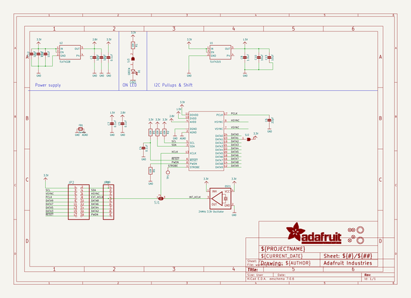
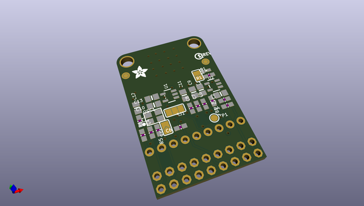
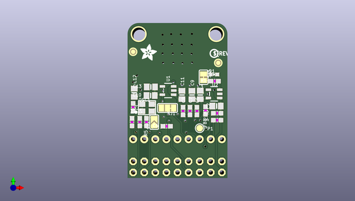
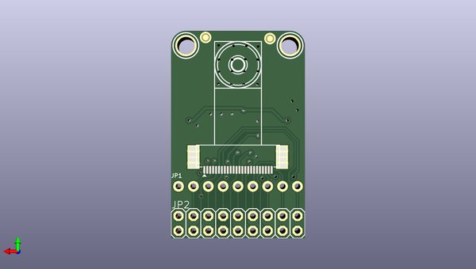

# adafruit_ov5640_camera_breakout_pcb
 
## summary 
* id: adafruit_adafruit_ov5640_camera_breakout_pcb_adafruit_ov5640_breakout
* user: adafruit
* name: adafruit_ov5640_camera_breakout_pcb
* board: adafruit_ov5640_breakout
* repo: https://github.com/adafruit/Adafruit-OV5640-Camera-Breakout-PCB

* src_file_repo_sch: 
* src_file_repo_sch_link: https://github.com/adafruit/Adafruit-OV5640-Camera-Breakout-PCB/tree/main/
* full details link: https://github.com/oomlout/oomlout_oomp_project_bot_v_2/tree/main/projects/adafruit_adafruit_ov5640_camera_breakout_pcb_adafruit_ov5640_breakout/current_version/working  

## schematic  
  
[schematic (pdf)](working_schematic.pdf) 

## pcb  
 
  
  
  
[board (pdf)](working.pdf)  

## working_bom
| Id | Designator | Footprint | Quantity | Designation | Supplier and ref |  | None | 
| --- | --- | --- | --- | --- | --- | --- | --- | 
| 1 | PLABEL1 | PLABEL1 | 1 |  |  |  | [''] | 
| 2 | C13,C2,C12,C11,C10,C3,C9 | 0805-NO | 7 | 10uF |  |  | [''] | 
| 3 | R6,R5,R2,R1,R4 | 0603-NO | 5 | 10K |  |  | [''] | 
| 4 | C7,C1,C4,C5 | 0603-NO | 4 | 0.1uF |  |  | [''] | 
| 5 | C8 | 0603-NO | 1 | 1.0uF |  |  | [''] | 
| 6 | PLABEL4 | PLABEL4 | 1 |  |  |  | [''] | 
| 7 | D1 | CHIPLED_0603_NOOUTLINE | 1 | GREEN |  |  | [''] | 
| 8 | PLABEL0 | PLABEL0 | 1 |  |  |  | [''] | 
| 9 | TP1 | TESTPOINT_ROUND_1.5MM | 1 |  |  |  | [''] | 
| 10 | FB1 | 0603-NO | 1 | ferrite |  |  | [''] | 
| 11 | U$22 | ADAFRUIT_3.5MM | 1 |  |  |  | [''] | 
| 12 | SJ2 | SOLDERJUMPER_ARROW_NOPASTE | 1 |  |  |  | [''] | 
| 13 | C6 | 0603-NO | 1 | 22pF |  |  | [''] | 
| 14 | U2 | SOT23-5 | 1 | TLV74328 |  |  | [''] | 
| 15 | U$25 | PCBFEAT-REV-040 | 1 |  |  |  | [''] | 
| 16 | OSC1 | OSC_3.2X2.5MM | 1 | 24MHz 3.3V Oscillator |  |  | [''] | 
| 17 | U1 | SOT23-5 | 1 | TLV74315 |  |  | [''] | 
| 18 | FID2,FID1,FID3,FID4 | FIDUCIAL_1MM | 4 | FIDUCIAL_1MM |  |  | [''] | 
| 19 | PLABEL2 | PLABEL2 | 1 |  |  |  | [''] | 
| 20 | SJ3 | SOLDERJUMPER_CLOSEDWIRE | 1 |  |  |  | [''] | 
| 21 | SJ1 | SOLDERJUMPER_2WAY_OPEN_NOPASTE | 1 |  |  |  | [''] | 
| 22 | PLABEL5 | PLABEL5 | 1 |  |  |  | [''] | 
| 23 | PLABEL3 | PLABEL3 | 1 |  |  |  | [''] | 
| 24 | U$17,U$1 | MOUNTINGHOLE_3.0_PLATEDTHIN | 2 | MOUNTINGHOLE3.0THIN |  |  | [''] | 
| 25 | PLABEL15 | PLABEL15 | 1 |  |  |  | [''] | 
| 26 | PLABEL9 | PLABEL9 | 1 |  |  |  | [''] | 
| 27 | JP1 | 1X09_ROUND_70 | 1 |  |  |  | [''] | 
| 28 | PLABEL8 | PLABEL8 | 1 |  |  |  | [''] | 
| 29 | PLABEL7 | PLABEL7 | 1 |  |  |  | [''] | 
| 30 | PLABEL20 | PLABEL20 | 1 |  |  |  | [''] | 
| 31 | PLABEL12 | PLABEL12 | 1 |  |  |  | [''] | 
| 32 | PLABEL18 | PLABEL18 | 1 |  |  |  | [''] | 
| 33 | PLABEL16 | PLABEL16 | 1 |  |  |  | [''] | 
| 34 | PLABEL6 | PLABEL6 | 1 |  |  |  | [''] | 
| 35 | PLABEL24 | PLABEL24 | 1 |  |  |  | [''] | 
| 36 | JP2 | 2X09-BIG | 1 |  |  |  | [''] | 
| 37 | PLABEL21 | PLABEL21 | 1 |  |  |  | [''] | 
| 38 | PLABEL23 | PLABEL23 | 1 |  |  |  | [''] | 
| 39 | X1 | OV2640FSL | 1 | CAMERA_OV2640 |  |  | [''] | 
| 40 | PLABEL11 | PLABEL11 | 1 |  |  |  | [''] | 
| 41 | PLABEL22 | PLABEL22 | 1 |  |  |  | [''] | 
| 42 | PLABEL10 | PLABEL10 | 1 |  |  |  | [''] | 
| 43 | PLABEL25 | PLABEL25 | 1 |  |  |  | [''] | 
| 44 | PLABEL13 | PLABEL13 | 1 |  |  |  | [''] | 
| 45 | PLABEL19 | PLABEL19 | 1 |  |  |  | [''] | 
| 46 | PLABEL17 | PLABEL17 | 1 |  |  |  | [''] | 
| 47 | PLABEL14 | PLABEL14 | 1 |  |  |  | [''] | 

## bom_schematic
| Ref | Qnty | Value | Cmp name | Footprint | Description | Vendor | DNP | 
| --- | --- | --- | --- | --- | --- | --- | --- | 
| C1, C4, C5, C7 | 4 | 0.1uF | CAP_CERAMIC0603_NO | working:0603-NO |  |  |  | 
| C2, C3, C9, C10, C11, C12, C13 | 7 | 10uF | CAP_CERAMIC0805-NOOUTLINE | working:0805-NO |  |  |  | 
| C6 | 1 | 22pF | CAP_CERAMIC0603_NO | working:0603-NO |  |  |  | 
| C8 | 1 | 1.0uF | CAP_CERAMIC0603_NO | working:0603-NO |  |  |  | 
| D1 | 1 | GREEN | LED0603_NOOUTLINE | working:CHIPLED_0603_NOOUTLINE |  |  |  | 
| FB1 | 1 | ferrite | FERRITE-0603NO | working:0603-NO |  |  |  | 
| FID1, FID2, FID3, FID4 | 4 | FIDUCIAL_1MM | FIDUCIAL_1MM | working:FIDUCIAL_1MM |  |  |  | 
| JP1 | 1 | HEADER-1X970MIL | HEADER-1X970MIL | working:1X09_ROUND_70 |  |  |  | 
| JP2 | 1 | PINHD-2X9-BIG | PINHD-2X9-BIG | working:2X09-BIG |  |  |  | 
| OSC1 | 1 | 24MHz 3.3V Oscillator | OSCILLATOR3.2X2.5 | working:OSC_3.2X2.5MM |  |  |  | 
| R1, R2, R4, R5, R6 | 5 | 10K | RESISTOR_0603_NOOUT | working:0603-NO |  |  |  | 
| SJ1 | 1 | SOLDERJUMPER_2WAY | SOLDERJUMPER_2WAY | working:SOLDERJUMPER_2WAY_OPEN_NOPASTE |  |  |  | 
| SJ2 | 1 | SOLDERJUMPER | SOLDERJUMPER | working:SOLDERJUMPER_ARROW_NOPASTE |  |  |  | 
| SJ3 | 1 | SOLDERJUMPERCLOSED | SOLDERJUMPERCLOSED | working:SOLDERJUMPER_CLOSEDWIRE |  |  |  | 
| TP1 | 1 | TESTPOINTROUND1.5MM | TESTPOINTROUND1.5MM | working:TESTPOINT_ROUND_1.5MM |  |  |  | 
| U1 | 1 | TLV74315 | VREG_SOT23-5 | working:SOT23-5 |  |  |  | 
| U2 | 1 | TLV74328 | VREG_SOT23-5 | working:SOT23-5 |  |  |  | 
| U$1, U$17 | 2 | MOUNTINGHOLE3.0THIN | MOUNTINGHOLE3.0THIN | working:MOUNTINGHOLE_3.0_PLATEDTHIN |  |  |  | 
| X1 | 1 | CAMERA_OV2640 | CAMERA_OV2640 | working:OV2640FSL |  |  |  | 

