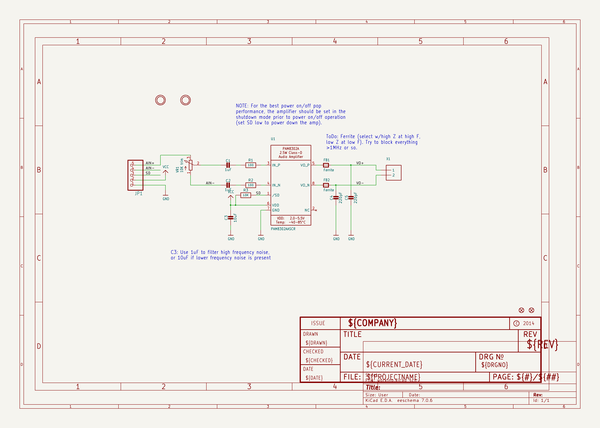
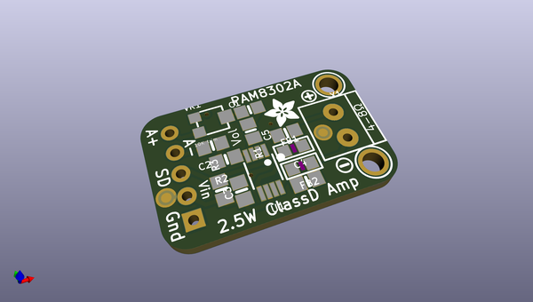
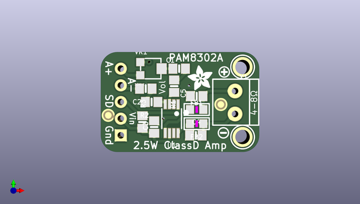
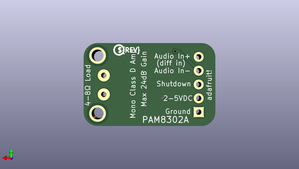

# adafruit_pam8302_mono_amplifier_pcb
 
## summary 
* id: adafruit_adafruit_pam8302_mono_amplifier_pcb_adafruit_pam8302
* user: adafruit
* name: adafruit_pam8302_mono_amplifier_pcb
* board: adafruit_pam8302
* repo: https://github.com/adafruit/Adafruit-PAM8302-Mono-Amplifier-PCB

* src_file_repo_sch: 
* src_file_repo_sch_link: https://github.com/adafruit/Adafruit-PAM8302-Mono-Amplifier-PCB/tree/master/
* full details link: https://github.com/oomlout/oomlout_oomp_project_bot_v_2/tree/main/projects/adafruit_adafruit_pam8302_mono_amplifier_pcb_adafruit_pam8302/current_version/working  

## schematic  
  
[schematic (pdf)](working_schematic.pdf)  

## pcb  
 
  
  
  
[board (pdf)](working.pdf)  

## working_bom
| Id | Designator | Footprint | Quantity | Designation | Supplier and ref |  | None | 
| --- | --- | --- | --- | --- | --- | --- | --- | 
| 1 | JP1 | 1X05_ROUND_70 | 1 |  |  |  | [''] | 
| 2 | FB1,FB2 | _0805 | 2 | Ferrite |  |  | [''] | 
| 3 | C1,C2 | 0805-NO | 2 | 1uF |  |  | [''] | 
| 4 | C3 | 0805-NO | 1 | 10uF |  |  | [''] | 
| 5 | FID1,FID2 | FIDUCIAL_1MM | 2 | FIDUCIAL" |  |  | [''] | 
| 6 | C5,C4 | 0805-NO | 2 | 220pF |  |  | [''] | 
| 7 | U$3 | SYMBOL_PLUS | 1 |  |  |  | [''] | 
| 8 | X1 | TERMBLOCK_1X2-3.5MM | 1 |  |  |  | [''] | 
| 9 | U$5 | ADAFRUIT_3.5MM | 1 |  |  |  | [''] | 
| 10 | R1,R2 | 0805-NO | 2 | 100 |  |  | [''] | 
| 11 | U$10,U$11 | MOUNTINGHOLE_2.0_PLATED | 2 | MOUNTINGHOLE2.0 |  |  | [''] | 
| 12 | U1 | MSOP8_0.65MM | 1 | PAM8302AASCR |  |  | [''] | 
| 13 | R3 | 0805-NO | 1 | 10K |  |  | [''] | 
| 14 | U$4 | SYMBOL_MINUS | 1 |  |  |  | [''] | 
| 15 | VR1 | TRIMPOT_BOURNS_3303W | 1 | 10K trim |  |  | [''] | 
| 16 | U$6 | PCBFEAT-REV-040 | 1 |  |  |  | [''] | 

## bom_schematic
| Ref | Qnty | Value | Cmp name | Footprint | Description | Vendor | DNP | 
| --- | --- | --- | --- | --- | --- | --- | --- | 
| C1, C2 | 2 | 1uF | CAP_CERAMIC0805-NOOUTLINE | working:0805-NO |  |  |  | 
| C3 | 1 | 10uF | CAP_CERAMIC0805-NOOUTLINE | working:0805-NO |  |  |  | 
| C4, C5 | 2 | 220pF | CAP_CERAMIC0805-NOOUTLINE | working:0805-NO |  |  |  | 
| FB1, FB2 | 2 | Ferrite | FERRITE_0805 | working:_0805 |  |  |  | 
| FID1, FID2 | 2 | FIDUCIAL"" | FIDUCIAL{dblquote}{dblquote} | working:FIDUCIAL_1MM |  |  |  | 
| JP1 | 1 | HEADER-1X570MIL | HEADER-1X570MIL | working:1X05_ROUND_70 |  |  |  | 
| R1, R2 | 2 | 100 | RESISTOR0805_NOOUTLINE | working:0805-NO |  |  |  | 
| R3 | 1 | 10K | RESISTOR0805_NOOUTLINE | working:0805-NO |  |  |  | 
| U1 | 1 | PAM8302AASCR | AUDIOAMP_PAM8302A | working:MSOP8_0.65MM |  |  |  | 
| U$10, U$11 | 2 | MOUNTINGHOLE2.0 | MOUNTINGHOLE2.0 | working:MOUNTINGHOLE_2.0_PLATED |  |  |  | 
| VR1 | 1 | 10K trim | TRIMPOT3303W/X | working:TRIMPOT_BOURNS_3303W |  |  |  | 
| X1 | 1 | TERMBLOCK_1X2 | TERMBLOCK_1X2 | working:TERMBLOCK_1X2-3.5MM |  |  |  | 

## mounting_holes
| x | y | package | value | ref | size | 
| --- | --- | --- | --- | --- | --- | 
| 0.0 | 10.667999999999992 | MOUNTINGHOLE_2.0_PLATED | MOUNTINGHOLE2.0 | U$10 | m3 | 
| 0.0 | 0.0 | MOUNTINGHOLE_2.0_PLATED | MOUNTINGHOLE2.0 | U$11 | m3 | 

