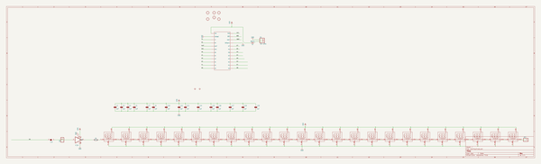
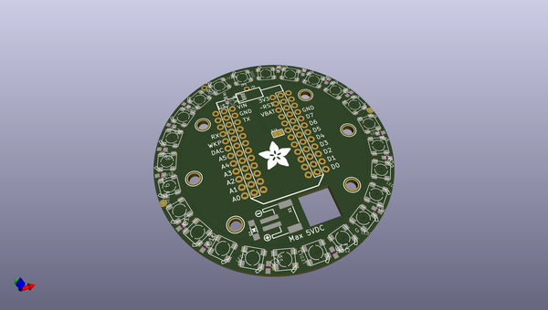
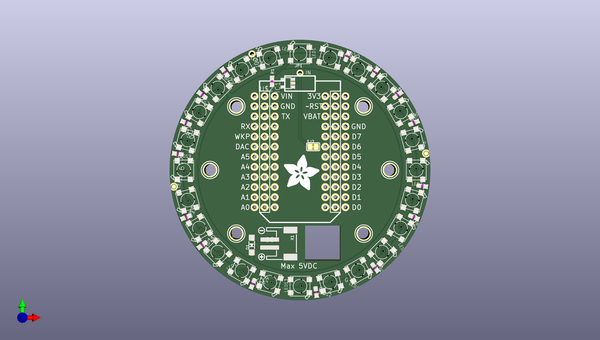
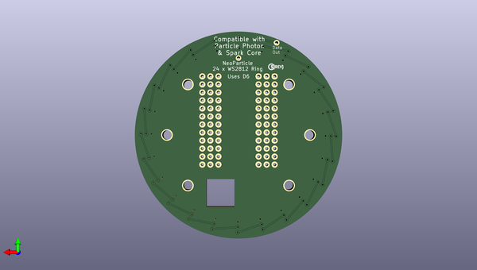

# adafruit_particle_spark_neopixel_ring_pcb
 
## summary 
* id: adafruit_adafruit_particle_spark_neopixel_ring_pcb_adafruit_neoparticle24
* user: adafruit
* name: adafruit_particle_spark_neopixel_ring_pcb
* board: adafruit_neoparticle24
* repo: https://github.com/adafruit/Adafruit-Particle-Spark-Neopixel-Ring-PCB

* src_file_repo_sch: 
* src_file_repo_sch_link: https://github.com/adafruit/Adafruit-Particle-Spark-Neopixel-Ring-PCB/tree/master/
* full details link: https://github.com/oomlout/oomlout_oomp_project_bot_v_2/tree/main/projects/adafruit_adafruit_particle_spark_neopixel_ring_pcb_adafruit_neoparticle24/current_version/working  

## schematic  
  
[schematic (pdf)](working_schematic.pdf)  

## pcb  
 
  
  
  
[board (pdf)](working.pdf)  

## working_bom
| Id | Designator | Footprint | Quantity | Designation | Supplier and ref |  | None | 
| --- | --- | --- | --- | --- | --- | --- | --- | 
| 1 | LED14,LED16,LED19,LED8,LED23,LED21,LED17,LED1,LED4,LED6,LED11,LED13,LED3,LED9,LED12,LED15,LED24,LED18,LED7,LED10,LED5,LED2,LED22,LED20 | WS2812B-NARROW | 24 | WS2812B5050 |  |  | [''] | 
| 2 | C20,C3,C5,C10,C2,C19,C4,C7,C12,C14,C16,C22,C17,C21,C8 | C0603 | 15 | 1uF |  |  | [''] | 
| 3 | U$8 | SYMBOL_MINUS | 1 |  |  |  | [''] | 
| 4 | U$9,U$3,U$5,U$4,U$6,U$10 | MOUNTINGHOLE_3.0_PLATEDTHIN | 6 | MOUNTINGHOLE3.0THIN |  |  | [''] | 
| 5 | U$7 | SYMBOL_PLUS | 1 |  |  |  | [''] | 
| 6 | FID2,FID1 | FIDUCIAL_1MM | 2 | FIDUCIAL" |  |  | [''] | 
| 7 | JP1 | 1X01_ROUND | 1 |  |  |  | [''] | 
| 8 | JP2 | 1X01-CLEANBIG | 1 |  |  |  | [''] | 
| 9 | SJ2 | SOLDERJUMPER_CLOSEDWIRE | 1 |  |  |  | [''] | 
| 10 | U$2 | SPARK_CORE_STACKABLE | 1 | PHOTON |  |  | [''] | 
| 11 | IC1 | SOT23-5 | 1 | 74AHC1G125DBV |  |  | [''] | 
| 12 | U$1 | ADAFRUIT_9MM | 1 |  |  |  | [''] | 
| 13 | D1 | SOD-123 | 1 | MBR120 |  |  | [''] | 
| 14 | X1 | JSTPH2 | 1 | JST-2PH |  |  | [''] | 
| 15 | R1 | 0603-NO | 1 | 470 ohm |  |  | [''] | 
| 16 | U$11 | PCBFEAT-REV-040 | 1 |  |  |  | [''] | 

## bom_schematic
| Ref | Qnty | Value | Cmp name | Footprint | Description | Vendor | DNP | 
| --- | --- | --- | --- | --- | --- | --- | --- | 
| C2, C3, C4, C5, C7, C8, C10, C12, C14, C16, C17, C19, C20, C21, C22 | 15 | 1uF | C-EUC0603 | working:C0603 |  |  |  | 
| D1 | 1 | MBR120 | DIODESOD-123 | working:SOD-123 |  |  |  | 
| FID1, FID2 | 2 | FIDUCIAL"" | FIDUCIAL{dblquote}{dblquote} | working:FIDUCIAL_1MM |  |  |  | 
| IC1 | 1 | 741G125DBV | 741G125DBV | working:SOT23-5 |  |  |  | 
| JP1 | 1 | HEADER-1X1ROUND | HEADER-1X1ROUND | working:1X01_ROUND |  |  |  | 
| JP2 | 1 | PINHD-1X1CB | PINHD-1X1CB | working:1X01-CLEANBIG |  |  |  | 
| LED1, LED2, LED3, LED4, LED5, LED6, LED7, LED8, LED9, LED10, LED11, LED12, LED13, LED14, LED15, LED16, LED17, LED18, LED19, LED20, LED21, LED22, LED23, LED24 | 24 | WS2812B5050-NARROW | WS2812B5050-NARROW | working:WS2812B-NARROW |  |  |  | 
| R1 | 1 | 470 ohm | RESISTOR_0603_NOOUT | working:0603-NO |  |  |  | 
| SJ2 | 1 | SOLDERJUMPER_CLOSED | SOLDERJUMPER_CLOSED | working:SOLDERJUMPER_CLOSEDWIRE |  |  |  | 
| U$2 | 1 | PHOTON | SPARK_CORE | working:SPARK_CORE_STACKABLE |  |  |  | 
| U$3, U$4, U$5, U$6, U$9, U$10 | 6 | MOUNTINGHOLE3.0THIN | MOUNTINGHOLE3.0THIN | working:MOUNTINGHOLE_3.0_PLATEDTHIN |  |  |  | 
| X1 | 1 | JST-2PH | CON_JST_PH_2PIN | working:JSTPH2 |  |  |  | 

## mounting_holes
| x | y | package | value | ref | size | 
| --- | --- | --- | --- | --- | --- | 
| 38.60600000000001 | 32.0 | MOUNTINGHOLE_3.0_PLATEDTHIN | MOUNTINGHOLE3.0THIN | U$3 | m3 | 
| 6.606000000000009 | 32.0 | MOUNTINGHOLE_3.0_PLATEDTHIN | MOUNTINGHOLE3.0THIN | U$4 | m3 | 
| 6.606000000000009 | 0.0 | MOUNTINGHOLE_3.0_PLATEDTHIN | MOUNTINGHOLE3.0THIN | U$5 | m3 | 
| 38.60600000000001 | 0.0 | MOUNTINGHOLE_3.0_PLATEDTHIN | MOUNTINGHOLE3.0THIN | U$6 | m3 | 
| 0.0 | 16.0 | MOUNTINGHOLE_3.0_PLATEDTHIN | MOUNTINGHOLE3.0THIN | U$9 | m3 | 
| 45.212 | 16.0 | MOUNTINGHOLE_3.0_PLATEDTHIN | MOUNTINGHOLE3.0THIN | U$10 | m3 | 

