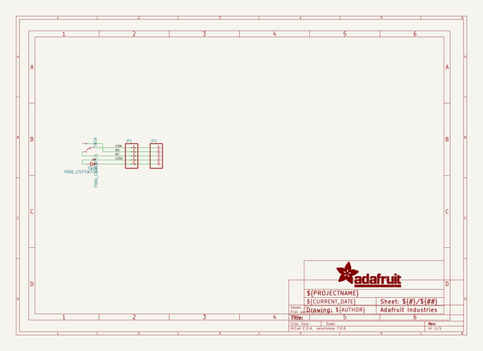
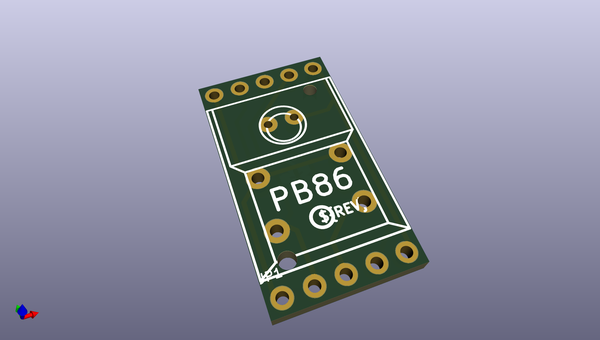
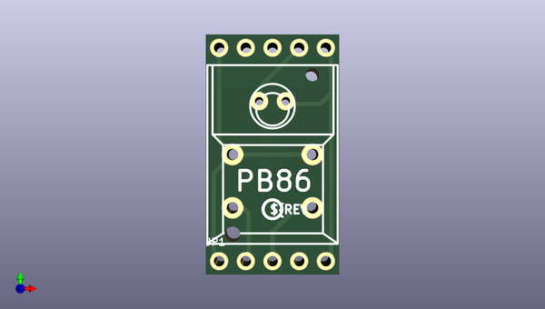
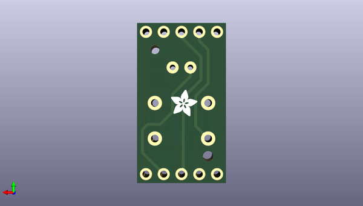

# adafruit_pb86_breakout_pcb
 
## summary 
* id: adafruit_adafruit_pb86_breakout_pcb_adafruit_pb86_breakout
* user: adafruit
* name: adafruit_pb86_breakout_pcb
* board: adafruit_pb86_breakout
* repo: https://github.com/adafruit/Adafruit-PB86-Breakout-PCB

* src_file_repo_sch: 
* src_file_repo_sch_link: https://github.com/adafruit/Adafruit-PB86-Breakout-PCB/tree/main/
* full details link: https://github.com/oomlout/oomlout_oomp_project_bot_v_2/tree/main/projects/adafruit_adafruit_pb86_breakout_pcb_adafruit_pb86_breakout/current_version/working  

## schematic  
  
[schematic (pdf)](working_schematic.pdf)  

## pcb  
 
  
  
  
[board (pdf)](working.pdf)  

## working_bom
| Id | Designator | Footprint | Quantity | Designation | Supplier and ref |  | None | 
| --- | --- | --- | --- | --- | --- | --- | --- | 
| 1 | JP1,JP2 | 1X05_ROUND | 2 |  |  |  | [''] | 
| 2 | PLABEL9 | PLABEL9 | 1 |  |  |  | [''] | 
| 3 | PLABEL4 | PLABEL4 | 1 |  |  |  | [''] | 
| 4 | PLABEL6 | PLABEL6 | 1 |  |  |  | [''] | 
| 5 | PLABEL0 | PLABEL0 | 1 |  |  |  | [''] | 
| 6 | U$1 | PCBFEAT-REV-040 | 1 |  |  |  | [''] | 
| 7 | PLABEL8 | PLABEL8 | 1 |  |  |  | [''] | 
| 8 | PLABEL7 | PLABEL7 | 1 |  |  |  | [''] | 
| 9 | PLABEL2 | PLABEL2 | 1 |  |  |  | [''] | 
| 10 | PLABEL3 | PLABEL3 | 1 |  |  |  | [''] | 
| 11 | PLABEL1 | PLABEL1 | 1 |  |  |  | [''] | 
| 12 | SW1 | PB86 | 1 | PB86_STEPSWITCH |  |  | [''] | 
| 13 | PLABEL5 | PLABEL5 | 1 |  |  |  | [''] | 
| 14 | PLABEL19 | PLABEL19 | 1 |  |  |  | [''] | 
| 15 | PLABEL18 | PLABEL18 | 1 |  |  |  | [''] | 
| 16 | PLABEL17 | PLABEL17 | 1 |  |  |  | [''] | 
| 17 | PLABEL15 | PLABEL15 | 1 |  |  |  | [''] | 
| 18 | PLABEL16 | PLABEL16 | 1 |  |  |  | [''] | 
| 19 | PLABEL11 | PLABEL11 | 1 |  |  |  | [''] | 
| 20 | U$32 | ADAFRUIT_3.5MM | 1 |  |  |  | [''] | 
| 21 | PLABEL10 | PLABEL10 | 1 |  |  |  | [''] | 
| 22 | PLABEL12 | PLABEL12 | 1 |  |  |  | [''] | 
| 23 | PLABEL13 | PLABEL13 | 1 |  |  |  | [''] | 
| 24 | PLABEL14 | PLABEL14 | 1 |  |  |  | [''] | 

## bom_schematic
| Ref | Qnty | Value | Cmp name | Footprint | Description | Vendor | DNP | 
| --- | --- | --- | --- | --- | --- | --- | --- | 
| JP1, JP2 | 2 | HEADER-1X5ROUND | HEADER-1X5ROUND | working:1X05_ROUND |  |  |  | 
| SW1 | 1 | PB86_STEPSWITCH | PB86_STEPSWITCH | working:PB86 |  |  |  | 

