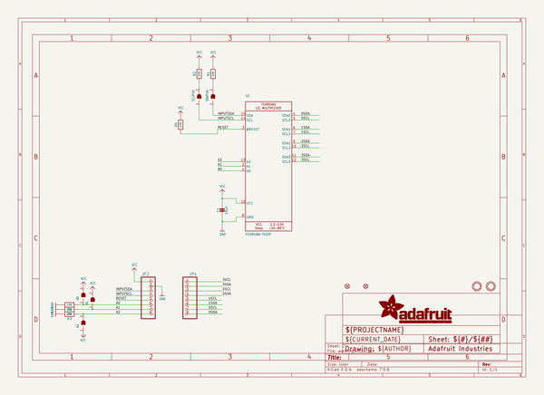
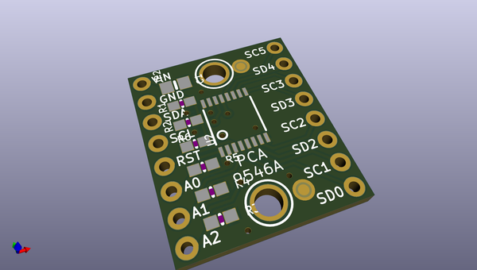
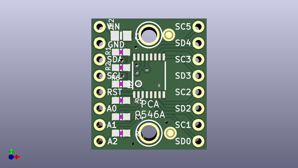
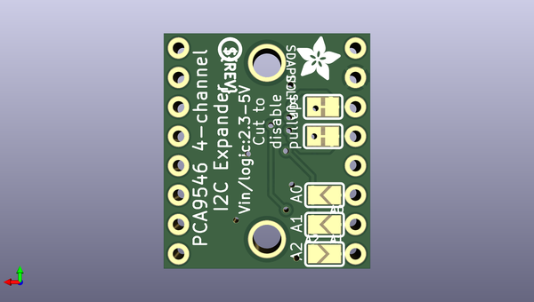

# adafruit_pca9546_pcb
 
## summary 
* id: adafruit_adafruit_pca9546_pcb_pca9546_breakout
* user: adafruit
* name: adafruit_pca9546_pcb
* board: pca9546_breakout
* repo: https://github.com/adafruit/Adafruit-PCA9546-PCB

* src_file_repo_sch: 
* src_file_repo_sch_link: https://github.com/adafruit/Adafruit-PCA9546-PCB/tree/main/
* full details link: https://github.com/oomlout/oomlout_oomp_project_bot_v_2/tree/main/projects/adafruit_adafruit_pca9546_pcb_pca9546_breakout/current_version/working  

## schematic  
  
[schematic (pdf)](working_schematic.pdf)  

## pcb  
 
  
  
  
[board (pdf)](working.pdf)  

## working_bom
| Id | Designator | Footprint | Quantity | Designation | Supplier and ref |  | None | 
| --- | --- | --- | --- | --- | --- | --- | --- | 
| 1 | U$4,U$5 | MOUNTINGHOLE_2.5_PLATED | 2 | MOUNTINGHOLE2.5 |  |  | [''] | 
| 2 | FID3,FID1 | FIDUCIAL_1MM | 2 | FIDUCIAL_1MM |  |  | [''] | 
| 3 | JP2,JP4 | 1X08_ROUND_70 | 2 |  |  |  | [''] | 
| 4 | R1,R6,R2,R3,R5,R4 | 0603-NO | 6 | 10K |  |  | [''] | 
| 5 | U2 | TSSOP16 | 1 | PCA9546A TSSOP |  |  | [''] | 
| 6 | C1 | 0805-NO | 1 | 10uF |  |  | [''] | 
| 7 | A2,A0,A1 | SOLDERJUMPER_ARROW_NOPASTE | 3 |  |  |  | [''] | 
| 8 | SDAPU0,SCLPU0 | SOLDERJUMPER_CLOSEDWIRE | 2 |  |  |  | [''] | 
| 9 | U$6 | PCBFEAT-REV-040 | 1 |  |  |  | [''] | 
| 10 | U$7 | ADAFRUIT_3.5MM | 1 |  |  |  | [''] | 

## bom_schematic
| Ref | Qnty | Value | Cmp name | Footprint | Description | Vendor | DNP | 
| --- | --- | --- | --- | --- | --- | --- | --- | 
| A0, A1, A2 | 3 | SOLDERJUMPER | SOLDERJUMPER | working:SOLDERJUMPER_ARROW_NOPASTE |  |  |  | 
| C1 | 1 | 10uF | CAP_CERAMIC0805-NOOUTLINE | working:0805-NO |  |  |  | 
| FID1, FID3 | 2 | FIDUCIAL_1MM | FIDUCIAL_1MM | working:FIDUCIAL_1MM |  |  |  | 
| JP2, JP4 | 2 | HEADER-1X870MIL | HEADER-1X870MIL | working:1X08_ROUND_70 |  |  |  | 
| R1, R2, R3, R4, R5, R6 | 6 | 10K | RESISTOR_0603_NOOUT | working:0603-NO |  |  |  | 
| SCLPU0 | 1 | SOLDERJUMPERCLOSED | SOLDERJUMPERCLOSED | working:SOLDERJUMPER_CLOSEDWIRE |  |  |  | 
| SDAPU0 | 1 | SOLDERJUMPERCLOSED | SOLDERJUMPERCLOSED | working:SOLDERJUMPER_CLOSEDWIRE |  |  |  | 
| U2 | 1 | PCA9546A TSSOP | XCA9546APW | working:TSSOP16 |  |  |  | 
| U$4, U$5 | 2 | MOUNTINGHOLE2.5 | MOUNTINGHOLE2.5 | working:MOUNTINGHOLE_2.5_PLATED |  |  |  | 

## mounting_holes
| x | y | package | value | ref | size | 
| --- | --- | --- | --- | --- | --- | 
| 0.0 | 0.0 | MOUNTINGHOLE_2.5_PLATED | MOUNTINGHOLE2.5 | U$4 | m3 | 
| 0.0 | 15.239999999999995 | MOUNTINGHOLE_2.5_PLATED | MOUNTINGHOLE2.5 | U$5 | m3 | 

