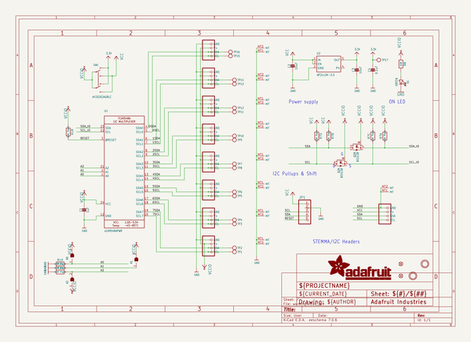

# adafruit_pca9548_pcb
 
## summary 
* id: adafruit_adafruit_pca9548_pcb_pca9548a_qt_board
* user: adafruit
* name: adafruit_pca9548_pcb
* board: pca9548a_qt_board
* repo: https://github.com/adafruit/Adafruit-PCA9548-PCB

* src_file_repo_sch: 
* src_file_repo_sch_link: https://github.com/adafruit/Adafruit-PCA9548-PCB/tree/main/
* full details link: https://github.com/oomlout/oomlout_oomp_project_bot_v_2/tree/main/projects/adafruit_adafruit_pca9548_pcb_pca9548a_qt_board/current_version/working  

## schematic  
  
[schematic (pdf)](working_schematic.pdf) 

## pcb  
 
  
  
  
[board (pdf)](working.pdf)  

## working_bom
| Id | Designator | Footprint | Quantity | Designation | Supplier and ref |  | None | 
| --- | --- | --- | --- | --- | --- | --- | --- | 
| 1 | PLABEL14 | PLABEL14 | 1 |  |  |  | [''] | 
| 2 | @HOLE1,@HOLE0 |  | 2 |  |  |  | [''] | 
| 3 | PLABEL8 | PLABEL8 | 1 |  |  |  | [''] | 
| 4 | C1 | 0603-NO | 1 | 1uF |  |  | [''] | 
| 5 | PLABEL2 | PLABEL2 | 1 |  |  |  | [''] | 
| 6 | CONN9,CONN8,CONN7,CONN4,CONN5,CONN6,CONN10,CONN2,CONN1 | JST_SH4 | 9 | STEMMA_I2C_QT |  |  | [''] | 
| 7 | R8 | 0603-NO | 1 | 10K |  |  | [''] | 
| 8 | D1 | CHIPLED_0603_NOOUTLINE | 1 | GREEN |  |  | [''] | 
| 9 | PLABEL9 | PLABEL9 | 1 |  |  |  | [''] | 
| 10 | PLABEL19 | PLABEL19 | 1 |  |  |  | [''] | 
| 11 | PLABEL0 | PLABEL0 | 1 |  |  |  | [''] | 
| 12 | PLABEL10 | PLABEL10 | 1 |  |  |  | [''] | 
| 13 | PLABEL18 | PLABEL18 | 1 |  |  |  | [''] | 
| 14 | C2,C3 | 0805-NO | 2 | 10uF |  |  | [''] | 
| 15 | PLABEL17 | PLABEL17 | 1 |  |  |  | [''] | 
| 16 | PLABEL6 | PLABEL6 | 1 |  |  |  | [''] | 
| 17 | PLABEL16 | PLABEL16 | 1 |  |  |  | [''] | 
| 18 | PLABEL12 | PLABEL12 | 1 |  |  |  | [''] | 
| 19 | U$19,U$22 | MOUNTINGHOLE_2.5_PLATED | 2 | MOUNTINGHOLE2.5 |  |  | [''] | 
| 20 | C4 | 0603-NO | 1 | 0.1uF |  |  | [''] | 
| 21 | FID4,FID2 | FIDUCIAL_1MM | 2 | FIDUCIAL_1MM |  |  | [''] | 
| 22 | PLABEL3 | PLABEL3 | 1 |  |  |  | [''] | 
| 23 | SW1 | EG1390 | 1 | AYZ0202AGRLC |  |  | [''] | 
| 24 | U2 | SOT23-5 | 1 | AP2112K-3.3 |  |  | [''] | 
| 25 | U1 | TSSOP24 | 1 | xCA9548APWR |  |  | [''] | 
| 26 | PLABEL7 | PLABEL7 | 1 |  |  |  | [''] | 
| 27 | Q2 | SOT363 | 1 | BSS138 |  |  | [''] | 
| 28 | PLABEL15 | PLABEL15 | 1 |  |  |  | [''] | 
| 29 | PLABEL1 | PLABEL1 | 1 |  |  |  | [''] | 
| 30 | R1,R7 | RESPACK_4X0603 | 2 | 10K Pack |  |  | [''] | 
| 31 | U$28 | ADAFRUIT_3.5MM | 1 |  |  |  | [''] | 
| 32 | PLABEL4 | PLABEL4 | 1 |  |  |  | [''] | 
| 33 | PLABEL11 | PLABEL11 | 1 |  |  |  | [''] | 
| 34 | PLABEL5 | PLABEL5 | 1 |  |  |  | [''] | 
| 35 | PLABEL13 | PLABEL13 | 1 |  |  |  | [''] | 
| 36 | JP1 | 1X05_ROUND_70 | 1 |  |  |  | [''] | 
| 37 | TP17,TP7,TP11,TP3,TP14,TP2,TP15,TP12,TP9,TP13,TP4,TP5,TP16,TP8,TP10,TP6,TP1 | TESTPOINT_ROUND_1.5MM_NO | 17 |  |  |  | [''] | 
| 38 | PLABEL23 | PLABEL23 | 1 |  |  |  | [''] | 
| 39 | U$5 | ADAFRUIT_5MM | 1 |  |  |  | [''] | 
| 40 | PLABEL24 | PLABEL24 | 1 |  |  |  | [''] | 
| 41 | PLABEL21 | PLABEL21 | 1 |  |  |  | [''] | 
| 42 | A1,A0,A2 | SOLDERJUMPER_ARROW_NOPASTE | 3 |  |  |  | [''] | 
| 43 | U$29 | PCBFEAT-REV-040 | 1 |  |  |  | [''] | 
| 44 | U$31 | STEMMAQT | 1 |  |  |  | [''] | 
| 45 | PLABEL20 | PLABEL20 | 1 |  |  |  | [''] | 
| 46 | PLABEL22 | PLABEL22 | 1 |  |  |  | [''] | 

## bom_schematic
| Ref | Qnty | Value | Cmp name | Footprint | Description | Vendor | DNP | 
| --- | --- | --- | --- | --- | --- | --- | --- | 
| A0, A1, A2 | 3 | SOLDERJUMPER | SOLDERJUMPER | working:SOLDERJUMPER_ARROW_NOPASTE |  |  |  | 
| C1 | 1 | 1uF | CAP_CERAMIC0603_NO | working:0603-NO |  |  |  | 
| C2, C3 | 2 | 10uF | CAP_CERAMIC0805-NOOUTLINE | working:0805-NO |  |  |  | 
| C4 | 1 | 0.1uF | CAP_CERAMIC0603_NO | working:0603-NO |  |  |  | 
| CONN1, CONN2, CONN4, CONN5, CONN6, CONN7, CONN8, CONN9, CONN10 | 9 | STEMMA_I2C_QT | STEMMA_I2C_QT | working:JST_SH4 |  |  |  | 
| D1 | 1 | GREEN | LED0603_NOOUTLINE | working:CHIPLED_0603_NOOUTLINE |  |  |  | 
| FID2, FID4 | 2 | FIDUCIAL_1MM | FIDUCIAL_1MM | working:FIDUCIAL_1MM |  |  |  | 
| JP1 | 1 | HEADER-1X570MIL | HEADER-1X570MIL | working:1X05_ROUND_70 |  |  |  | 
| Q2 | 1 | BSS138 | MOSFET-N_DUAL | working:SOT363 |  |  |  | 
| R1, R7 | 2 | 10K Pack | RESISTOR_4PACK | working:RESPACK_4X0603 |  |  |  | 
| R8 | 1 | 10K | RESISTOR_0603_NOOUT | working:0603-NO |  |  |  | 
| SW1 | 1 | AYZ0202AGRLC | SWITCH_DPDTEG1390 | working:EG1390 |  |  |  | 
| TP1, TP2, TP3, TP4, TP5, TP6, TP7, TP8, TP9, TP10, TP11, TP12, TP13, TP14, TP15, TP16, TP17 | 17 | TESTPOINTROUND1.5MMNO | TESTPOINTROUND1.5MMNO | working:TESTPOINT_ROUND_1.5MM_NO |  |  |  | 
| U1 | 1 | xCA9548APWR | TCA9548A | working:TSSOP24 |  |  |  | 
| U2 | 1 | AP2112K-3.3 | VREG_SOT23-5 | working:SOT23-5 |  |  |  | 
| U$19, U$22 | 2 | MOUNTINGHOLE2.5 | MOUNTINGHOLE2.5 | working:MOUNTINGHOLE_2.5_PLATED |  |  |  | 

## mounting_holes
| x | y | package | value | ref | size | 
| --- | --- | --- | --- | --- | --- | 
| 0.0 | 15.37 | MOUNTINGHOLE_2.5_PLATED | MOUNTINGHOLE2.5 | U$19 | m3 | 
| 0.0 | 0.0 | MOUNTINGHOLE_2.5_PLATED | MOUNTINGHOLE2.5 | U$22 | m3 | 

