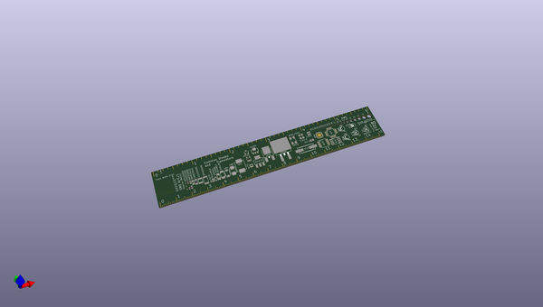
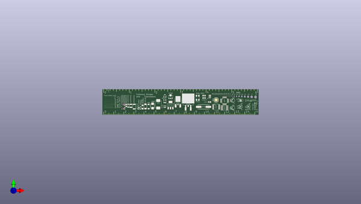
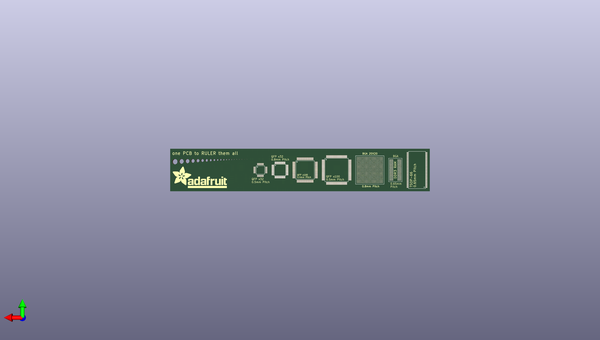

# adafruit_pcb_ruler
 
## summary 
* id: adafruit_adafruit_pcb_ruler_adafruit_pcb_reference_ruler
* user: adafruit
* name: adafruit_pcb_ruler
* board: adafruit_pcb_reference_ruler
* repo: https://github.com/adafruit/Adafruit-PCB-Ruler

* src_file_repo_sch: 
* src_file_repo_sch_link: https://github.com/adafruit/Adafruit-PCB-Ruler/tree/master/
* full details link: https://github.com/oomlout/oomlout_oomp_project_bot_v_2/tree/main/projects/adafruit_adafruit_pcb_ruler_adafruit_pcb_reference_ruler/current_version/working  

## pcb  
 
  
  
  
[board (pdf)](working.pdf)  

## working_bom
| Id | Designator | Footprint | Quantity | Designation | Supplier and ref |  | None | 
| --- | --- | --- | --- | --- | --- | --- | --- | 
| 1 | E$44 | SMB-DIODE | 1 |  |  |  | [''] | 
| 2 | E$22,E$19,E$21,E$17,E$20,E$18 | EDGE-INCHES-EIGTH | 6 |  |  |  | [''] | 
| 3 | E$6,E$1,E$14,E$11,E$15,E$12,E$7,E$9,E$2,E$4,E$8,E$13,E$10,E$5,E$3 | EDGE-MILLIMETERS | 15 |  |  |  | [''] | 
| 4 | E$49 | SOD80C | 1 |  |  |  | [''] | 
| 5 | E$33 | SOT23-5 | 1 |  |  |  | [''] | 
| 6 | E$42 | SC79_INFINEON | 1 |  |  |  | [''] | 
| 7 | E$52 | DIODE-SYMB | 1 |  |  |  | [''] | 
| 8 | E$26 | 1206 | 1 |  |  |  | [''] | 
| 9 | E$38 | CRYSTAL-SMD-2.5X2 | 1 |  |  |  | [''] | 
| 10 | E$29 | DPAK | 1 |  |  |  | [''] | 
| 11 | E$40 | XTAL-2X1.2 | 1 |  |  |  | [''] | 
| 12 | E$16,E$63,E$60 | 0201 | 3 |  |  |  | [''] | 
| 13 | E$25 | 0805 | 1 |  |  |  | [''] | 
| 14 | E$51 | PMOS-SYMB | 1 |  |  |  | [''] | 
| 15 | E$28 | 2010 | 1 |  |  |  | [''] | 
| 16 | E$35 | SC70 | 1 |  |  |  | [''] | 
| 17 | E$31 | SOT223 | 1 |  |  |  | [''] | 
| 18 | E$39 | HC49UP | 1 |  |  |  | [''] | 
| 19 | E$59 | PNP-SYMB | 1 |  |  |  | [''] | 
| 20 | E$48 | SOD-323 | 1 |  |  |  | [''] | 
| 21 | E$58,E$70 | TQFP32-5MM | 2 |  |  |  | [''] | 
| 22 | E$57 | SO08 | 1 |  |  |  | [''] | 
| 23 | E$43 | SMA-DIODE | 1 |  |  |  | [''] | 
| 24 | E$62,E$24 | 0603 | 2 |  |  |  | [''] | 
| 25 | E$36 | CRYSTAL-SMD-5X3.2 | 1 |  |  |  | [''] | 
| 26 | E$30 | D2PAK | 1 |  |  |  | [''] | 
| 27 | E$46 | ALL-HOLES | 1 |  |  |  | [''] | 
| 28 | E$41 | MICROMELF-R | 1 |  |  |  | [''] | 
| 29 | E$37 | CRYSTAL-SMD-3.2X2.5 | 1 |  |  |  | [''] | 
| 30 | E$56 | TSSOP16 | 1 |  |  |  | [''] | 
| 31 | E$34 | SOT23-3 | 1 |  |  |  | [''] | 
| 32 | E$47 | SOD-128 | 1 |  |  |  | [''] | 
| 33 | E$54 | NPN-SYMB | 1 |  |  |  | [''] | 
| 34 | E$45 | SMC | 1 |  |  |  | [''] | 
| 35 | E$23,E$61 | 0402 | 2 |  |  |  | [''] | 
| 36 | E$27 | 1210 | 1 |  |  |  | [''] | 
| 37 | E$53 | LED-GUIDE | 1 |  |  |  | [''] | 
| 38 | E$32 | SOT89 | 1 |  |  |  | [''] | 
| 39 | E$50 | NMOS-SYMB | 1 |  |  |  | [''] | 
| 40 | E$55 | QFN-24 | 1 |  |  |  | [''] | 
| 41 | E$67 | BGA-0.8MM-P-19X19 | 1 |  |  |  | [''] | 
| 42 | E$66 | TSOP-66 | 1 |  |  |  | [''] | 
| 43 | E$65 | TQFP100 | 1 |  |  |  | [''] | 
| 44 | E$68 | TQFP-100-12X12MM | 1 |  |  |  | [''] | 
| 45 | E$72 | ADAFRUIT-LOGO-0.5IN | 1 |  |  |  | [''] | 
| 46 | E$69 | TQFP32-08 | 1 |  |  |  | [''] | 
| 47 | E$71 | BGA-96-14X8MM | 1 |  |  |  | [''] | 

