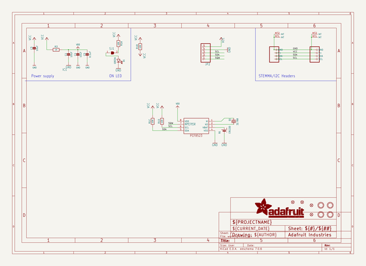
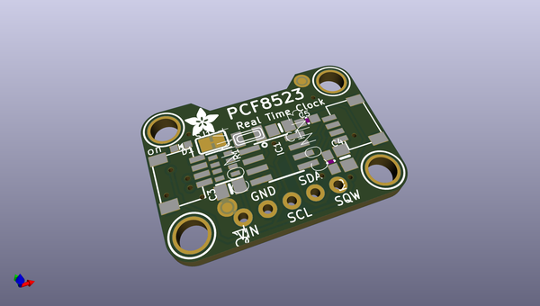
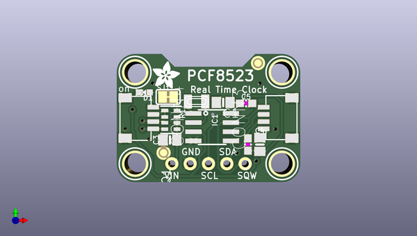
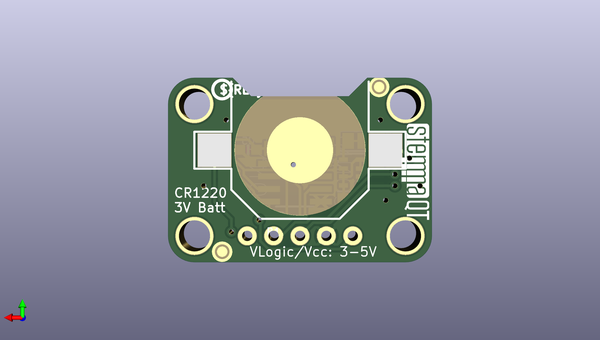

# adafruit_pcf8523_rtc_breakout_pcb
 
## summary 
* id: adafruit_adafruit_pcf8523_rtc_breakout_pcb_adafruit_pcf8523_rtc_soic_8
* user: adafruit
* name: adafruit_pcf8523_rtc_breakout_pcb
* board: adafruit_pcf8523_rtc_soic_8
* repo: https://github.com/adafruit/Adafruit-PCF8523-RTC-Breakout-PCB

* src_file_repo_sch: 
* src_file_repo_sch_link: https://github.com/adafruit/Adafruit-PCF8523-RTC-Breakout-PCB/tree/master/
* full details link: https://github.com/oomlout/oomlout_oomp_project_bot_v_2/tree/main/projects/adafruit_adafruit_pcf8523_rtc_breakout_pcb_adafruit_pcf8523_rtc_soic_8/current_version/working  

## schematic  
  
[schematic (pdf)](working_schematic.pdf)  

## pcb  
 
  
  
  
[board (pdf)](working.pdf)  

## working_bom
| Id | Designator | Footprint | Quantity | Designation | Supplier and ref |  | None | 
| --- | --- | --- | --- | --- | --- | --- | --- | 
| 1 | JP2 | 1X05_ROUND_70 | 1 |  |  |  | [''] | 
| 2 | CONN3,CONN4 | JST_SH4 | 2 | STEMMA_I2C_QT |  |  | [''] | 
| 3 | SJ1 | SOLDERJUMPER_CLOSEDWIRE | 1 |  |  |  | [''] | 
| 4 | C1,C4,C3 | 0805-NO | 3 | 10uF |  |  | [''] | 
| 5 | U$17,U$21,U$19,U$9 | MOUNTINGHOLE_3.0_PLATEDTHIN | 4 | MOUNTINGHOLE3.0THIN |  |  | [''] | 
| 6 | U$22 | ADAFRUIT_3.5MM | 1 |  |  |  | [''] | 
| 7 | FID4,FID3,FID1,FID2 | FIDUCIAL_1MM | 4 | FIDUCIAL_1MM |  |  | [''] | 
| 8 | C5 | 0603-NO | 1 | 0.1uF |  |  | [''] | 
| 9 | R3 | 0603-NO | 1 | 1K |  |  | [''] | 
| 10 | R1 | RESPACK_4X0603 | 1 | 10K |  |  | [''] | 
| 11 | D1 | CHIPLED_0603_NOOUTLINE | 1 | GREEN |  |  | [''] | 
| 12 | IC1 | SOIC8_150MIL | 1 | RTC_PCF8523T |  |  | [''] | 
| 13 | Q1 | XTAL3215 | 1 | 32.768 |  |  | [''] | 
| 14 | U$31 | STEMMAQT | 1 |  |  |  | [''] | 
| 15 | B1 | CR1220 | 1 | CR1220 |  |  | [''] | 
| 16 | U$25 | PCBFEAT-REV-040 | 1 |  |  |  | [''] | 

## bom_schematic
| Ref | Qnty | Value | Cmp name | Footprint | Description | Vendor | DNP | 
| --- | --- | --- | --- | --- | --- | --- | --- | 
| B1 | 1 | CR1220 | BATTERYCR1220_SMT | working:CR1220 |  |  |  | 
| C1, C3, C4 | 3 | 10uF | CAP_CERAMIC0805-NOOUTLINE | working:0805-NO |  |  |  | 
| C5 | 1 | 0.1uF | CAP_CERAMIC0603_NO | working:0603-NO |  |  |  | 
| CONN3, CONN4 | 2 | STEMMA_I2C_QT | STEMMA_I2C_QT | working:JST_SH4 |  |  |  | 
| D1 | 1 | GREEN | LED0603_NOOUTLINE | working:CHIPLED_0603_NOOUTLINE |  |  |  | 
| FID1, FID2, FID3, FID4 | 4 | FIDUCIAL_1MM | FIDUCIAL_1MM | working:FIDUCIAL_1MM |  |  |  | 
| IC1 | 1 | RTC_PCF8523T | RTC_PCF8523T | working:SOIC8_150MIL |  |  |  | 
| JP2 | 1 | HEADER-1X570MIL | HEADER-1X570MIL | working:1X05_ROUND_70 |  |  |  | 
| Q1 | 1 | 32.768 | CRYSTAL_3215 | working:XTAL3215 |  |  |  | 
| R1 | 1 | 10K | RESISTOR_4PACK | working:RESPACK_4X0603 |  |  |  | 
| R3 | 1 | 1K | RESISTOR_0603_NOOUT | working:0603-NO |  |  |  | 
| SJ1 | 1 | SOLDERJUMPER_CLOSED | SOLDERJUMPER_CLOSED | working:SOLDERJUMPER_CLOSEDWIRE |  |  |  | 
| U$9, U$17, U$19, U$21 | 4 | MOUNTINGHOLE3.0THIN | MOUNTINGHOLE3.0THIN | working:MOUNTINGHOLE_3.0_PLATEDTHIN |  |  |  | 

## mounting_holes
| x | y | package | value | ref | size | 
| --- | --- | --- | --- | --- | --- | 
| 0.0 | 12.700000000000003 | MOUNTINGHOLE_3.0_PLATEDTHIN | MOUNTINGHOLE3.0THIN | U$9 | m3 | 
| 20.319999999999993 | 12.700000000000003 | MOUNTINGHOLE_3.0_PLATEDTHIN | MOUNTINGHOLE3.0THIN | U$17 | m3 | 
| 0.0 | 0.0 | MOUNTINGHOLE_3.0_PLATEDTHIN | MOUNTINGHOLE3.0THIN | U$19 | m3 | 
| 20.319999999999993 | 0.0 | MOUNTINGHOLE_3.0_PLATEDTHIN | MOUNTINGHOLE3.0THIN | U$21 | m3 | 

