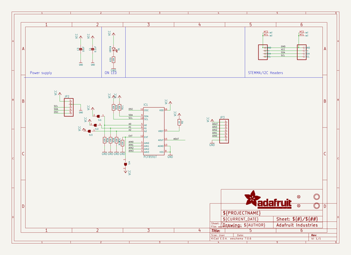
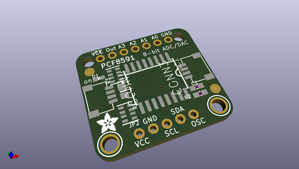
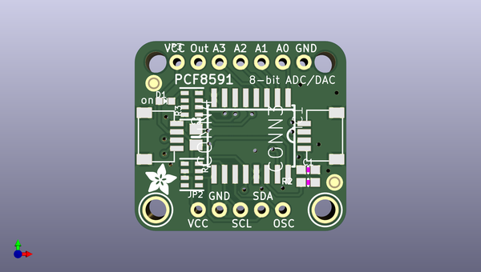
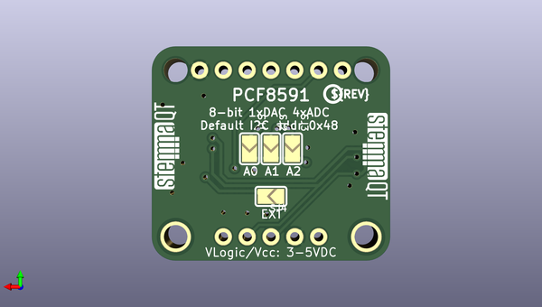

# adafruit_pcf8591_pcb
 
## summary 
* id: adafruit_adafruit_pcf8591_pcb_adafruit_pcf8591
* user: adafruit
* name: adafruit_pcf8591_pcb
* board: adafruit_pcf8591
* repo: https://github.com/adafruit/Adafruit-PCF8591-PCB

* src_file_repo_sch: 
* src_file_repo_sch_link: https://github.com/adafruit/Adafruit-PCF8591-PCB/tree/master/
* full details link: https://github.com/oomlout/oomlout_oomp_project_bot_v_2/tree/main/projects/adafruit_adafruit_pcf8591_pcb_adafruit_pcf8591/current_version/working  

## schematic  
  
[schematic (pdf)](working_schematic.pdf) 

## pcb  
 
  
  
  
[board (pdf)](working.pdf)  

## working_bom
| Id | Designator | Footprint | Quantity | Designation | Supplier and ref |  | None | 
| --- | --- | --- | --- | --- | --- | --- | --- | 
| 1 | U$21,U$19 | MOUNTINGHOLE_2.5_PLATED | 2 | MOUNTINGHOLE2.5 |  |  | [''] | 
| 2 | FID3,FID4 | FIDUCIAL_1MM | 2 | FIDUCIAL_1MM |  |  | [''] | 
| 3 | D1 | CHIPLED_0603_NOOUTLINE | 1 | GREEN |  |  | [''] | 
| 4 | C1 | 0603-NO | 1 | 0.1uF |  |  | [''] | 
| 5 | R3,R1 | RESPACK_4X0603 | 2 | 10K |  |  | [''] | 
| 6 | JP3 | 1X07_ROUND_70 | 1 |  |  |  | [''] | 
| 7 | CONN3,CONN4 | JST_SH4 | 2 | STEMMA_I2C_QT |  |  | [''] | 
| 8 | @HOLE0,@HOLE1 |  | 2 |  |  |  | [''] | 
| 9 | C3 | 0805-NO | 1 | 10uF |  |  | [''] | 
| 10 | R2 | 0603-NO | 1 | 1K |  |  | [''] | 
| 11 | IC1 | SO16W | 1 | PCF8591T |  |  | [''] | 
| 12 | JP2 | 1X05_ROUND_70 | 1 |  |  |  | [''] | 
| 13 | U$22 | ADAFRUIT_3.5MM | 1 |  |  |  | [''] | 
| 14 | U$30,U$31 | STEMMAQT | 2 |  |  |  | [''] | 
| 15 | SJ2,SJ4,SJ1,SJ3 | SOLDERJUMPER_ARROW_NOPASTE | 4 |  |  |  | [''] | 
| 16 | U$25 | PCBFEAT-REV-040 | 1 |  |  |  | [''] | 

## bom_schematic
| Ref | Qnty | Value | Cmp name | Footprint | Description | Vendor | DNP | 
| --- | --- | --- | --- | --- | --- | --- | --- | 
| C1 | 1 | 0.1uF | CAP_CERAMIC0603_NO | working:0603-NO |  |  |  | 
| C3 | 1 | 10uF | CAP_CERAMIC0805-NOOUTLINE | working:0805-NO |  |  |  | 
| CONN3, CONN4 | 2 | STEMMA_I2C_QT | STEMMA_I2C_QT | working:JST_SH4 |  |  |  | 
| D1 | 1 | GREEN | LED0603_NOOUTLINE | working:CHIPLED_0603_NOOUTLINE |  |  |  | 
| FID3, FID4 | 2 | FIDUCIAL_1MM | FIDUCIAL_1MM | working:FIDUCIAL_1MM |  |  |  | 
| IC1 | 1 | PCF8591T | PCF8591T | working:SO16W |  |  |  | 
| JP2 | 1 | HEADER-1X570MIL | HEADER-1X570MIL | working:1X05_ROUND_70 |  |  |  | 
| JP3 | 1 | HEADER-1X770MIL | HEADER-1X770MIL | working:1X07_ROUND_70 |  |  |  | 
| R1, R3 | 2 | 10K | RESISTOR_4PACK | working:RESPACK_4X0603 |  |  |  | 
| R2 | 1 | 1K | RESISTOR_0603_NOOUT | working:0603-NO |  |  |  | 
| SJ1, SJ2, SJ3, SJ4 | 4 | SOLDERJUMPER | SOLDERJUMPER | working:SOLDERJUMPER_ARROW_NOPASTE |  |  |  | 
| U$19, U$21 | 2 | MOUNTINGHOLE2.5 | MOUNTINGHOLE2.5 | working:MOUNTINGHOLE_2.5_PLATED |  |  |  | 

## mounting_holes
| x | y | package | value | ref | size | 
| --- | --- | --- | --- | --- | --- | 
| 0.0 | 0.0 | MOUNTINGHOLE_2.5_PLATED | MOUNTINGHOLE2.5 | U$19 | m3 | 
| 20.32 | 0.0 | MOUNTINGHOLE_2.5_PLATED | MOUNTINGHOLE2.5 | U$21 | m3 | 

