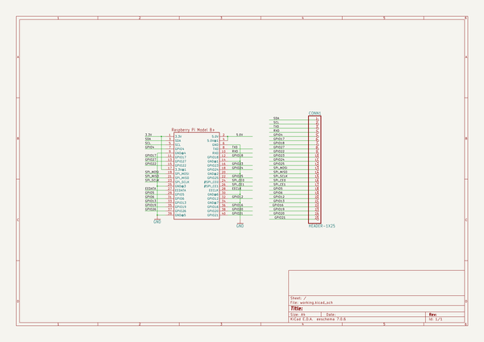
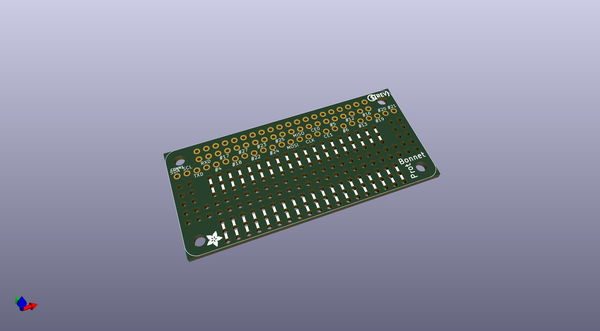
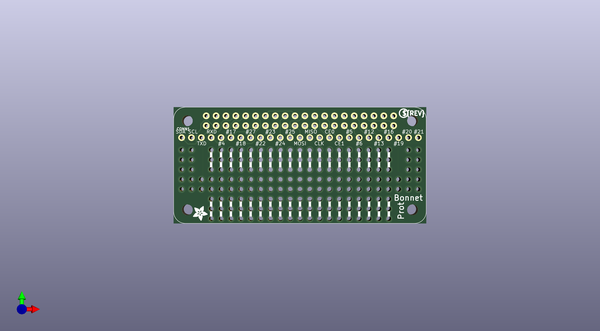
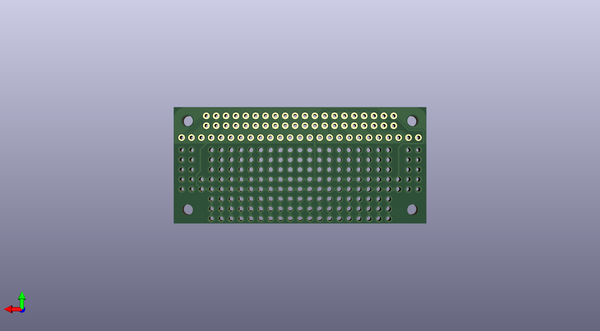

# adafruit_perma_proto_bonnet_pcb
 
## summary 
* id: adafruit_adafruit_perma_proto_bonnet_pcb_adafruit_perma_proto_bonnet
* user: adafruit
* name: adafruit_perma_proto_bonnet_pcb
* board: adafruit_perma_proto_bonnet
* repo: https://github.com/adafruit/Adafruit-Perma-Proto-Bonnet-PCB

* src_file_repo_sch: 
* src_file_repo_sch_link: https://github.com/adafruit/Adafruit-Perma-Proto-Bonnet-PCB/tree/master/
* full details link: https://github.com/oomlout/oomlout_oomp_project_bot_v_2/tree/main/projects/adafruit_adafruit_perma_proto_bonnet_pcb_adafruit_perma_proto_bonnet/current_version/working  

## schematic  
  
[schematic (pdf)](working_schematic.pdf)  

## pcb  
 
  
  
  
[board (pdf)](working.pdf)  

## working_bom
| Id | Designator | Footprint | Quantity | Designation | Supplier and ref |  | None | 
| --- | --- | --- | --- | --- | --- | --- | --- | 
| 1 | RPI1 | PI_BONNET_NODIM | 1 | RASPBERRYPI_BPLUS_BONNETNODIM |  |  | [''] | 
| 2 | U$1 | ADAFRUIT_3.5MM | 1 |  |  |  | [''] | 
| 3 | CONN1 | 1X25_ROUND_70MIL | 1 | HEADER-1X25 |  |  | [''] | 
| 4 | U$3 | PCBFEAT-REV-056 | 1 |  |  |  | [''] | 

## bom_schematic
| Ref | Qnty | Value | Cmp name | Footprint | Description | Vendor | DNP | 
| --- | --- | --- | --- | --- | --- | --- | --- | 
| CONN1 | 1 | HEADER-1X25 | HEADER-1X25 | working:1X25_ROUND_70MIL |  |  |  | 
| RPI1 | 1 | RASPBERRYPI_BPLUS_BONNETNODIM | RASPBERRYPI_BPLUS_BONNETNODIM | working:PI_BONNET_NODIM |  |  |  | 

