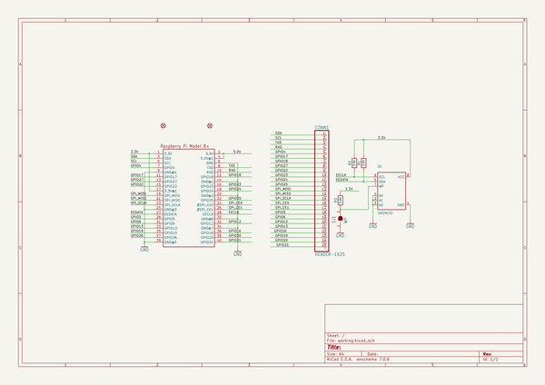
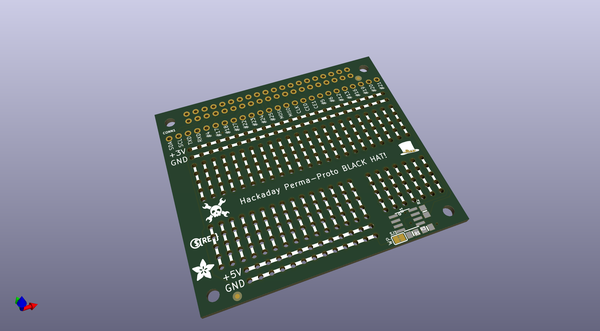
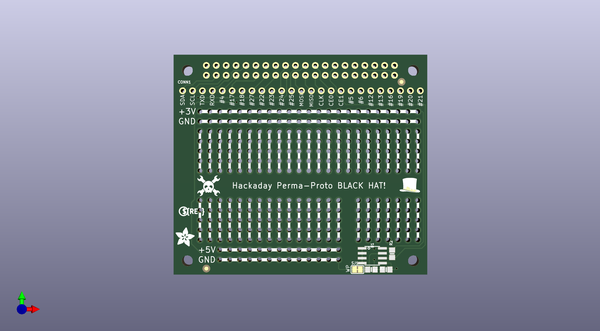
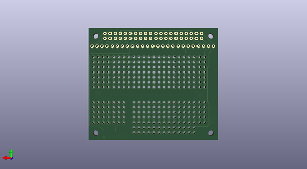

# adafruit_perma_proto_hat_pcb
 
## summary 
* id: adafruit_adafruit_perma_proto_hat_pcb_adafruit_had_proto_hat_rev_a
* user: adafruit
* name: adafruit_perma_proto_hat_pcb
* board: adafruit_had_proto_hat_rev_a
* repo: https://github.com/adafruit/Adafruit-Perma-Proto-HAT-PCB

* src_file_repo_sch: 
* src_file_repo_sch_link: https://github.com/adafruit/Adafruit-Perma-Proto-HAT-PCB/tree/master/
* full details link: https://github.com/oomlout/oomlout_oomp_project_bot_v_2/tree/main/projects/adafruit_adafruit_perma_proto_hat_pcb_adafruit_had_proto_hat_rev_a/current_version/working  

## schematic  
  
[schematic (pdf)](working_schematic.pdf) 

## pcb  
 
  
  
  
[board (pdf)](working.pdf)  

## working_bom
| Id | Designator | Footprint | Quantity | Designation | Supplier and ref |  | None | 
| --- | --- | --- | --- | --- | --- | --- | --- | 
| 1 | SJ1 | SOLDERJUMPER_CLOSEDWIRE | 1 | WP |  |  | [''] | 
| 2 | R2,R3,R1 | 0805-NO | 3 | 3.9K |  |  | [''] | 
| 3 | RPI1 | PI_HAT_NOSLOTS | 1 | RASPBERRYPI_BPLUS_HATNOSLOTS |  |  | [''] | 
| 4 | U$2 | PIHATLOGO | 1 |  |  |  | [''] | 
| 5 | U$1 | ADAFRUIT_5MM | 1 |  |  |  | [''] | 
| 6 | FID2,FID3 | FIDUCIAL_1MM | 2 | FIDUCIAL" |  |  | [''] | 
| 7 | CONN1 | 1X25_ROUND_70MIL | 1 | HEADER-1X25 |  |  | [''] | 
| 8 | U$5 | HAD_LOGO_200MIL | 1 |  |  |  | [''] | 
| 9 | U1 | SOIC8_150MIL | 1 | CAT24C32 |  |  | [''] | 
| 10 | U$3 | PCBFEAT-REV-056 | 1 |  |  |  | [''] | 

## bom_schematic
| Ref | Qnty | Value | Cmp name | Footprint | Description | Vendor | DNP | 
| --- | --- | --- | --- | --- | --- | --- | --- | 
| CONN1 | 1 | HEADER-1X25 | HEADER-1X25 | working:1X25_ROUND_70MIL |  |  |  | 
| FID2, FID3 | 2 | FIDUCIAL"" | FIDUCIAL{dblquote}{dblquote} | working:FIDUCIAL_1MM |  |  |  | 
| R1, R2, R3 | 3 | 3.9K | RESISTOR0805_NOOUTLINE | working:0805-NO |  |  |  | 
| RPI1 | 1 | RASPBERRYPI_BPLUS_HATNOSLOTS | RASPBERRYPI_BPLUS_HATNOSLOTS | working:PI_HAT_NOSLOTS |  |  |  | 
| SJ1 | 1 | WP | SOLDERJUMPER_CLOSED | working:SOLDERJUMPER_CLOSEDWIRE |  |  |  | 
| U1 | 1 | CAT24C32 | EEPROM_I2C_SOIC8_GENERIC | working:SOIC8_150MIL |  |  |  | 

