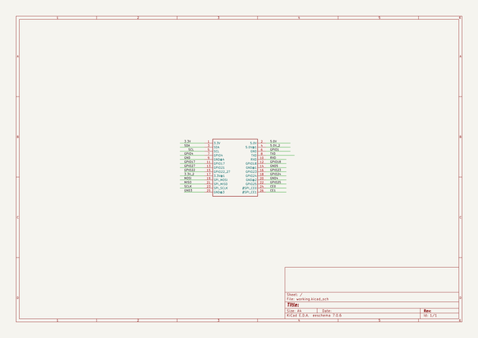

# adafruit_perma_proto_pi_pcbs
 
## summary 
* id: adafruit_adafruit_perma_proto_pi_pcbs_adafruit_perma_proto_pi_half_size
* user: adafruit
* name: adafruit_perma_proto_pi_pcbs
* board: adafruit_perma_proto_pi_half_size
* repo: https://github.com/adafruit/Adafruit-Perma-Proto-Pi-PCBs

* src_file_repo_sch: 
* src_file_repo_sch_link: https://github.com/adafruit/Adafruit-Perma-Proto-Pi-PCBs/tree/master/
* full details link: https://github.com/oomlout/oomlout_oomp_project_bot_v_2/tree/main/projects/adafruit_adafruit_perma_proto_pi_pcbs_adafruit_perma_proto_pi_half_size/current_version/working  

## schematic  
  
[schematic (pdf)](working_schematic.pdf) 

## pcb  
 
  
  
  
[board (pdf)](working.pdf)  

## bom_schematic
| Ref | Qnty | Value | Cmp name | Footprint | Description | Vendor | DNP | 
| --- | --- | --- | --- | --- | --- | --- | --- | 
| JP1 | 1 | RASBERRYPI_IDC | RASBERRYPI_IDC | working:RASBERRYPI_IDC |  |  |  | 

