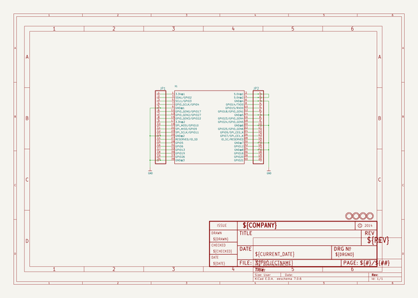

# adafruit_pi_cobber_pcbs
 
## summary 
* id: adafruit_adafruit_pi_cobber_pcbs_adafruit_cobbler
* user: adafruit
* name: adafruit_pi_cobber_pcbs
* board: adafruit_cobbler
* repo: https://github.com/adafruit/Adafruit-Pi-Cobber-PCBs

* src_file_repo_sch: 
* src_file_repo_sch_link: https://github.com/adafruit/Adafruit-Pi-Cobber-PCBs/tree/master/
* full details link: https://github.com/oomlout/oomlout_oomp_project_bot_v_2/tree/main/projects/adafruit_adafruit_pi_cobber_pcbs_adafruit_cobbler/current_version/working  

## schematic  
  
[schematic (pdf)](working_schematic.pdf)  

## pcb  
 
  
  
  
[board (pdf)](working.pdf)  

## working_bom
| Id | Designator | Footprint | Quantity | Designation | Supplier and ref |  | None | 
| --- | --- | --- | --- | --- | --- | --- | --- | 
| 1 | U$2,U$1,U$3,U$4 | MOUNTINGHOLE_2.5_PLATED_THICK | 4 | MOUNTINGHOLE2.5_THICK |  |  | [''] | 
| 2 | X1 | RASPBERRYPI_B+_IDC | 1 |  |  |  | [''] | 
| 3 | JP2,JP1 | 1X20_ROUND | 2 |  |  |  | [''] | 

## bom_schematic
| Ref | Qnty | Value | Cmp name | Footprint | Description | Vendor | DNP | 
| --- | --- | --- | --- | --- | --- | --- | --- | 
| JP1, JP2 | 2 | HEADER-1X20ROUND | HEADER-1X20ROUND | working:1X20_ROUND |  |  |  | 
| U$1, U$2, U$3, U$4 | 4 | MOUNTINGHOLE2.5_THICK | MOUNTINGHOLE2.5_THICK | working:MOUNTINGHOLE_2.5_PLATED_THICK |  |  |  | 
| X1 | 1 | RASPBERRYPI_B+_IDC | RASPBERRYPI_B+_IDC | working:RASPBERRYPI_B+_IDC |  |  |  | 

## mounting_holes
| x | y | package | value | ref | size | 
| --- | --- | --- | --- | --- | --- | 
| 0.0 | 15.239999999999995 | MOUNTINGHOLE_2.5_PLATED_THICK | MOUNTINGHOLE2.5_THICK | U$1 | m3 | 
| 58.41999999999999 | 15.239999999999995 | MOUNTINGHOLE_2.5_PLATED_THICK | MOUNTINGHOLE2.5_THICK | U$2 | m3 | 
| 0.0 | 0.0 | MOUNTINGHOLE_2.5_PLATED_THICK | MOUNTINGHOLE2.5_THICK | U$3 | m3 | 
| 58.41999999999999 | 0.0 | MOUNTINGHOLE_2.5_PLATED_THICK | MOUNTINGHOLE2.5_THICK | U$4 | m3 | 

