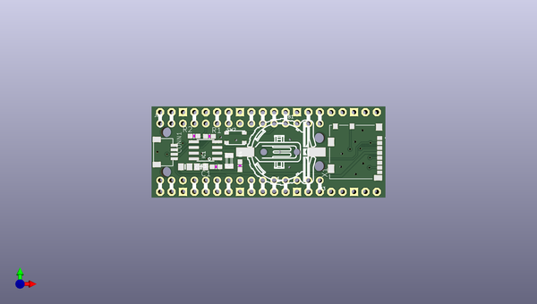

# adafruit_picowbell_adalogger_pcb
 
## summary 
* id: adafruit_adafruit_picowbell_adalogger_pcb_adafruit_picowbell_adalogger
* user: adafruit
* name: adafruit_picowbell_adalogger_pcb
* board: adafruit_picowbell_adalogger
* repo: https://github.com/adafruit/Adafruit-PiCowbell-Adalogger-PCB

* src_file_repo_sch: 
* src_file_repo_sch_link: https://github.com/adafruit/Adafruit-PiCowbell-Adalogger-PCB/tree/main/
* full details link: https://github.com/oomlout/oomlout_oomp_project_bot_v_2/tree/main/projects/adafruit_adafruit_picowbell_adalogger_pcb_adafruit_picowbell_adalogger/current_version/working  

## pcb  
 
  
  
  
[board (pdf)](working.pdf)  

## working_bom
| Id | Designator | Footprint | Quantity | Designation | Supplier and ref |  | None | 
| --- | --- | --- | --- | --- | --- | --- | --- | 
| 1 | PLABEL16 | PLABEL16 | 1 |  |  |  | [''] | 
| 2 | PLABEL18 | PLABEL18 | 1 |  |  |  | [''] | 
| 3 | PLABEL3 | PLABEL3 | 1 |  |  |  | [''] | 
| 4 | PLABEL12 | PLABEL12 | 1 |  |  |  | [''] | 
| 5 | JP3,JP4 | 1X15_ROUND_70 | 2 |  |  |  | [''] | 
| 6 | B1 | CR1220-2 | 1 | CR1220 |  |  | [''] | 
| 7 | @HOLE2,@HOLE1,@HOLE3,@HOLE0 |  | 4 |  |  |  | [''] | 
| 8 | PLABEL19 | PLABEL19 | 1 |  |  |  | [''] | 
| 9 | PLABEL21 | PLABEL21 | 1 |  |  |  | [''] | 
| 10 | X1 | MOLEX_104031-0811 | 1 | MICROSD |  |  | [''] | 
| 11 | PLABEL6 | PLABEL6 | 1 |  |  |  | [''] | 
| 12 | R3 | 0603-NO | 1 | 1K |  |  | [''] | 
| 13 | PLABEL20 | PLABEL20 | 1 |  |  |  | [''] | 
| 14 | PLABEL0 | PLABEL0 | 1 |  |  |  | [''] | 
| 15 | PLABEL10 | PLABEL10 | 1 |  |  |  | [''] | 
| 16 | PLABEL17 | PLABEL17 | 1 |  |  |  | [''] | 
| 17 | PLABEL1 | PLABEL1 | 1 |  |  |  | [''] | 
| 18 | PLABEL8 | PLABEL8 | 1 |  |  |  | [''] | 
| 19 | IC1 | SOIC8_150MIL | 1 | RTC_PCF8523/T |  |  | [''] | 
| 20 | Q1 | XTAL3215 | 1 | 32.768 |  |  | [''] | 
| 21 | PLABEL4 | PLABEL4 | 1 |  |  |  | [''] | 
| 22 | PLABEL25 | PLABEL25 | 1 |  |  |  | [''] | 
| 23 | R1,R2,R4 | 0603-NO | 3 | 10K |  |  | [''] | 
| 24 | PLABEL22 | PLABEL22 | 1 |  |  |  | [''] | 
| 25 | PLABEL13 | PLABEL13 | 1 |  |  |  | [''] | 
| 26 | C2,C1 | 0805-NO | 2 | 10uF |  |  | [''] | 
| 27 | PLABEL26 | PLABEL26 | 1 |  |  |  | [''] | 
| 28 | PLABEL15 | PLABEL15 | 1 |  |  |  | [''] | 
| 29 | PLABEL23 | PLABEL23 | 1 |  |  |  | [''] | 
| 30 | CONN1 | JST_SH4 | 1 | STEMMA_I2C_QT |  |  | [''] | 
| 31 | SW2 | BTN_RKB2_4.6X2.8 | 1 | tact |  |  | [''] | 
| 32 | PLABEL11 | PLABEL11 | 1 |  |  |  | [''] | 
| 33 | PLABEL2 | PLABEL2 | 1 |  |  |  | [''] | 
| 34 | PLABEL9 | PLABEL9 | 1 |  |  |  | [''] | 
| 35 | PLABEL5 | PLABEL5 | 1 |  |  |  | [''] | 
| 36 | PLABEL14 | PLABEL14 | 1 |  |  |  | [''] | 
| 37 | CB1 | PICOWBELL_THM | 1 | PICOWBELL_THM |  |  | [''] | 
| 38 | PLABEL7 | PLABEL7 | 1 |  |  |  | [''] | 
| 39 | PLABEL24 | PLABEL24 | 1 |  |  |  | [''] | 
| 40 | PLABEL49 | PLABEL49 | 1 |  |  |  | [''] | 
| 41 | U$11 | COWBELL_0.5IN | 1 |  |  |  | [''] | 
| 42 | PLABEL56 | PLABEL56 | 1 |  |  |  | [''] | 
| 43 | PLABEL51 | PLABEL51 | 1 |  |  |  | [''] | 
| 44 | PLABEL30 | PLABEL30 | 1 |  |  |  | [''] | 
| 45 | PLABEL52 | PLABEL52 | 1 |  |  |  | [''] | 
| 46 | PLABEL43 | PLABEL43 | 1 |  |  |  | [''] | 
| 47 | PLABEL35 | PLABEL35 | 1 |  |  |  | [''] | 
| 48 | PLABEL55 | PLABEL55 | 1 |  |  |  | [''] | 
| 49 | PLABEL47 | PLABEL47 | 1 |  |  |  | [''] | 
| 50 | PLABEL34 | PLABEL34 | 1 |  |  |  | [''] | 
| 51 | PLABEL53 | PLABEL53 | 1 |  |  |  | [''] | 
| 52 | PLABEL44 | PLABEL44 | 1 |  |  |  | [''] | 
| 53 | PLABEL41 | PLABEL41 | 1 |  |  |  | [''] | 
| 54 | PLABEL39 | PLABEL39 | 1 |  |  |  | [''] | 
| 55 | PLABEL54 | PLABEL54 | 1 |  |  |  | [''] | 
| 56 | PLABEL36 | PLABEL36 | 1 |  |  |  | [''] | 
| 57 | PLABEL50 | PLABEL50 | 1 |  |  |  | [''] | 
| 58 | PLABEL45 | PLABEL45 | 1 |  |  |  | [''] | 
| 59 | PLABEL32 | PLABEL32 | 1 |  |  |  | [''] | 
| 60 | PLABEL33 | PLABEL33 | 1 |  |  |  | [''] | 
| 61 | PLABEL27 | PLABEL27 | 1 |  |  |  | [''] | 
| 62 | PLABEL48 | PLABEL48 | 1 |  |  |  | [''] | 
| 63 | PLABEL46 | PLABEL46 | 1 |  |  |  | [''] | 
| 64 | PLABEL40 | PLABEL40 | 1 |  |  |  | [''] | 
| 65 | PLABEL38 | PLABEL38 | 1 |  |  |  | [''] | 
| 66 | PLABEL42 | PLABEL42 | 1 |  |  |  | [''] | 
| 67 | U$12 | PCBFEAT-REV-040 | 1 |  |  |  | [''] | 
| 68 | PLABEL37 | PLABEL37 | 1 |  |  |  | [''] | 
| 69 | U$10 | ADALOGGER_LOGO | 1 |  |  |  | [''] | 
| 70 | SJ1 | SOLDERJUMPER_ARROW_NOPASTE | 1 |  |  |  | [''] | 
| 71 | PLABEL31 | PLABEL31 | 1 |  |  |  | [''] | 

