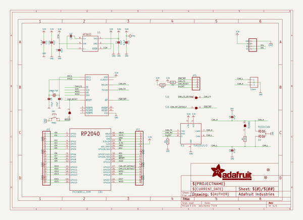
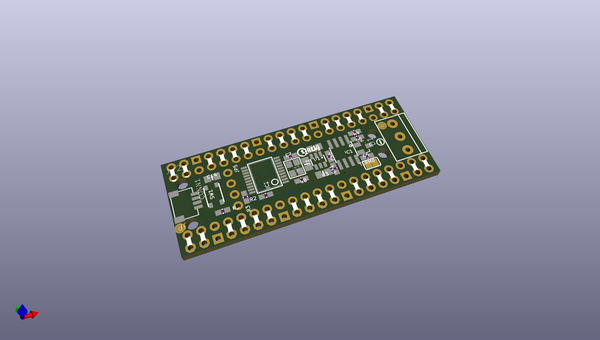
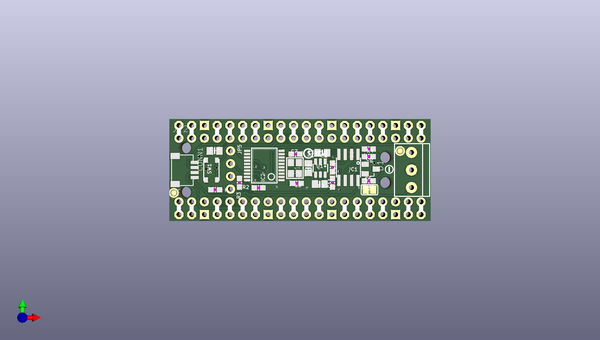
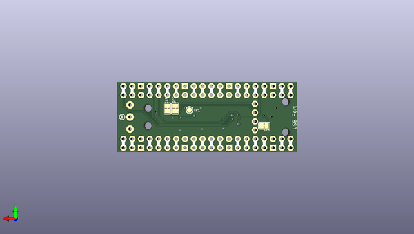

# adafruit_picowbell_can_bus_pcb
 
## summary 
* id: adafruit_adafruit_picowbell_can_bus_pcb_adafruit_picowbell_can_bus
* user: adafruit
* name: adafruit_picowbell_can_bus_pcb
* board: adafruit_picowbell_can_bus
* repo: https://github.com/adafruit/Adafruit-PiCowbell-CAN-Bus-PCB

* src_file_repo_sch: 
* src_file_repo_sch_link: https://github.com/adafruit/Adafruit-PiCowbell-CAN-Bus-PCB/tree/main/
* full details link: https://github.com/oomlout/oomlout_oomp_project_bot_v_2/tree/main/projects/adafruit_adafruit_picowbell_can_bus_pcb_adafruit_picowbell_can_bus/current_version/working  

## schematic  
  
[schematic (pdf)](working_schematic.pdf) 

## pcb  
 
  
  
  
[board (pdf)](working.pdf)  

## working_bom
| Id | Designator | Footprint | Quantity | Designation | Supplier and ref |  | None | 
| --- | --- | --- | --- | --- | --- | --- | --- | 
| 1 | PLABEL70 | PLABEL70 | 1 |  |  |  | [''] | 
| 2 | C5,C6 | 0603-NO | 2 | 47pF |  |  | [''] | 
| 3 | D1 | SOT23 | 1 | PESD1CAN |  |  | [''] | 
| 4 | C8,C7 | 0603-NO | 2 | 15pF |  |  | [''] | 
| 5 | JP2,JP1 | 1X20_ROUND_70MIL | 2 |  |  |  | [''] | 
| 6 | IC2 | SSOP20 | 1 | MCP2515/ST |  |  | [''] | 
| 7 | FID2,FID1 | FIDUCIAL_1MM | 2 | FIDUCIAL_1MM |  |  | [''] | 
| 8 | PLABEL69 | PLABEL69 | 1 |  |  |  | [''] | 
| 9 | PLABEL67 | PLABEL67 | 1 |  |  |  | [''] | 
| 10 | PLABEL68 | PLABEL68 | 1 |  |  |  | [''] | 
| 11 | C14,C2,C1 | 0805-NO | 3 | 10uF |  |  | [''] | 
| 12 | PLABEL72 | PLABEL72 | 1 |  |  |  | [''] | 
| 13 | U$34,U$2 | SYMBOL_MINUS | 2 |  |  |  | [''] | 
| 14 | TERM0,SJ1,SJ5,SJ6 | SOLDERJUMPER_CLOSEDWIRE | 4 |  |  |  | [''] | 
| 15 | R1,R2,R3 | 0603-NO | 3 | 10K |  |  | [''] | 
| 16 | JP5 | 1X04_ROUND | 1 |  |  |  | [''] | 
| 17 | @HOLE3,@HOLE1,@HOLE2,@HOLE0 |  | 4 |  |  |  | [''] | 
| 18 | U1 | SOT23-6 | 1 | AP3602 |  |  | [''] | 
| 19 | PLABEL65 | PLABEL65 | 1 |  |  |  | [''] | 
| 20 | PLABEL71 | PLABEL71 | 1 |  |  |  | [''] | 
| 21 | C3 | 0805-NO | 1 | 1uF |  |  | [''] | 
| 22 | CAN0 | TERMBLOCK_1X3-3.5MM | 1 | 3.5mm |  |  | [''] | 
| 23 | C11,C10 | 0603-NO | 2 | 0.1uF |  |  | [''] | 
| 24 | U$11 | PCBFEAT-REV-040 | 1 |  |  |  | [''] | 
| 25 | IC1 | SOIC8_150MIL | 1 | TJA1051T/3 |  |  | [''] | 
| 26 | PLABEL66 | PLABEL66 | 1 |  |  |  | [''] | 
| 27 | PLABEL64 | PLABEL64 | 1 |  |  |  | [''] | 
| 28 | Y1 | CRYSTAL_3.2X2.5 | 1 | 16MHz 9pF |  |  | [''] | 
| 29 | PLABEL73 | PLABEL73 | 1 |  |  |  | [''] | 
| 30 | R4 | 0603-NO | 1 | 120 |  |  | [''] | 
| 31 | SW1 | BTN_RKB2_4.6X2.8 | 1 | RKB2 |  |  | [''] | 
| 32 | CB1 | PICOWBELL_THM | 1 | PICOWBELL_THM |  |  | [''] | 
| 33 | CONN1 | JST_SH4 | 1 | STEMMA_I2C_QT |  |  | [''] | 
| 34 | PLABEL83 | PLABEL83 | 1 |  |  |  | [''] | 
| 35 | PLABEL78 | PLABEL78 | 1 |  |  |  | [''] | 
| 36 | PLABEL38 | PLABEL38 | 1 |  |  |  | [''] | 
| 37 | PLABEL60 | PLABEL60 | 1 |  |  |  | [''] | 
| 38 | PLABEL63 | PLABEL63 | 1 |  |  |  | [''] | 
| 39 | PLABEL59 | PLABEL59 | 1 |  |  |  | [''] | 
| 40 | PLABEL79 | PLABEL79 | 1 |  |  |  | [''] | 
| 41 | PLABEL37 | PLABEL37 | 1 |  |  |  | [''] | 
| 42 | PLABEL53 | PLABEL53 | 1 |  |  |  | [''] | 
| 43 | PLABEL57 | PLABEL57 | 1 |  |  |  | [''] | 
| 44 | PLABEL75 | PLABEL75 | 1 |  |  |  | [''] | 
| 45 | PLABEL74 | PLABEL74 | 1 |  |  |  | [''] | 
| 46 | PLABEL46 | PLABEL46 | 1 |  |  |  | [''] | 
| 47 | PLABEL85 | PLABEL85 | 1 |  |  |  | [''] | 
| 48 | PLABEL49 | PLABEL49 | 1 |  |  |  | [''] | 
| 49 | PLABEL52 | PLABEL52 | 1 |  |  |  | [''] | 
| 50 | PLABEL50 | PLABEL50 | 1 |  |  |  | [''] | 
| 51 | PLABEL43 | PLABEL43 | 1 |  |  |  | [''] | 
| 52 | PLABEL61 | PLABEL61 | 1 |  |  |  | [''] | 
| 53 | PLABEL82 | PLABEL82 | 1 |  |  |  | [''] | 
| 54 | PLABEL47 | PLABEL47 | 1 |  |  |  | [''] | 
| 55 | PLABEL56 | PLABEL56 | 1 |  |  |  | [''] | 
| 56 | PLABEL54 | PLABEL54 | 1 |  |  |  | [''] | 
| 57 | PLABEL80 | PLABEL80 | 1 |  |  |  | [''] | 
| 58 | TP1 | TESTPOINT_ROUND_1.5MM | 1 |  |  |  | [''] | 
| 59 | PLABEL81 | PLABEL81 | 1 |  |  |  | [''] | 
| 60 | PLABEL42 | PLABEL42 | 1 |  |  |  | [''] | 
| 61 | PLABEL84 | PLABEL84 | 1 |  |  |  | [''] | 
| 62 | PLABEL55 | PLABEL55 | 1 |  |  |  | [''] | 
| 63 | PLABEL41 | PLABEL41 | 1 |  |  |  | [''] | 
| 64 | PLABEL76 | PLABEL76 | 1 |  |  |  | [''] | 
| 65 | PLABEL62 | PLABEL62 | 1 |  |  |  | [''] | 
| 66 | PLABEL77 | PLABEL77 | 1 |  |  |  | [''] | 
| 67 | PLABEL45 | PLABEL45 | 1 |  |  |  | [''] | 
| 68 | PLABEL36 | PLABEL36 | 1 |  |  |  | [''] | 
| 69 | PLABEL44 | PLABEL44 | 1 |  |  |  | [''] | 
| 70 | PLABEL51 | PLABEL51 | 1 |  |  |  | [''] | 
| 71 | PLABEL40 | PLABEL40 | 1 |  |  |  | [''] | 
| 72 | PLABEL58 | PLABEL58 | 1 |  |  |  | [''] | 

## bom_schematic
| Ref | Qnty | Value | Cmp name | Footprint | Description | Vendor | DNP | 
| --- | --- | --- | --- | --- | --- | --- | --- | 
| C1, C2, C14 | 3 | 10uF | CAP_CERAMIC0805-NOOUTLINE | working:0805-NO |  |  |  | 
| C3 | 1 | 1uF | CAP_CERAMIC0805-NOOUTLINE | working:0805-NO |  |  |  | 
| C5, C6 | 2 | 47pF | CAP_CERAMIC0603_NO | working:0603-NO |  |  |  | 
| C7, C8 | 2 | 15pF | CAP_CERAMIC0603_NO | working:0603-NO |  |  |  | 
| C10, C11 | 2 | 0.1uF | CAP_CERAMIC0603_NO | working:0603-NO |  |  |  | 
| CAN0 | 1 | 3.5mm | TERMBLOCK_1X3 | working:TERMBLOCK_1X3-3.5MM |  |  |  | 
| CB1 | 1 | PICOWBELL_THM | PICOWBELL_THM | working:PICOWBELL_THM |  |  |  | 
| CONN1 | 1 | STEMMA_I2C_QT | STEMMA_I2C_QT | working:JST_SH4 |  |  |  | 
| D1 | 1 | PESD1CAN | PESD1CAN | working:SOT23 |  |  |  | 
| FID1, FID2 | 2 | FIDUCIAL_1MM | FIDUCIAL_1MM | working:FIDUCIAL_1MM |  |  |  | 
| IC1 | 1 | TJA1051T/3 | CAN_TRANSCIEVER_TCAN1051V | working:SOIC8_150MIL |  |  |  | 
| IC2 | 1 | MCP2515/ST | MCP2515/ST | working:SSOP20 |  |  |  | 
| JP1, JP2 | 2 | HEADER-1X20_70MIL | HEADER-1X20_70MIL | working:1X20_ROUND_70MIL |  |  |  | 
| JP5 | 1 | HEADER-1X4ROUND | HEADER-1X4ROUND | working:1X04_ROUND |  |  |  | 
| R1, R2, R3 | 3 | 10K | RESISTOR_0603_NOOUT | working:0603-NO |  |  |  | 
| R4 | 1 | 120 | RESISTOR_0603_NOOUT | working:0603-NO |  |  |  | 
| SJ1, SJ5, SJ6 | 3 | SOLDERJUMPER_CLOSED | SOLDERJUMPER_CLOSED | working:SOLDERJUMPER_CLOSEDWIRE |  |  |  | 
| SW1 | 1 | RKB2 | SWITCH_TACT_SMT_RKB2 | working:BTN_RKB2_4.6X2.8 |  |  |  | 
| TERM0 | 1 | SOLDERJUMPER_CLOSED | SOLDERJUMPER_CLOSED | working:SOLDERJUMPER_CLOSEDWIRE |  |  |  | 
| TP1 | 1 | TESTPOINTROUND1.5MM | TESTPOINTROUND1.5MM | working:TESTPOINT_ROUND_1.5MM |  |  |  | 
| U1 | 1 | AP3602 | AP3602 | working:SOT23-6 |  |  |  | 
| Y1 | 1 | 16MHz 9pF | CRYSTAL3.2X2.5 | working:CRYSTAL_3.2X2.5 |  |  |  | 

