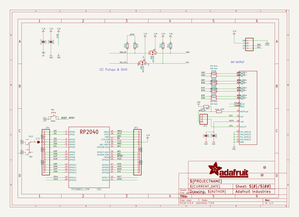
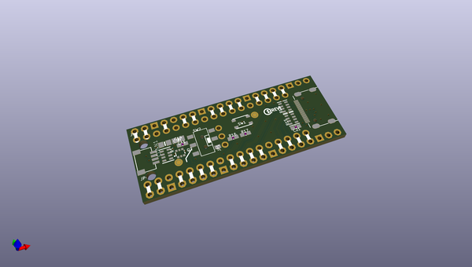
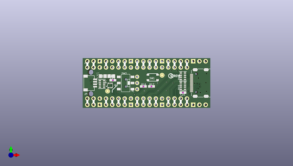
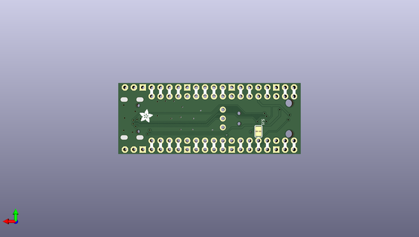

# adafruit_picowbell_dvi_output
 
## summary 
* id: adafruit_adafruit_picowbell_dvi_output_adafruit_picowbell_dvi_output_for_pico
* user: adafruit
* name: adafruit_picowbell_dvi_output
* board: adafruit_picowbell_dvi_output_for_pico
* repo: https://github.com/adafruit/Adafruit-PiCowbell-DVI-Output

* src_file_repo_sch: 
* src_file_repo_sch_link: https://github.com/adafruit/Adafruit-PiCowbell-DVI-Output/tree/main/
* full details link: https://github.com/oomlout/oomlout_oomp_project_bot_v_2/tree/main/projects/adafruit_adafruit_picowbell_dvi_output_adafruit_picowbell_dvi_output_for_pico/current_version/working  

## schematic  
  
[schematic (pdf)](working_schematic.pdf) 

## pcb  
 
  
  
  
[board (pdf)](working.pdf)  

## working_bom
| Id | Designator | Footprint | Quantity | Designation | Supplier and ref |  | None | 
| --- | --- | --- | --- | --- | --- | --- | --- | 
| 1 | PLABEL86 | PLABEL86 | 1 |  |  |  | [''] | 
| 2 | PLABEL73 | PLABEL73 | 1 |  |  |  | [''] | 
| 3 | PLABEL67 | PLABEL67 | 1 |  |  |  | [''] | 
| 4 | PLABEL100 | PLABEL100 | 1 |  |  |  | [''] | 
| 5 | PLABEL81 | PLABEL81 | 1 |  |  |  | [''] | 
| 6 | SW2 | EG1390 | 1 | EG13 |  |  | [''] | 
| 7 | FID1,FID2 | FIDUCIAL_1MM | 2 | FIDUCIAL_1MM |  |  | [''] | 
| 8 | C14,C19 | 0805-NO | 2 | 10uF |  |  | [''] | 
| 9 | PLABEL99 | PLABEL99 | 1 |  |  |  | [''] | 
| 10 | R14,R15 | RESPACK_4X0603 | 2 | 220 Pack |  |  | [''] | 
| 11 | PLABEL89 | PLABEL89 | 1 |  |  |  | [''] | 
| 12 | PLABEL97 | PLABEL97 | 1 |  |  |  | [''] | 
| 13 | PLABEL68 | PLABEL68 | 1 |  |  |  | [''] | 
| 14 | CB1 | PICOWBELL_THM | 1 | PICOWBELL_THM |  |  | [''] | 
| 15 | PLABEL75 | PLABEL75 | 1 |  |  |  | [''] | 
| 16 | PLABEL85 | PLABEL85 | 1 |  |  |  | [''] | 
| 17 | U$10 | PCBFEAT-REV-040 | 1 |  |  |  | [''] | 
| 18 | PLABEL71 | PLABEL71 | 1 |  |  |  | [''] | 
| 19 | PLABEL80 | PLABEL80 | 1 |  |  |  | [''] | 
| 20 | JP4,JP3 | 1X17_ROUND70 | 2 |  |  |  | [''] | 
| 21 | PLABEL84 | PLABEL84 | 1 |  |  |  | [''] | 
| 22 | PLABEL98 | PLABEL98 | 1 |  |  |  | [''] | 
| 23 | PLABEL66 | PLABEL66 | 1 |  |  |  | [''] | 
| 24 | X2 | MINIHDMI_CNCTECH | 1 | 47151-0001 |  |  | [''] | 
| 25 | PLABEL82 | PLABEL82 | 1 |  |  |  | [''] | 
| 26 | R1 | RESPACK_4X0603 | 1 | 10K Pack |  |  | [''] | 
| 27 | PLABEL76 | PLABEL76 | 1 |  |  |  | [''] | 
| 28 | PLABEL92 | PLABEL92 | 1 |  |  |  | [''] | 
| 29 | R17,R16 | 0603-NO | 2 | 100K |  |  | [''] | 
| 30 | PLABEL88 | PLABEL88 | 1 |  |  |  | [''] | 
| 31 | C21 | 0603-NO | 1 | 1uF |  |  | [''] | 
| 32 | PLABEL69 | PLABEL69 | 1 |  |  |  | [''] | 
| 33 | PLABEL91 | PLABEL91 | 1 |  |  |  | [''] | 
| 34 | @HOLE0,@HOLE1 |  | 2 |  |  |  | [''] | 
| 35 | PLABEL70 | PLABEL70 | 1 |  |  |  | [''] | 
| 36 | PLABEL65 | PLABEL65 | 1 |  |  |  | [''] | 
| 37 | PLABEL74 | PLABEL74 | 1 |  |  |  | [''] | 
| 38 | PLABEL94 | PLABEL94 | 1 |  |  |  | [''] | 
| 39 | PLABEL78 | PLABEL78 | 1 |  |  |  | [''] | 
| 40 | JP1 | 1X03_ROUND | 1 |  |  |  | [''] | 
| 41 | PLABEL87 | PLABEL87 | 1 |  |  |  | [''] | 
| 42 | PLABEL79 | PLABEL79 | 1 |  |  |  | [''] | 
| 43 | C11 | 0603-NO | 1 | 0.1uF |  |  | [''] | 
| 44 | SW1 | BTN_RKB2_4.6X2.8 | 1 | RKB2 |  |  | [''] | 
| 45 | PLABEL90 | PLABEL90 | 1 |  |  |  | [''] | 
| 46 | PLABEL64 | PLABEL64 | 1 |  |  |  | [''] | 
| 47 | PLABEL96 | PLABEL96 | 1 |  |  |  | [''] | 
| 48 | PLABEL93 | PLABEL93 | 1 |  |  |  | [''] | 
| 49 | PLABEL95 | PLABEL95 | 1 |  |  |  | [''] | 
| 50 | PLABEL72 | PLABEL72 | 1 |  |  |  | [''] | 
| 51 | Q2 | SOT363 | 1 | BSS138 |  |  | [''] | 
| 52 | CONN1 | JST_SH4 | 1 | STEMMA_I2C_QT |  |  | [''] | 
| 53 | PLABEL77 | PLABEL77 | 1 |  |  |  | [''] | 
| 54 | PLABEL83 | PLABEL83 | 1 |  |  |  | [''] | 
| 55 | PLABEL104 | PLABEL104 | 1 |  |  |  | [''] | 
| 56 | PLABEL53 | PLABEL53 | 1 |  |  |  | [''] | 
| 57 | PLABEL46 | PLABEL46 | 1 |  |  |  | [''] | 
| 58 | PLABEL57 | PLABEL57 | 1 |  |  |  | [''] | 
| 59 | PLABEL103 | PLABEL103 | 1 |  |  |  | [''] | 
| 60 | PLABEL56 | PLABEL56 | 1 |  |  |  | [''] | 
| 61 | PLABEL101 | PLABEL101 | 1 |  |  |  | [''] | 
| 62 | PLABEL40 | PLABEL40 | 1 |  |  |  | [''] | 
| 63 | PLABEL63 | PLABEL63 | 1 |  |  |  | [''] | 
| 64 | PLABEL108 | PLABEL108 | 1 |  |  |  | [''] | 
| 65 | PLABEL102 | PLABEL102 | 1 |  |  |  | [''] | 
| 66 | PLABEL43 | PLABEL43 | 1 |  |  |  | [''] | 
| 67 | PLABEL51 | PLABEL51 | 1 |  |  |  | [''] | 
| 68 | PLABEL61 | PLABEL61 | 1 |  |  |  | [''] | 
| 69 | PLABEL42 | PLABEL42 | 1 |  |  |  | [''] | 
| 70 | PLABEL44 | PLABEL44 | 1 |  |  |  | [''] | 
| 71 | PLABEL39 | PLABEL39 | 1 |  |  |  | [''] | 
| 72 | PLABEL60 | PLABEL60 | 1 |  |  |  | [''] | 
| 73 | PLABEL47 | PLABEL47 | 1 |  |  |  | [''] | 
| 74 | PLABEL50 | PLABEL50 | 1 |  |  |  | [''] | 
| 75 | PLABEL48 | PLABEL48 | 1 |  |  |  | [''] | 
| 76 | PLABEL54 | PLABEL54 | 1 |  |  |  | [''] | 
| 77 | PLABEL38 | PLABEL38 | 1 |  |  |  | [''] | 
| 78 | PLABEL62 | PLABEL62 | 1 |  |  |  | [''] | 
| 79 | PLABEL59 | PLABEL59 | 1 |  |  |  | [''] | 
| 80 | PLABEL41 | PLABEL41 | 1 |  |  |  | [''] | 
| 81 | PLABEL52 | PLABEL52 | 1 |  |  |  | [''] | 
| 82 | PLABEL109 | PLABEL109 | 1 |  |  |  | [''] | 
| 83 | PLABEL45 | PLABEL45 | 1 |  |  |  | [''] | 
| 84 | SJ1 | SOLDERJUMPER_CLOSEDWIRE | 1 |  |  |  | [''] | 
| 85 | PLABEL105 | PLABEL105 | 1 |  |  |  | [''] | 
| 86 | PLABEL49 | PLABEL49 | 1 |  |  |  | [''] | 
| 87 | PLABEL36 | PLABEL36 | 1 |  |  |  | [''] | 
| 88 | PLABEL55 | PLABEL55 | 1 |  |  |  | [''] | 
| 89 | FRAME0 | ADAFRUIT_3.5MM | 1 |  |  |  | [''] | 
| 90 | PLABEL106 | PLABEL106 | 1 |  |  |  | [''] | 
| 91 | PLABEL37 | PLABEL37 | 1 |  |  |  | [''] | 
| 92 | PLABEL107 | PLABEL107 | 1 |  |  |  | [''] | 
| 93 | PLABEL58 | PLABEL58 | 1 |  |  |  | [''] | 

## bom_schematic
| Ref | Qnty | Value | Cmp name | Footprint | Description | Vendor | DNP | 
| --- | --- | --- | --- | --- | --- | --- | --- | 
| C11 | 1 | 0.1uF | CAP_CERAMIC0603_NO | working:0603-NO |  |  |  | 
| C14, C19 | 2 | 10uF | CAP_CERAMIC0805-NOOUTLINE | working:0805-NO |  |  |  | 
| C21 | 1 | 1uF | CAP_CERAMIC0603_NO | working:0603-NO |  |  |  | 
| CB1 | 1 | PICOWBELL_THM | PICOWBELL_THM | working:PICOWBELL_THM |  |  |  | 
| CONN1 | 1 | STEMMA_I2C_QT | STEMMA_I2C_QT | working:JST_SH4 |  |  |  | 
| FID1, FID2 | 2 | FIDUCIAL_1MM | FIDUCIAL_1MM | working:FIDUCIAL_1MM |  |  |  | 
| JP1 | 1 | HEADER-1X3ROUND | HEADER-1X3ROUND | working:1X03_ROUND |  |  |  | 
| JP3, JP4 | 2 | HEADER-1X17 | HEADER-1X17 | working:1X17_ROUND70 |  |  |  | 
| Q2 | 1 | BSS138 | MOSFET-N_DUAL | working:SOT363 |  |  |  | 
| R1 | 1 | 10K Pack | RESISTOR_4PACK | working:RESPACK_4X0603 |  |  |  | 
| R14, R15 | 2 | 220 Pack | RESISTOR_4PACK | working:RESPACK_4X0603 |  |  |  | 
| R16, R17 | 2 | 100K | RESISTOR_0603_NOOUT | working:0603-NO |  |  |  | 
| SJ1 | 1 | SOLDERJUMPER_CLOSED | SOLDERJUMPER_CLOSED | working:SOLDERJUMPER_CLOSEDWIRE |  |  |  | 
| SW1 | 1 | RKB2 | SWITCH_TACT_SMT_RKB2 | working:BTN_RKB2_4.6X2.8 |  |  |  | 
| SW2 | 1 | EG13 | SWITCH_DPDTEG1390 | working:EG1390 |  |  |  | 
| X2 | 1 | 47151-0001 | HDMI_MOLEX_47151_MINI | working:MINIHDMI_CNCTECH |  |  |  | 

