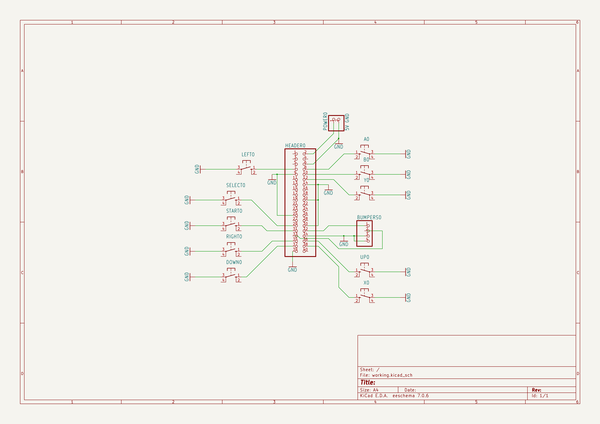
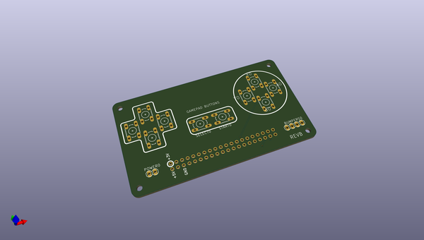
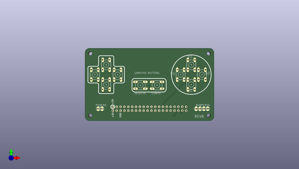
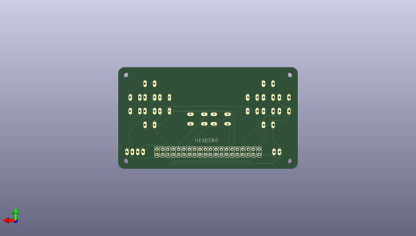

# adafruit_pigrrl_pcb
 
## summary 
* id: adafruit_adafruit_pigrrl_pcb_pigrrl_buttonpcb
* user: adafruit
* name: adafruit_pigrrl_pcb
* board: pigrrl_buttonpcb
* repo: https://github.com/adafruit/Adafruit-PiGRRL-PCB

* src_file_repo_sch: 
* src_file_repo_sch_link: https://github.com/adafruit/Adafruit-PiGRRL-PCB/tree/master/
* full details link: https://github.com/oomlout/oomlout_oomp_project_bot_v_2/tree/main/projects/adafruit_adafruit_pigrrl_pcb_pigrrl_buttonpcb/current_version/working  

## schematic  
  
[schematic (pdf)](working_schematic.pdf) 

## pcb  
 
  
  
  
[board (pdf)](working.pdf)  

## working_bom
| Id | Designator | Footprint | Quantity | Designation | Supplier and ref |  | None | 
| --- | --- | --- | --- | --- | --- | --- | --- | 
| 1 | @HOLE2,@HOLE0,@HOLE1,@HOLE3 |  | 4 |  |  |  | [''] | 
| 2 | LEFT0,START0,SELECT0,DOWN0,B0,A0,RIGHT0,Y0,X0,UP0 | B3F-10XX | 10 |  |  |  | [''] | 
| 3 | BUMPERS0 | 1X04 | 1 |  |  |  | [''] | 
| 4 | POWER0 | 1X02 | 1 | 5V GND |  |  | [''] | 
| 5 | HEADER0 | 2X20 | 1 |  |  |  | [''] | 

## bom_schematic
| Ref | Qnty | Value | Cmp name | Footprint | Description | Vendor | DNP | 
| --- | --- | --- | --- | --- | --- | --- | --- | 
| A0 | 1 | 10-XX | 10-XX | working:B3F-10XX |  |  |  | 
| B0 | 1 | 10-XX | 10-XX | working:B3F-10XX |  |  |  | 
| BUMPERS0 | 1 | PINHD-1X4 | PINHD-1X4 | working:1X04 |  |  |  | 
| DOWN0 | 1 | 10-XX | 10-XX | working:B3F-10XX |  |  |  | 
| HEADER0 | 1 | PINHD-2X20 | PINHD-2X20 | working:2X20 |  |  |  | 
| LEFT0 | 1 | 10-XX | 10-XX | working:B3F-10XX |  |  |  | 
| POWER0 | 1 | 5V GND | PINHD-1X2 | working:1X02 |  |  |  | 
| RIGHT0 | 1 | 10-XX | 10-XX | working:B3F-10XX |  |  |  | 
| SELECT0 | 1 | 10-XX | 10-XX | working:B3F-10XX |  |  |  | 
| START0 | 1 | 10-XX | 10-XX | working:B3F-10XX |  |  |  | 
| UP0 | 1 | 10-XX | 10-XX | working:B3F-10XX |  |  |  | 
| X0 | 1 | 10-XX | 10-XX | working:B3F-10XX |  |  |  | 
| Y0 | 1 | 10-XX | 10-XX | working:B3F-10XX |  |  |  | 

